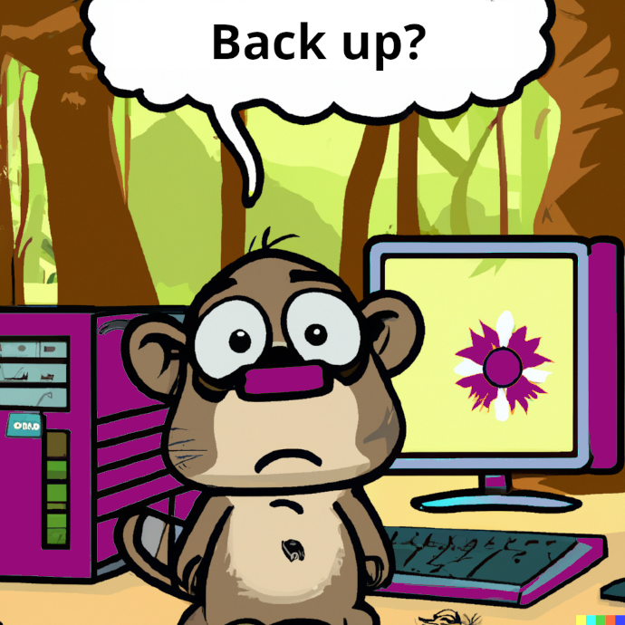

## Speicher & Backup

{{0-1}}
Wo und wie speichern wir unsere Forschungsdaten?
---

  

{{1-3}}
****************
> **Unterschiedliche Speichermedien haben Vor- und Nachteile...**

****************

{{2-3}}
****************
> **...beispielsweise bzgl. der Lebensdauer**:

****************

{{3-4}}
****************
> **Grundsätzlich immer auch an ein Backup denken!**
>
>- min. 3 Kopien einer Datei
>- min. 2 verschiedene Medien
>- von denen min. ein Medium remote ist
>- Backup in regelmäßigen Intervallen

****************

{{4}}
*****************
Besondere Aufmerksamkeit bei sensiblen Daten:
---

> **Schützen Sie sensible Daten!**
>
>- Hardware (z. B. in einem abschießbaren Raum gelagert)
>- Dateiverschlüsselung
>- Passwortsicherheit
>- Mindestens zwei Personen sollten Zugang zu Ihren Daten haben

*****************

### Backup vs. Langzeitarchivierung

| Back up                                                                          | Langzeit Speicherung            |
| -------------------------------------------------------------------------------- | ----------------------------- |
| Automatisches Backup von allen Daten   | Speicherung von ausgewählten Daten |
| All Versionen                                                                     | Nur die finale Version            |
|   zur Verhinderung von Datenverlust  (technisch, z.B. Defekt, oder menschlich, z.B. versehentlich gelöscht) | Integritätssicherung   (z. B. regelmäßige Überprüfung auf modifizierte oder beschädigte Daten,  Dateisystemkonsistenz)      |
|                                                                                  | Langzeitspeicherung             |
|                                                                                  | Durchsuchbar                 |

