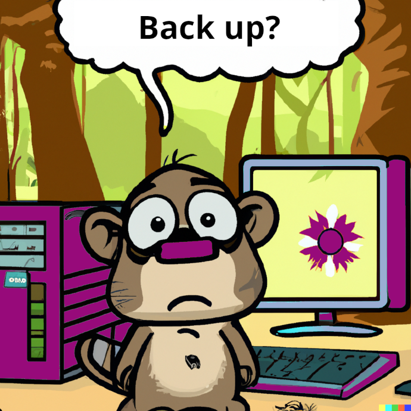
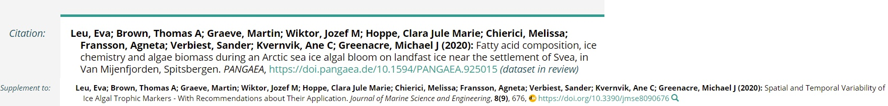
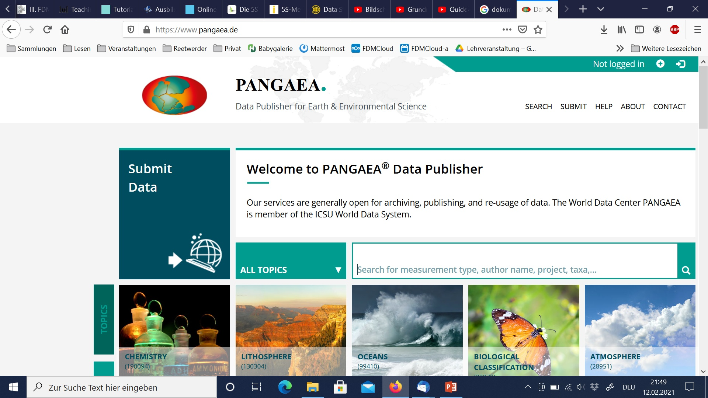
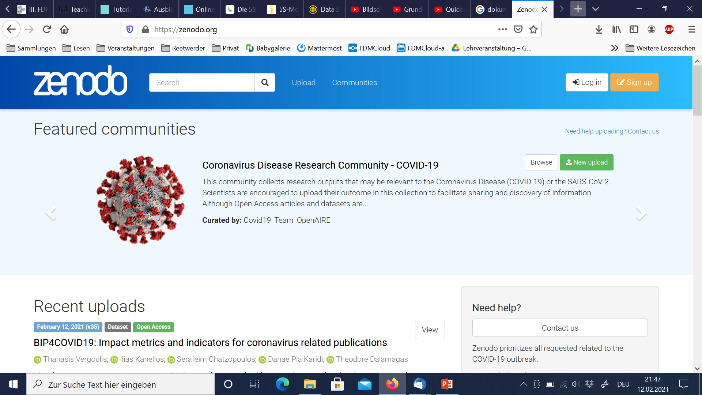
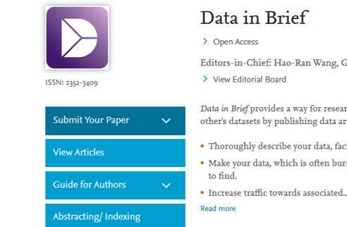
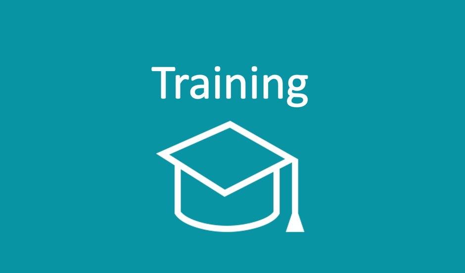
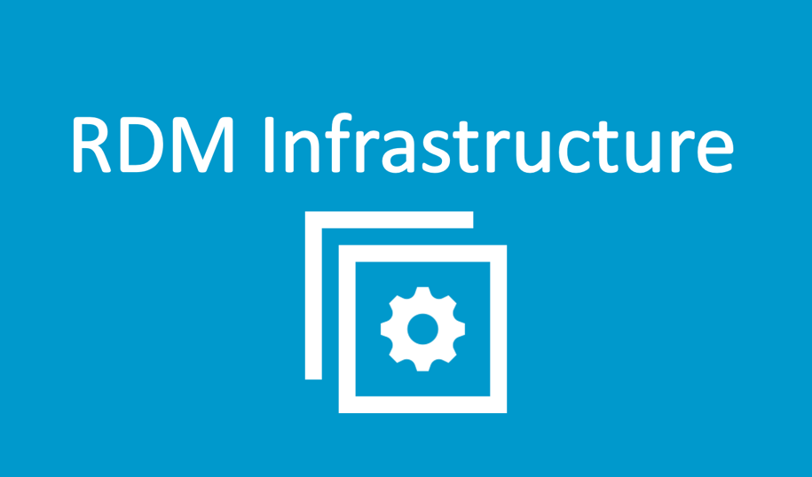
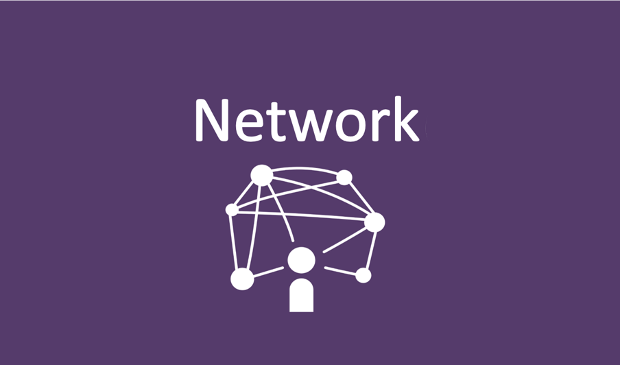

<!--

author:   Britta Petersen, Linda Zollitsch
email:    b.petersen@rz.uni-kiel.de
version:  0.1.0
language: de
narrator: UK English Female

icon:     images/Logo_cau-norm-de-lilagrey-rgb-0720_2022.png

comment:  This document provides a brief introduction to research data management for lecturers. It provides an overview of rdm related topics as well as some didactic and methodologies for teaching rdm to students.

-->

# Train-the-Lecturer Forschungsdatenmanagement
<center></center>

<div style="page-break-after: always;"></div>

> To see this document as an interactive LiaScript rendered version, click on the
> following link/badge:
>
> [](https://liascript.github.io/course/?https://raw.githubusercontent.com/RDM4CAU/TtL-FDM/main/TtL-FDM_Workshop.md#1)
>
> If you have questions, please contact us: [Central Research Data Management](https://www.datamanagement.uni-kiel.de/de)
>
> This work is licenced under CCBY (https://creativecommons.org/licenses/by/4.0/)

<div style="page-break-after: always;"></div>

## Warm up

> **Lassen Sie uns zum Aufwärmen ein kleines Spiel spielen:**
>
> Verdecken Sie Ihre Kamera mit einem Post-it oder einem Finger.
>
> Ich lese Aussagen vor.
>
> Bei jeder Aussage, der Sie zustimmen können, zeigen Sie sich bitte wieder und winken kurz in die Kamera.
>
> That's it !

{{1-2}}
********************************************************************************

><p style="color:#9a047f">Ich trinke morgens gerne Kaffee.</p>

********************************************************************************

{{2-3}}
********************************************************************************

><p style="color:#9a047f">Ich bin hauptsächlich in der Lehre tätig.</p>

********************************************************************************

{{3-4}}
********************************************************************************

><p style="color:#9a047f">Wenn ich mich entscheiden muss, ob ich ins Kino oder in ein Konzert gehe, entscheide ich mich wahrscheinlich für das Konzert.</p>

********************************************************************************

{{4-5}}
********************************************************************************

><p style="color:#9a047f">Ich arbeite in einem naturwissenschaftlichen Bereich.</p>

********************************************************************************

{{5-6}}
********************************************************************************

><p style="color:#9a047f">Ich arbeite in einem geisteswissenschaftlichen Bereich.</p>

********************************************************************************

{{6-7}}
********************************************************************************

><p style="color:#9a047f">Ich kenne die FAIR-Prinzipien.</p>

********************************************************************************

{{7-8}}
********************************************************************************

><p style="color:#9a047f">In meinen Lehrveranstaltungen werden bereits FDM-Aspekte behandelt.</p>

********************************************************************************

{{8-9}}
********************************************************************************

><p style="color:#9a047f">Ich habe ein Haustier.</p>

********************************************************************************

{{9-10}}
********************************************************************************

><p style="color:#9a047f">Ich nutze OER und/oder offene Daten in meinen Lehrveranstaltungen.</p>

********************************************************************************

{{10-11}}
********************************************************************************

><p style="color:#9a047f">Ich habe eine ORCID.</p>

********************************************************************************

{{11-12}}
********************************************************************************

><p style="color:#9a047f">Ich habe schon hochschuldidaktische Veranstaltungen besucht.</p>

********************************************************************************

{{12-13}}
********************************************************************************

><p style="color:#9a047f">Ich arbeite im medizinischen Bereich.</p>

********************************************************************************

{{13-14}}
********************************************************************************

><p style="color:#9a047f">In meinen Lehrveranstaltungen wird programmiert.</p>

********************************************************************************

<div style="page-break-after: always;"></div>

## Workshop Regeln


- Machen Sie auf sich aufmerksam, wenn Sie etwas sagen wollen.
- Fragen Sie bei Unklarheiten nach.
- Hören Sie sich gegenseitig zu und lassen Sie einander ausreden.
- Helfen Sie sich gegenseitig.
- Erledigen Sie möglichst nichts nebenbei.
- Beteiligen Sie sich aktiv.
- Fehler zulassen -> positive Fehlerkultur.
- Geben Sie Bescheid, wenn Sie eine Pause benötigen.


## Ziele dieses Workshops


Wir möchten mit Ihnen erreichen, dass Sie am Ende des Workshops ...

* ... erläutern können, welche Aspekte zum Themenkomplex FDM gehören.  
* ... Grundprinzipien des FDM und die Bedeutung von FDM für Forschungsprozesse und GWP erläutern können.
* ... Themenaspekte aus dem FDM identifizieren, die in die eigene Lehre integriert werden können.
* ... erste Ansätze und Ideen zur Integration von FDM-Aspekten in die eigene Lehre entwickeln.
* ... über Ansätze zur Integration von FDM-Themenaspekten in die Lehre reflektiert und diskutiert haben.
* ... auch ein bisschen Spaß hatten.

<div style="page-break-after: always;"></div>

## Limitationen


Aus zeitlichen Gründen werden wir heute nur einige grundlegende Aspekte dessen, was es über Inhalte und Methoden im Forschungsdatenmanagement zu wissen gibt, behandeln können.

Wir werden uns keine speziellen Software-Tools anschauen.

Fachspezifische Aspekte werden nicht behandelt, dürfen von Ihnen aber sehr gerne in die Diskussionen eingebracht werden.

Zum Ende des Workshops nehmen wir gerne Ihre Wünsche für weiterführende/vertiefende Workshopthemen auf.

<div style="page-break-after: always;"></div>

## Agenda


Illustration: Cleo Michelsen

Unsere Agenda für heute

- Ankommen: Workshop Regeln, Warm-up, Erwartungen, Ziele und Limitationen
- Allgemeine didaktische Hinweise
- Überblick über das Themenspektrum FDM
- Nähere Betrachtung von ausgewählten Themenaspekten
- Übungen ausprobieren und eigene Ideen/Übungen/Aufgabenstellungen entwickeln
- FDM an der CAU
- Offene Fragen/Wünsche
- Feedback

---

** Wir machen eine Stunde Mittagspause**

<div style="page-break-after: always;"></div>

# Einstieg
 <!-- width="80px" align="right" -->

> **Gruppenarbeit**: 
>
>Stellen Sie sich einander vor und berichten Sie gegenseitig in welchen Fachbereichen Sie tätig sind. 
>
>Tauschen Sie sich darüber aus, warum Sie heute hier sind.
>
>Was spricht aus Ihrer Sicht für die Vermittlung von Kenntnissen und Fähigkeiten im Bereich FDM an Studierende?
>
>Bestimmen Sie eine Person, die Ihre Diskussion im Plenum kurz zusammenfasst.

<div style="page-break-after: always;"></div>

# Allgemeine didaktische Hinweise

<!--- 
Kurze Einführung in didaktische Rahmenbedingungen

Methode: Vortrag im Plenum

Lernziele (LZM-FDM):

Lernende können organisatorische Aspekte eines didaktischen Szenarios benennen. (LZ-ID: 06\_001\_1109)

Lernende können Methoden zur Auswahl und Strukturierung von Lerninhalten benennen. (LZ-ID: 06\_001\_1111)

Lernende können Bedingungen für ein anregendes Lehren und Lernen benennen. (LZ-ID: 06\_001\_1107) 
--->

Bevor wir in das Thema Forschungsdatenmanagement einsteigen, einige allgemeine didaktische Hinweise:

## Planung einer Lehrveranstaltung

Bei der Planung einer Lehrveranstaltung müssen Sie immer drei wichtige Fragen beantworten:

- Was ist das Ziel?
- Wer ist Ihre Zielgruppe?
- Wie viel Zeit haben Sie zur Verfügung?

<!-- style="width: 80%;background-color: lightblue;"-->
``` ascii

         Ziel🎯
          /\
         /  \
        /____\
  Zeit⏳       Zielgruppe👥
```
<div style="page-break-after: always;"></div>

## Rahmenbedingungen einer Lehrveranstaltung

Neben den Schlüsselfragen gilt es, sich weitere Rahmenbedingungen zu verdeutlichen und diese bei der Planung zu beachten:

<!-- style="width: 80%;background-color: lightblue;"-->
``` ascii

 .--------------------------------.
 | Aspects of course planning     |
 '--------------------------------'

                        learning styles    prior knowledge     learning content
                                    \         /                   /
                                   .-------------.     .-----------------.
                   diversity------ | learners👥  |     | content related |----learning objectives
                                   '-------------'     | aspects 🎯      |
                                        \              '-----------------'
                                         \              /
           type of course                 \            /               equipment
                   \                       \          /                  /
               .----------------.        +-----------------+       .--------------.
      time-----| administrativ  |--------| course planning |-------|  technical   |--- support
               | aspects ⏳      |        +-----------------+       |  aspects     |
               '----------------'                |                 '--------------'
                 /        |                      |                         \
  learning location     formal                   |                          \
                        requirements             |                         media
                                         .-------------.  
                                         | didactic    |
                            assessment---| aspects     | \
                                         '-------------'  social forms
                                                |
                                        teaching methods
```

<div style="page-break-after: always;"></div>

## Phasen einer Lerneinheit

<!-- style="width: 80%;background-color: palegrey;"-->
``` ascii
.----------------------------------------------------------------------.
|Preparation: define goal(s), target group, time and other             |
|conditions. Explain access and technical requirements, references     |
|to related materials/LMS course, other references                     |
+----------------------------------------------------------------------+
.----------------------------------------------------------------------.
| Teaching unit                                                        |
| +----------------.  .--------------------------.  .----------------+ |
| | Entry      📖  |  | Working phase        👩‍💻  |  | Closing    🏁  | |
| |----------------|  |--------------------------|  |--------------- | |
| | identify       |  | stimulate                |  | summarize      | |
| | activate       |  | support                  |  | confirm        | |
| | motivate       |  | lead/direct              |  | feedback       | |
| |                |  |                          |  | evaluate       | |
| |                |  |                          |  | close          | |
| |                |  |                          |  | open           | |
| +----------------'  '--------------------------'  '----------------+ |
|                                                                      |
|      -----------------learning objectives----------------->          |
'----------------------------------------------------------------------'
+----------------------------------------------------------------------+
| Follow-up: save results, share minutes with participants,            |
| evaluate feedback, reflection                                        |
'----------------------------------------------------------------------'

```
<div style="page-break-after: always;"></div>

## Planungshilfen

Bei der Gestaltung und Vorbereitung einer Lehrveranstaltung können hilfreich sein:

- **Mindmaps**

  - helfen, einen thematischen Überblick über Inhalte und Rahmenbedingungen zu erhalten

- **Checklisten**

  - helfen bei der (Selbst-)Organisation im Vorfeld

- **Ablaufpläne**

  - helfen bei der Feinplanung der Veranstaltung
  - helfen, während einer Veranstaltungsdurchführung organisiert zu bleiben

- **Vorhandenes Unterrichtsmaterial**

  - offen lizensiert und nachnutzbar aufbereitetes Lehr-/Lernmaterial (OER) 

<div style="page-break-after: always;"></div>

### Checklist

Checklisten können helfen, sich auf eine Lehrveranstaltung vorzubereiten. 

```markdown
# Checklist: Planning a workshop

## People involved
- Who is responsible and who else is involved (e.g. aditional technical support)?

## Who is the audience?
- Who is your audience?
- Prior knowledge and experiences?
- What motivates people to participate?
- Any special needs to be considered?
- ...

## What is the topic?
- What is the core topic of your workshop?
- How can you break down a complex topic into manageable learning bites?

## Learning objectives
Define clear, comprehensible and achievable goals.

- What knowledge and what skills should participants have acquired at the end of the workshop?

## Time
- How much time do you have?

## Formal requirements
- Are there any formalties to consider?

## Type of implementation
- Do you conduct your workshop as face-to-face event, online, hybrid or blended?

- [ ] face-to-face
- [ ] online
- [ ] hybrid
- [ ] blended

## Required material
- List the required material (e.g. handouts, presentation, videos, paper and markers)

## Technical aspects
- What technical aspects do you need to take into account for preparation and implementation of your workshop?
- What kind of OS and softwares will you be working with?
- Is it necessary to prepare the devices used (e.g. installation of programs)?
- Any preparations with regard to authorization and authentication for certain systems necessary?

## Methods and social forms
- What kind of teaching methods do you plan to use?
- In which social forms will participants work?

## Assessment
- Do you plan an assessment?
- Which form of assessment do you plan?

## Feedback/Evaluation
- How do you plan to collect feedback?
- Will you use tools to evaluate?
```

<div style="page-break-after: always;"></div>

### Ablaufpläne
Ablaufpläne helfen dabei, eine Veranstaltung Schritt für Schritt zu planen.

Ablaufpläne helfen dabei...

- das Zeitlimit einzuhalten
- einen Überblick über die kommenden Schritte zu haben
- die benötigten Materialien (z.B. über Links) zum richtigen Zeitpunkt zur Hand zu haben
- Rollen zuzuweisen (Teamteaching)
- die Veranstaltung an jemanden abgeben zu können
- ...

> Ein Beispiel könnte so aussehen:
>
> 

Ein runterladbares Beispiel finden Sie hier: [Ablaufplan: Introduction to Git&GitLab](https://cau-git.rz.uni-kiel.de/fdm/schulungen/git-einfuehrung/-/tree/main/course_materials?ref_type=heads)

<div style="page-break-after: always;"></div>

## Die Frage nach dem Wie?

### Prioritäten setzen

> **Zeit ist immer ein limitierender Faktor! **
>
> Wir müssen entscheiden, was wirklich nötig ist, um Lernziele in einer bestimmten Zeit zu erreichen, d.h. wir müssen
>
> - Prioritäten setzen
> - das Wesentliche aus den zu vermittelnden Inhalten herausfiltern.

Hier kann eine Tabelle hilfreich sein, um einen Überblick über besonders und weniger wichtige Inhalte zu erhalten
---

<!-- markdownlint-capture -->

<!-- markdownlint-disable MD033 -->

<!-- style="width: 100%;background-color:lightblue;"-->
> | muss | sollte | könnte |
> | ------------------------------ | -------- | -------- |
> | Absolut notwendig, um <br> das Thema zu verstehen. | Es wäre sinnvoll <br>, diese Aspekte anzusprechen. | Wenn genügend Zeit zur Verfügung steht, wäre es schön, diese Aspekte zu behandeln. |
> | ... | ... | ... |

<!-- markdownlint-restore -->

<div style="page-break-after: always;"></div>

### Motivation

{{0-4}}
********************************************************************************

**Nach der Selbstbestimmungstheorie von Deci & Ryan (2008) wird die Motivation der Lernenden durch die Erfüllung bestimmter Bedürfnisse bestimmt:**

********************************************************************************

{{1-2}}
********************************************************************************

<!-- style="width: 80%;background-color: palegrey;"-->
``` ascii
                 +----------+
                / feeling of \
      +--------+  competency  +---------+
     / feeling  \            /  social   \
    +of autonomy +----------+ integration +
     \          /            \           /
      '--------+  MOTIVATION  +---------'
                \            /
                 '----------'
```

********************************************************************************

{{2}}
********************************************************************************
<!-- style="width: 80%;background-color: palegrey;"-->
``` ascii
                       .-------------------.
                       | achievable goals  |
                       '-------------------'
 .-------------------.            |             .----------------------------.
 | transparent goals |       +----------+       |good atmosphere, activities |
 '-------------------'      /            \      '----------------------------'
             \    +--------+  competence  +---------+    /
              \  /          \            / social    \  /
                +  autonomy  +----------+ integration +
                 \          /            \           /
                  '--------+  MOTIVATION  +---------'
                            \            /
                             '----------'
```

********************************************************************************

{{3}}
********************************************************************************

>**Was denken Sie? Welche Maßnahmen können die Motivation der Lernenden steigern? Wie können wir als Lehrende auf die Bedürfnisse der Lernenden eingehen?**

********************************************************************************
<div style="page-break-after: always;"></div>

### Aktivierung

{{0-1}}
********************************************************************************

<!-- style="width: 70%;background-color: lightblue;"-->
``` ascii
 .-------------------------------------------------------------.
 | Level of activation during lessons                          |
 |-------------------------------------------------------------|
 |                                                             |  
 | .---------------.                                           |
 | |  interactive  |-> collaborative and creating processes    |
 | '-------+-------'                                           |
 |        |                                                    |
 |        |  more learning-friendly than                       |
 |        V                                                    |
 |.-------+-------.                                            |
 || collaborative |-> generate output, contribute own ideas    |
 |'-------+-------'                                            |
 |        |                                                    |
 |        |  more learning-friendly than                       |
 |        V                                                    |
 |.-------+-------.                                            |
 ||     active    |-> to do something, to be actively involved |
 |'---------------'                                            |
 |        |                                                    |
 |        |  more learning-friendly than                       |
 |        V                                                    |
 |.-------+-------.                                            |
 ||    passive    |-> listening                                |
 |'---------------'                                            |
 '-------------------------------------------------------------'
```

********************************************************************************

<div style="page-break-after: always;"></div>

{{1-2}}
********************************************************************************

Verschiedene Aktivierungsmethoden und eine Variation von Sozial- und Arbeitsformen einbeziehen
---

- Sie haben einen positiven Effekt auf das Lernen
- Sie verlagern die Aktivität vom Trainer auf die Lernenden
- Verschiedene Methoden sprechen unterschiedliche Lerntypen an
- Verschiedene Sozialformen sprechen unterschiedliche Lerntypen an
- Unterschiedliche Methoden erfordern einen unterschiedlichen Zeitaufwand

********************************************************************************

{{2-3}}
********************************************************************************

Kriterien für die Auswahl einer Methode
---

- Thema
- Größe der Gruppe
- Energie der Gruppe
- Verfügbare Zeit
- Persönlicher Unterrichtsstil
********************************************************************************

{{3}}
********************************************************************************

Verschiedene Universitäten bieten Sammlungen von Methoden für die Lehre an.
---

Eine kleine Auswahl haben wir Ihnen mitgebracht:

- [Methodensammlung der CAU Kiel](https://einfachgutelehre.uni-kiel.de/methoden)

- [Methodensammlung Universität Konstanz](https://www.uni-konstanz.de/asd/infopool/toolbox-lehre/methodensammlung/)

- [Methodensammlung HS Fulda](https://www.hs-fulda.de/unsere-hochschule/a-z-alle-institutionen/dienstleistungen-lehre-und-studium/fuer-lehrende/hochschuldidaktik/methodenkoffer)

********************************************************************************

<div style="page-break-after: always;"></div>

# Orientierung im Themenbereich FDM

<!---
Orientierung im Themenbereich FDM, Grundbegriffe im FDM

Lernziele (LZM-FDM):
Lernende können	den Begriff Forschungsdaten	erläutern.(LZ-ID: 01_001_0007)

Lernende können	Beispiele für Forschungsdaten	benennen. (LZ-ID: 01_001_0008)

Lernende können Themen im Forschungsdatenmanagement (FDM) benennen. (neu)

--->

Der Themenbereich Forschungsdatenmanagement ist komplex. 

Wir wollen uns dem Themenbereich erstmal vorsichtig nähern...


## ~~Gruppenarbeit~~: Lernzielmatrix zum Themenbereich FDM


**Kleingruppenarbeit in Break-Outs:**
---
Überfliegen Sie die in der [Lernzielmatrix](https://zenodo.org/records/15025246) zum Themenbereich FDM aufgeführten Themenbereiche/Inhaltsaspekte und diskutieren Sie in Ihrer Gruppe:

* Decken sich die aufgeführten Aspekte mit Ihren Vorstellungen?
* Sind Aspekte aufgeführt, die Sie nicht erwartet hätten?
* Fehlen Ihnen bestimmte Aspekte?
* Wenn Sie an Ihre eigene Lehre denken, gibt es Aspekte, die bereits vermittelt werden?

---

Notieren Sie Stichpunkte zu Ihren Diskussionen auf dem Miro-Borad: https://miro.com/app/board/uXjVM_wsd4I=/?moveToWidget=3458764556871918720&cot=10.

Bestimmen Sie eine Person, die Ihre Diskussion im Plenum kurz zusammenfasst.

Sie haben ~10 Minuten Zeit.
---

<div style="page-break-after: always;"></div>

## Begriffsdefinition Forschungsdatenmanagement

{{1}}
********************************************************************************
Das Portal **Forschungsdaten.info** definiert den Begriff **"Forschungsdatenmanagement"** folgendermaßen:

> Forschungsdatenmanagement (FDM) umfasst die Prozesse der **Transformation**, **Selektion** und **Speicherung** von Forschungsdaten mit dem gemeinsamen **Ziel**, diese *langfristig* und *personenunabhängig* **zugänglich**, **nachnutzbar** und **nachprüfbar** zu halten.
>
>(*forschungsdaten.info, letzter Zugriff 29.11.2022*)

********************************************************************************

<div style="page-break-after: always;"></div>

## Begriffsdefinition Forschungsdaten

**Und was sind Forschungsdaten?**

{{2}}
********************************************************************************
Die **DFG** definiert den Begriff **"Forschungsdaten"** folgendermaßen:

> „Zu Forschungsdaten zählen u. a. Messdaten, Laborwerte, audiovisuelle Informationen, Texte, Surveydaten oder Beobachtungsdaten, methodische Testverfahren sowie Fragebögen. Korpora und Simulationen können ebenfalls zentrale Ergebnisse wissenschaftlicher Forschung darstellen und werden daher ebenfalls unter den Begriff Forschungsdaten gefasst. Da Forschungsdaten in einigen Fachbereichen auf der Analyse von Objekten basieren (z. B. Gewebe-, Material-, Gesteins-, Wasser- und Bodenproben, Prüfkörper, Installationen, Artefakte und Kunstgegenstände), muss der Umgang mit diesen ebenso sorgfältig sein und eine fachlich adäquate Nachnutzungsmöglichkeit, wann immer sinnvoll und möglich, mitgedacht werden. Ähnliches gilt, wenn Software für die Entstehung oder Verarbeitung von Forschungsdaten erforderlich ist.“
>
> (*DFG 2021*)

********************************************************************************

{{3}}
********************************************************************************

Etwas weniger kompliziert definierte das PrePARe Projekt der Camebridge University den Begriff **Forschungsdaten** als:

> “Any any information you use in your research.”
>
> (*University of Camebridge PrePARe Project*)

********************************************************************************
<div style="page-break-after: always;"></div>

### Beispiele für Forschungsdaten


- Audio- und Videoaufzeichnungen
- Tagebücher
- Daten aus geografischen Informationssystemen (GIS)
- Labor- und Feldnotizen
- Modell-, Skript- und Forschungssoftwarecode
- Bilder und Abbildungen
- Fragebögen und Codebücher
- Proben und Artefakte
- Sensor-Daten
- Sequenzierdaten
- Spektren
- Text- und Tabellenkalkulationsdokumente
- Textkorpora und Annotationen
- Topographie-Daten
- Abschriften

<div style="page-break-after: always;"></div>

## Forschungsdatenlebenszyklus
<!---
Lernende können	Phasen des Forschungsdatenlebenszyklus	benennen. (LZ-ID: 01_005_0079)
--->


<P><SMALL>Illustration: Cleo Michelsen, basierend auf dem Forschungsdatenlebenszyklus des UK Data Service</SMALL></P>

<div style="page-break-after: always;"></div>

{{1}}
********************************************************************************


**Planung**:

* Auf welche Weise entstehen neue Daten?
* Werden Daten wiederverwendet?
* Welche Datentypen, im Sinne von Datenformaten (z. B. Bilddaten, Textdaten oder Messdaten in Tabellen) entstehen?
* Welche Analysen sind geplant?
* Welches Datenvolumen ist zu erwarten?
* Welche rechtlichen und ethischen Aspekte müssen berücksichtigt werden?
* Wer ist verantwortlich?

---

********************************************************************************

<div style="page-break-after: always;"></div>

{{2}}
********************************************************************************


**Erhebung und Analyse**:

* Welche Ansätze werden verfolgt, um die Daten nachvollziehbar zu dokumentieren?
* Welche Maßnahmen werden getroffen, um eine hohe Qualität der Daten zu gewährleisten?
* Welche digitalen Methoden und Werkzeuge (z. B. Software) sind zur Nutzung und Analyse der Daten erforderlich?
* Auf welche Weise werden die Daten während der Projektlaufzeit gespeichert und gesichert?
* Wie wird die Sicherheit sensibler Daten während der Projektlaufzeit gewährleistet (Zugriffs- und Nutzungsverwaltung)?

********************************************************************************
---

<div style="page-break-after: always;"></div>

{{3}}
********************************************************************************


**Archivierung & Veröffentlichung**:

* Welche rechtlichen Besonderheiten bestehen im Zusammenhang mit dem Umgang mit Forschungsdaten in dem Forschungsprojekt?
* Sind Auswirkungen oder Einschränkungen in Bezug auf die spätere Veröffentlichung bzw. Zugänglichkeit zu erwarten?
* Auf welche Weise werden nutzungs- und urheberrechtliche Aspekte sowie Eigentumsfragen berücksichtigt?
* Existieren wichtige wissenschaftliche Kodizes bzw. fachliche Normen, die Berücksichtigung finden sollten?

---
********************************************************************************

<div style="page-break-after: always;"></div>

{{4}}
********************************************************************************


**Nachnutzung**:

* Welche Daten bieten sich für eine Nachnutzung besonders an?
* Nach welchen Kriterien werden Forschungsdaten ausgewählt, um diese für die Nachnutzung durch andere zur Verfügung zu stellen?
* Planen Sie die Archivierung Ihrer Daten in einer geeigneten Infrastruktur?
* Falls ja, wie und wo? Gibt es Sperrfristen?
* Wann sind die Forschungsdaten für Dritte nutzbar?

********************************************************************************

<div style="page-break-after: always;"></div>

## FAIR-Prinzipien

<!---
Lernende können	die FAIR-Prinzipien	benennen. (LZ-ID: 01_007_0117)
Lernende können	die FAIR-Prinzipien	erläutern. LZ-ID: 01_007_0118)
--->


 Illustration: Patrick Hochstenbach in Engelhardt, Claudia et. al. (2021).

Ein wichtiges Ziel des strukturierten Foschungsdatenmanagements ist es, Daten langfristig und personenunabhängig zugänglich, nachnutzbar und nachprüfbar zu halten. 

Die [**FAIR-Prinzpien**](https://www.nature.com/articles/sdata201618) dienen als Leitfaden für die Auswahl von Handlungsoptionen, die sicherstellen sollen, dass die im Rahmen von Forschung geschaffenen digitalen Artefakte auffindbar, zugänglich, interoperabel und wiederverwendbar sind.

<div style="page-break-after: always;"></div>

{{1}}
>**F**indable

{{2-3}}
****************
Der erste Schritt bei der (Wieder-)Verwendung von Daten besteht darin, sie zu finden. Metadaten und Daten sollten sowohl für Menschen als auch für Computer leicht zu finden sein. Maschinenlesbare Metadaten sind für das automatische Auffinden von Datensätzen und Diensten unerlässlich und daher ein wesentlicher Bestandteil des FAIRification-Prozesses.

F1. (Meta)data are assigned a globally unique and persistent identifier

F2. Data are described with rich metadata (defined by R1 below)

F3. Metadata clearly and explicitly include the identifier of the data they describe

F4. (Meta)data are registered or indexed in a searchable resource

***************


{{1}}
>**A**ccessible

{{3-4}}
***********************
Sobald der Nutzer die gewünschten Daten gefunden hat, muss er wissen, wie er auf sie zugreifen kann, möglicherweise einschließlich Authentifizierung und Autorisierung.

A1. (Meta)data are retrievable by their identifier using a standardised communications protocol

A1.1 The protocol is open, free, and universally implementable

A1.2 The protocol allows for an authentication and authorisation procedure, where necessary

A2. Metadata are accessible, even when the data are no longer available

******************

<div style="page-break-after: always;"></div>

{{1}}
>**I**nteroperable

{{4-5}}
**********************
Daten sollten in einer Form vorliegen, die die Nutzung mit diversen Anwendungen oder Arbeitsabläufen für die Analyse, Speicherung und Verarbeitung ermöglichen.

I1. (Meta)data use a formal, accessible, shared, and broadly applicable language for knowledge representation.

I2. (Meta)data use vocabularies that follow FAIR principles

I3. (Meta)data include qualified references to other (meta)data

**********************

{{1}}
>**R**eusable

{{5-6}}
***************
Das Ziel von FAIR ist es, die Wiederverwendung von Daten zu optimieren. Um dies zu erreichen, sollten Metadaten und Daten gut dokumentiert und beschrieben sowie mit einer eindeutigen Angabe bzgl. der Nutzungsbedingungen (Lizenzen) versehen sein.

R1. Meta(data) are richly described with a plurality of accurate and relevant attributes

R1.1. (Meta)data are released with a clear and accessible data usage license

R1.2. (Meta)data are associated with detailed provenance

R1.3. (Meta)data meet domain-relevant community standards

**************

<div style="page-break-after: always;"></div>

# Erste Schritte im FDM

Wir werden uns eine Auswahl an Themenaspekten etwas näher anschauen:

* Dateibenennung & Versionierung
* Dokumentation von Forschungsdaten 
* Nachnutzung von Forschungsdaten

<div style="page-break-after: always;"></div>

## Ordner- und Dateibenennung
{{0-1}}
********************************************************************************
<div style="text-align:center">
><p style="color:#9a047f">**Es mag banal erscheinen, aber eine strukturierte Ordner- und Dateibenennung ist ein erster Schritt im Forschungsdatenmanagement!**</p>
</div>

<center></center>

<div style="text-align:center">
<P><SMALL>https://xkcd.com/1459. Shared under CC-BY-NC License</SMALL></P>
</div>

********************************************************************************

{{1-2}}
********************************************************************************


* Haben Sie sich schon mal über sich selbst geärgert, weil Sie bestimmte Dateien nicht oder nur mit großem Aufwand finden konnten?

* Sind Ihnen vielleicht sogar schon mal Daten verloren gegangen, weil Dateien versehentlich überschrieben wurden?

---

********************************************************************************

<div style="page-break-after: always;"></div>

{{2}}
********************************************************************************

Ordner und Dateien sollten systematisch benannt und geordnet sein, damit

* die Dateien jetzt und in Zukunft leicht auffindbar und zugänglich sind,
* längeres Suchen von Dateien oder das Vergleichen verschiedener Versionen von Dateien vermieden wird,
* Änderungen nachvollziehbar sind,
* die Dateien nicht versehentlich gelöscht oder überschrieben werden,
* um die Zusammenarbeit zu verbessern und
* Automatisierungsprozesse zu ermöglichen.

********************************************************************************

<div style="page-break-after: always;"></div>

### Ordnerstrukturen

{{0-1}}
********************************************************************************

Folgende Punkte können bei der Erstellung einer nachvollziehbaren Ordnerstruktur helfen:

* Ordner fassen Dateien mit gemeinsamen Eigenschaften zusammen

  * Mögliche Ordnungskategorien: Teilprojekte, Arbeitspakete, Datum oder Zeitraum (z. B. Monate, Quartale), Datentypen, Datenanalysen, Literatur, Formate, ...

* Beschreibende Ordnernamen verweisen auf die Inhalte

* Ordner sind hierarchisch strukturiert

* Es sind nicht zu viele Unterordner angelegt worden (Pfadlänge)

* Laufende und abgeschlossene Arbeiten werden getrennt

* Rohdaten werden gesondert abgelegt

* Es gibt eine Zwischenablage, die regelmäßig aufgeräumt wird -->

* Nicht mehr benötigte Dateien werden regelmäßig gelöscht

********************************************************************************

{{1-2}}
********************************************************************************

Es gilt außerdem:

* Ausprobieren und anpassen
* Dokumentieren/Dokumentation bei Änderungen anpassen
* Für gemeinsam genutzte Dateien gemeinsame Regeln festlegen
* Konsequent bleiben

********************************************************************************

{{2}}
********************************************************************************
Beispiel Ordnerstruktur:


********************************************************************************

<div style="page-break-after: always;"></div>

### Dateibenennung
{{0-1}}
********************************************************************************
Die Art und Weise der Benennung von Dateien ist ein wichtiger Baustein im Forschungsdatenmanagement.

Folgende Punkte können bei der Erstellung nachvollziehbarer Dateinamen helfen:


* Weniger als 32 Zeichen (besser noch weniger) für Dateinamen benutzen

* Dateinamen sollten deutlich auf den Inhalt der Datei hinweisen

* Grundsätzlich keine unspezifischen Dateinamen (untitled3746.cvs, protokoll-final.docx) verwenden

* Keine Sonderzeichen, Umlaute oder Leerzeichen in Dateinamen benutzen

* Erlaubte Sonderzeichen sind Unterstrich ( _ ) und Bindestrich ( - )

* Führende Null(en) bei Nummerierungen verwenden

* Datumsangaben nach der ISO 8601 (YYYYMMDD oder YYYY-MM-DD oder YYYY_MM_DD)
********************************************************************************

{{1-2}}
********************************************************************************

**Es gilt außerdem:**

* Prüfen, ob bereits etablierte Dateibenennungskonventionen existieren
* eigene Benennungsregeln in einer Dateibenennungskonvention festhalten
* Konventionen möglichst frühzeitig festlegen
* Unterschiedliche Konventionen für verschiedene Dateitypen sind erlaubt
* Dokumentieren/Dokumentation bei Änderungen anpassen

********************************************************************************

{{2}}
********************************************************************************
Beispiele für Benennungskonventionen:


********************************************************************************

<div style="page-break-after: always;"></div>

### Versionierung

{{0-1}}
********************************************************************************

 Illustration: Cleo Michelsen

********************************************************************************

<div style="page-break-after: always;"></div>

{{1-2}}
********************************************************************************

>* Um verschiedene Stadien der Bearbeitung von Dateien nachvollziehen und unterscheiden zu können, sollte eine konsequente Versionierung vorgenommen werden.
>
>* Das Vorgehen bei der Versionierung sollte allen, die gemeinsam an Datenmaterial arbeiten bekannt sein.
>
>* Versionierungen können im Dateinamen vorgenommen werden und die Vorgehensweise gemeinsam mit der Dokumentation zu Ordnerstruktur und Dateibenennung in einer README-Datei dokumentiert werden.
>
>* In einer **Versionskontrolltabelle** kann eine Dokumentation der vorgenommenen Änderungen erfolgen.
>
> * <p style="color:#9a047f">***Rohdaten immer separat und ggf. schreibgeschützt abspeichern***</p>

********************************************************************************

<div style="page-break-after: always;"></div>

{{2-3}}
********************************************************************************

**Versionierung im Dateinamen:**

Die Versionierung kann als Bestandteil des Dateinamens definiert werden und dabei zwischen größeren und kleineren Änderungen unterscheiden:

* Beispiel für größere Änderungen = Beispieldatei\_v1 -> Beispieldatei_v2
* Beispiel für kleinere Änderungen = Beispieldatei\_v1.1 -> Beispieldatei\_v1.2
* Beispiel für Major.Minor.Sub-Minor = Beispieldatei\_v0.1.0 -> Beispieldatei\_v0.1.1

><p style="color:#9a047f">**Unspezifische Bezeichnungen vermeiden!**</p>
>
>* ~original1~
>* ~neu~
>* ~bearbeitung2~
>* ~final~
>* ~final_2~


********************************************************************************
<div style="page-break-after: always;"></div>

{{3-4}}
********************************************************************************

**Beispiel für eine Versionskontrolltabelle**

| Versionsnr.  | Änderungen                       | Datum      | Bearbeitung durch |
| :----------  | :----------                      | ---        | ---               |
| 1.0          | Freigabe                         | 2016-11-2  | KL                |
| 1.1          | Verbesserung Rechtschreibfehler  | 2016-11-20 | KL                |
| 1.2          | Änderungen am Layout             | 2017-02-20 | GN                |
| 2.0          | Neues Kapitel (3.1.) hinzugefügt | 2017-02-20 | GN                |

Eine Versionskontrolltabelle kann innerhalb des bearbeiteten Dokuments oder als separate Datei angelegt werden.

********************************************************************************
<div style="page-break-after: always;"></div>

{{4-5}}
********************************************************************************
**Beispiel für eine Versionsinformation innerhalb eines Dokuments:**


********************************************************************************

{{5}}
********************************************************************************

<div style="page-break-after: always;"></div>

**Beispiel eines dokumentierten Versionierungsschemas:**


https://zenodo.org/record/6076538#.Y4pE63bMJPa

********************************************************************************
<div style="page-break-after: always;"></div>

#### Softwaregestützte Versionierung

Es gibt eine Reihe von nützlichen Tools, die Ihnen helfen, insbesondere textbasierte Daten und Forschungsdatencode zu verfolgen und zu versionieren.

Die am weitesten verbreiteten basieren auf dem Versionsverwaltungssystem Git und umfassen unter anderem:

* GitHub: https://github.com
* GitLab: https://about.gitlab.com
* Bitbucket: https://bitbucket.org
* Gitea: https://gitea.io/en-us

<div style="page-break-after: always;"></div>

#### Gitlab RZ CAU

> **Das Rechenzentrum betreibt einen zentral den Git-Dienst [Gitlab RZ CAU](https://cau-git.rz.uni-kiel.de/) für die Einrichtungen der CAU.**
>
> Der Dienst basiert auf einer speziellen GitLab-Installation.
>
> Der Dienst ist unter [https://cau-git.rz.uni-kiel.de/](https://cau-git.rz.uni-kiel.de/) aufrufbar.

{{1}}
********************************************************************************

**Zu den Funktionen gehören unter anderem:**

- Die Bereitstellung einer Versionsverwaltung auf Basis von Git.
- Eine Administrationsoberfläche für die dezentrale Vergabe von Rechten.
- Ein Webinterface für die Zusammenarbeit an Projekten auf Basis von GitLab, inkl.

  - Verwaltung von mehreren Entwicklungszweigen
  - Issue-Management
  - integriertes Wiki

********************************************************************************

{{2}}
********************************************************************************

**Registrierung:**

Die Registrierung erfolgt mit der Kennung für allgemeine Dienste.

Eine explizite Aktivierung ist für die Registrierung nicht erforderlich.

Dies gilt auch für Studierende.

********************************************************************************

<div style="page-break-after: always;"></div>

{{3}}
********************************************************************************

**Beantragung Projektgruppe:**

Das Rechenzentrum der Universität Kiel richtet auf Antrag Projektgruppen ein.

- Antragsberechtigt sind die Leiterinnen und Leiter der dem Rechenzentrum bekannten Einrichtungen.
- Für jede Projektgruppe können ein oder mehrere Administratoren definiert werden, die zunächst neuen Projektgruppen zugeordnet werden.
- Innerhalb der Projektgruppen können die Gruppenadministratoren selbständig

  - neue Projekte anlegen
  - Projekte löschen
  - Rechte an beliebige Benutzer (mit gültiger RZ-LDAP-Kennung) vergeben

- Die weitere Verwaltung von Rechten an untergeordneten Gruppen und Projekten erfolgt durch die Projektadministratoren.

********************************************************************************

{{4}}
********************************************************************************

**Login**

> **Die Login-Seite von [Gitlab RZ CAU](https://cau-git.rz.uni-kiel.de) finden Sie unter [https://cau-git.rz.uni-kiel.de/users/sign_in](https://cau-git.rz.uni-kiel.de/users/sign_in).**
>
> Um sich anzumelden, benötigen Sie
>
> - RZ-LDAP-Benutzername (z.B. *szrzs123*, *sughi456* usw.)
> - Kennwort
>
> Studierende, benötigen
>
> - stu-Kennung (z.B. *stu208876*)
> - Kennwort
>
> <p style="color:#9a047f">***Studierende wie Mitarbeitende müssen sich ein erstes Mal eingeloggt haben, bevor sie von Betreuern auffindbar sind und Projekten hinzugefügt werden können!***</p>

********************************************************************************

<div style="page-break-after: always;"></div>

### ~~Einzelarbeit~~: Dateibenennungskonvention für Abgaben

<div style="text-align:center">
><p style="color:#9a047f">**Haben Sie sich schon mal über die Dateinamen von bei Ihnen eingereichten Hausarbeiten oder sonstigen abgabepflichtigen Aufgaben geärgert?**</p>
</div>

>**Einzelarbeit** (gerne auch in Partnerarbeit, falls Sie eine Veranstaltung gemeinsam durchführen)
>
>Denken Sie an eine Ihrer Lehrveranstaltungen, in der Studierende die Bearbeitung von Aufgaben in Form von Dateien bei Ihnen einreichen müssen. Erstellen Sie eine Dateibenennungskonvention, die Ihren Studierenden vorgibt, in welcher Form die abzugebenden Dateien benannt werden sollen.
>
>Überlegen Sie, was für eine Form der Benennung für Sie im Hinblick auf automatisches Sortieren praktisch wäre.
> 
>Bitte dokumentieren Sie 
>
>1. die Konvention Form von [Namensaspekt-a]-[Namensaspekt-b]-[...]-[Namensaspekt-x].\[Dateiendung\]
>2. für welche Dateien Ihre Namenskonvention gilt,
>2. die zu verwendenden, beschreibenden Namensaspekte und deren Reihenfolge sowie
>3. Vorgaben für  ggf. zu verwendende Abkürzungen.  
>
>Dokumentieren Sie auf dem Miro-Board: https://miro.com/app/board/uXjVM_wsd4I=/?moveToWidget=3458764556871918720&cot=10.

<div style="page-break-after: always;"></div>

# Gruppenarbeiten

{{0-1}}
*********


>**Wir gehen in eine größere Gruppenarbeit**.
>
>Wir werden Break-Out-Räume erstellen, in denen Sie in Gruppen zu verschiedenen Themen arbeiten:
>
>- **Break-Out I: Dokumentation**
>
>- **Break-Out II: Nachnutzung**


*********

{{1}}
*********

**Ablauf der Arbeitsphase:**

| Schritte |   Zeit   |
| -------- |----------|
| Ankommen, Aufgabenstellung erfassen, Materialien bearbeiten     | ~10 Min. | 
| Aufgabe ausprobieren     | ~15 Min. | 
| Reflexion zu Integration in eigene Lehre / Ideen entwickeln     | ~15 Min. | 
| Präsentation vorbereiten   | ~10 Min. | 

*********

<div style="page-break-after: always;"></div>

## Datendokumentation & Datenqualität 📝
Nicht nur für eine Nachnutzung von Forschungsdaten durch Dritte, sondern auch für die zukünftige Nutzung durch die Datenerzeuger:innen selbst, ist eine möglichst ausführliche Dokumentation von Forschungsdaten enorm wichtig. 

Dokumentationen sind in der Regel nicht zielführend für die Beantwortung der wissenschaftlichen Fragestellung an der Forschende gerade arbeiten. Sie werden daher häufig als "lästige Zusatzarbeit" verstanden. 

Es ist daher enorm wichtig, die Relevanz einer guten Dokumentation aufzuzeigen und Routinen für das Dokumentieren von Forschungsdaten zu erarbeiten und zu vermitteln.

<div style="page-break-after: always;"></div>

### Warum dokumentieren?

>**Besuchen Sie die folgenden Webseiten:**
>
>- VerbundFDB: https://www.forschungsdaten-bildung.de/daten-dokumentieren 
>
>- forschungsdaten.info: https://forschungsdaten.info/themen/beschreiben-und-dokumentieren/datendokumentation/ 
>
>Überfliegen Sie die beiden Artikel und beantworten Sie folgende Frage:

>**Welche der folgenden Argumente für die Datendokumentation werden in den Beiträgen genannt?**
>
>- [[x]] Ohne Dokumentation laufen wir Gefahr Daten nicht wiederzufinden.
>- [[ ]] Ohne Dokumentation erhält man keine Fördergelder.
>- [[x]] Dokumentation zielt auf Erhalt der Interpretierbarkeit und Nachvollziehbarkeit der Daten.
>- [[x]] Dokumentation trägt zu Sichtbarkeit und Wiederauffindbarkeit von Daten bei.
>- [[ ]] Ohne Dokumentation sind Daten unbrauchbar.

<div style="page-break-after: always;"></div>

### Dokumentation & GWP
**Darüberhinaus gehört eine angemessene Dokumentation zur guten wissenschaftlichen Praxis!** 

><p style="color:#9a047f">*Die Qualität von Daten zeichnet sich in der Wissenschaft unter anderem durch Transparenz und Nachvollziehbarkeit der Datensätze aus. Entsprechend der FAIR-Prinzipien sollten die Daten auffindbar (findable), zugänglich (accessible), interoperabel (interoperable) und wiederverwendbar (reusable) sein. Für die (Nach-)Nutzung von Forschungsdaten ist es wichtig, dass sie nicht nur methodisch korrekt erhoben, sondern auch gut dokumentiert vorliegen. Nur so ergeben sich im wissenschaftlichen Arbeiten valide Ergebnisse, die möglichst replizierbar sind.*</p>
>
><P><SMALL>[Bundesministerium für Bildung und Forschung](https://www.bildung-forschung.digital/digitalezukunft/de/wissen/forschungsdaten/datenqualitaet-in-der-wissenschaft-sichern/datenqualitaet-in-der-wissenschaft-sichern_node.html) (2019): Datenqualität in der Wissenschaft sichern.</SMALL></P>

>>Hierzu ein...
>>
>>**...kurzer Rechercheauftrag**:
>>
>>Welche Leitlinie der [DFG Leitlinien zur guten wissenschaftlichen Praxis](https://zenodo.org/records/6472827) beschäftigt sich mit der Dokumentation?
>>
>>Leitlinie [[12]]
*******
><p style="color:#9a047f">**Leitlinie 12: Dokumentation**
„Wissenschaftlerinnen und Wissenschaftler dokumentieren alle für das Zustandekommen eines Forschungsergebnisses relevanten Informationen so nachvollziehbar, wie dies im betroffenen Fachgebiet erforderlich und angemessen ist, um das Ergebnis überprüfen und bewerten zu können. […]“
</p>
>
><P><SMALL>Deutsche Forschungsgemeinschaft. (2019). Leitlinien zur guten wissenschaftlichen Praxis. Kodex. https://doi.org/10.5281/zenodo.6472827, S. 17.  
</SMALL></P>
*******

<div style="page-break-after: always;"></div>

### Dokumentationsformen

Daten können auf verschiedene Weise dokumentiert werden. Dabei muss ggf. für jedes Forschungsprojekt individuell entschieden werden, welche Dokumentationsform am geeignetsten ist. Gegebenenfalls kann eine Kombination von verschiedenen Dokumentationsformen nötig sein.

Der Artikel zur Dokumentation auf [forschungsdaten.info](https://forschungsdaten.info/themen/beschreiben-und-dokumentieren/datendokumentation/) zählt unterschiedliche Formate für eine Dokumentation auf.

>**Welche der folgenden Formate werden als mögliche Dokumentationsformen in dem Artikel genannt?** 
>
>[[x]] ReadMe-Datei
>[[ ]] College-Block, kariert
>[[x]] Elektronisches Laborbuch
>[[ ]] Messenger-Gruppe
>[[x]] (projektinternes) Wiki
>[[ ]] Artikel in einem Data Journal
>[[x]] in der Datei selber bzw. in den Metainformationen der Datei.

<div style="page-break-after: always;"></div>

#### Beispiele

Beispiel für eine Readme-Vorlage:
https://zenodo.org/record/6956989#.Y8ZHgnbMJPY


Beispiele für Data Dictionary und Codebook


<div style="page-break-after: always;"></div>

### ~~Aufgabe~~: Datendokumentation

> 
>
>**Kleingruppenarbeit**
>
>Sie arbeiten in einem Verbundprojekt und erhalten einen Datensatz in Form einer Excel-Tabelle von einem Projektpartner.
>
>Bitte diskutieren Sie in Ihrer Gruppe:
>
>* Spekulieren Sie, um was für Daten es sich handeln könnte.
>* Welche Informationen benötigen Sie, um mit diesem Datensatz arbeiten zu können?
>* Was fällt Ihnen hinsichtlich der Datenqualität an diesem Datensatz auf?
>* Welche Schritte wären erfoderlich, um diesen Datensatz für Ihre Arbeit berücksichtigen zu können?
>
>Notieren Sie die wichtigsten Punkte Ihrer Diskussionen auf dem Miro-Board:
>https://miro.com/app/board/uXjVM_wsd4I=/?share_link_id=765881800401
>
>Erarbeiten Sie eine Liste an Informationen, die in einer guten Datendokumentation enthalten sein sollten.
>
>Die Excel-Datei Ihres Kollegen finden Sie hier: <A HREF="downloads/average_d.xlsx" download>average_d.xlsx</A> oder auf dem Miro-Board.

<div style="page-break-after: always;"></div>

### Bestandteile einer Datendokumentation

**Eine gute Datendokumentation enthält Informationen zu:**

* Kontext: Projekthistorie, Absicht/Zielsetzung, Hypothesen, ...
* Methoden: Sampling, Umstände der Erhebung, technische Rahmenbedingungen, ...
* Datenstrukturen, Beziehungen zwischen Objekten
* Wertebereiche, Qualitätskriterien, Gültigkeit
* Änderungen im Projektverlauf, Versionierung
* Informationen zu Datenzugang und Nutzungsbedingungen
* Informationen zu Kontaktmöglichkeiten

---

**Fokus Datenqualität**:

* Erläuterung der verwendeten Terminologie, ggf. Definitionen/kontrollierten Vokabularen und Ontologien bzw. Thesauri
* ggf. vordefinierte Wertebereiche, Format-Vorgaben (z.B. Datum YYYY-MM-DD)
* Aussagekräftige Bezeichnungen von Spaltenköpfen (Sonderzeichen vermeiden)
* Namen, Bezeichnungen für Variablen, Einheiten und ihre Werte dokumentieren
* Erklärungen für Codes/Klassifikationsschemata
* Kodierung fehlende Werte/Gründe für fehlende Werte
* Abgeleitete Daten, verwendete Algorithmen, Gewichtungen ...
* Innerhalb einer Zelle nicht mit Komma trennen -> Probleme bei der Umwandlung in csv.

<div style="page-break-after: always;"></div>

### ~~Gruppenarbeit~~: Reflexion Lehre

> 
>
>**Kleingruppenarbeit**
>
>Tauschen Sie sich in Ihrer Gruppe darüber aus, in welchen Ihrer Lehrveranstaltungen das Thema Datendokumentation thematisiert werden könnte (oder bereits thematisiert wird).  
>
>Entwickeln und sammeln Sie Idee(n) für Aufgabenstellungen/Übungen zum Thema Datendokumentation.
>
>Notieren Sie die wichtigsten Punkte Ihrer Diskussionen und Ihre Ideen auf dem Miro-Board.

<div style="page-break-after: always;"></div>

## Nachnutzung von Forschungsdaten ♻️

Eine Recherche zu bereits existierenden Vorarbeiten gehört zu jeder wissenschaftlichen Arbeit. 

Bereits erhobene Forschungsdaten nachzunutzen kann in verschiedenen Zusammenhängen sinnvoll sein: Forschungsdaten müssen ggf. nicht erneut zeit- und kostenintensiv erhoben werden, sie können als Vergleichswerte dienen, für Meta-Analysen verwendet oder in ganz anderen Kontexten neu analysiert werden.  

>Auf der Seite [**forschungsdaten.info**](https://forschungsdaten.info/themen/finden-und-nachnutzen/forschungsdaten-finden/) werden verschiedene mögliche Nachnutzungsformen aufgelistet. 
>
>**Tauschen Sie sich kurz miteinander aus**: Haben Sie selbst schon Forschungsdaten nachgenutzt? Welche Formen der Nachnutzung kennen und nutzen Sie selbst? Fallen Ihnen Nachnutzungsformen ein, die durch die Liste auf forschungsdaten.info nicht abgedeckt sind?
>
>Dokumentieren Sie auf dem Miro-Board.

<div style="page-break-after: always;"></div>

### Forschungsdaten finden

>**Wer Daten nachnutzen möchte, muss zunächst einen passenden Datensatz finden!**

Es gibt verschiedene Möglichkeiten, um nach Forschungsdaten zu suchen:

- In **Fachrepositorien** (z.B. https://www.fidgeo.de/daten-publikationen/daten-publikationen) und **fachübergreifenden Repositorien** (z. B. https://zenodo.org/)
- In **institutionellen Repositorien** (z.B. https://opendata.uni-kiel.de/content/index.xml) 
- In Repositorien für **offene Verwaltungsdaten** (z. B. https://opendata.schleswig-holstein.de/dataset)
- Mittels **(Meta)suchmaschinen** (z. B. B2FIND http://b2find.eudat.eu gesisDataSearch http://datasearch.gesis.org/start Mendeley Data https://data.mendeley.com/)
- Recherche in **bibliothekarischen Suchmaschinen** (z. B. BASE https://www.base-search.net/Search/Advanced)
- Google: Stichwort und „data set“ bzw. Google Dataset Search
- Eine Sammlung verschiedener Open Access Repositorien finden Sie auch hier: https://www.uni-due.de/imperia/md/images/ogesomo/oa-rechercheplattformen.pdf 

>Die TUM listet auf Ihren Internetseiten unter der Überschrift "Daten finden" verschiedene Möglichkeiten für die Datenrecherche auf: (https://web.tum.de/researchdata/support-information/daten-nachnutzen/).
>
>**Welche der von der TUM aufgelisteten Möglichkeiten fehlen in unserer Liste?**
>
>[[ ]] Suchmaschienen
>[[ ]] Repositorien
>[[x]] Data Journals
>[[x]] Zeitschriftenartikel

<div style="page-break-after: always;"></div>

### Forschungsdaten zitieren

Im Sinne der guten wissenschaftlichen Praxis müssen Forschungsdaten wie jede andere Quelle eindeutig zitiert werden.

Verschiedene Gruppen und wissenschaftliche Communities haben sich damit beschäftigt, Guidelines und Empfehlungen zur Zitation von Forschungsdaten zu erstellen. 

Hervorzuheben sind hier insbesondere die Empfehlung der Initiative [**Force11**](https://force11.org/) sowie des internationalen Registrierungsservice [**DataCite**](https://schema.datacite.org/).

Es existiert (noch) kein einheitlicher Standard für Datenzitationen.

>- **Nach FORCE11-Empfehlung**: Autor:in(nen) (Publikationsjahr): Titel der Forschungsdaten. Datenrepositorium oder Archiv. Version. Weltweit persistenter Identifikator (vorzugsweise als Link)

>- **Nach DataCite 2013**: Urheber:in (Veröffentlichungsdatum): Titel. Version. Publikationsagent. Genereller Ressourcentyp. Identifikator

---

<div style="page-break-after: always;"></div>


{{1}}
********************************************************************************
>**Aufgabe**: 
>
>Zitieren Sie folgende Publikation nach FORCE11-Empfehlung: http://dx.doi.org/10.13140/RG.2.2.34005.12001 

********************************************************************************

{{2}}
********************************************************************************
>**Lösung**:
>
>Risan, Patrick (2017): Accommodating Trauma in Police Interviews. An Exploration of Rapport in Investigative Interviews of Traumatized Victims. NSD - Norwegian Centre for Research Data. https://doi.org/10.13140/RG.2.2.34005.12001

********************************************************************************

{{3}}
********************************************************************************
>Für die Identifikation von elektronischen Textpublikationen existieren mittlerweile diverse Systeme von persistenten Identifikatoren. 
>
>Die ZBW nennt eine Reihe von existierenden Identifikatoren: https://auffinden-zitieren-dokumentieren.de/zitieren/ 
>
>**Welches ist laut des ZBW-Artikels das am häufigsten verwendete System für persistente Identifikatoren?**

[[ ]] Archival Research Key (ARK)
[[x]] Digital Object Identifier (DOI)
[[ ]] Handle
[[ ]] Persistent URL (PURL)
[[ ]] Uniform Resource Name (URN) 

********************************************************************************

<div style="page-break-after: always;"></div>

### Rechtslage einschätzen 

Um einschätzen zu können, ob und in welcher Form Datensätze und sonstige Materialien nachgenutzt werden dürfen, sollten Lizenzsysteme bekannt sein.

Durch freie Lizenzen wird die Nutzung eines urheberrechtlich geschützten Inhalts nachnutzenden erlaubt. Dabei können Einschränkungen in Hinblick auf den die Verbreitung von Bearbeitungen und Veränderungen oder in Bezug auf die Modalitäten einer weiteren Veröffentlichung bestehen. 

Die am häufigsten verwendeten Lizenzen sind:

- Creative Commons (CC) / für Texte, Abbildungen und Daten geeignet
- GNU General Public License (GPL) / für Software konzipiert
- Open Data Commons (ODC) / für Datenbanken konzipiert
- Community Data License Agreement / für Daten konzipiert

Das hierunter bekannteste Lizenzsystem sind die [Creative Commons Lizenzen](https://de.creativecommons.net/was-ist-cc/):

<div style="width:75%;">
")
</div>

Informationen auf forschungsdaten.info: https://forschungsdaten.info/themen/rechte-und-pflichten/forschungsdaten-veroeffentlichen/creative-commons-lizenzen/

---
<div style="page-break-after: always;"></div>

{{1}}
********************************************************************************
>**Aufgabe**: 
>
>Sie finden eine ähnliche Abbildung, wie die obige auf dieser Seite: https://lehreladen.rub.de/lehrformate-methoden/open-educational-resources/creative-commons/
>
>1. Unter welcher Lizenz wurde die dortige Abbildung veröffentlicht? 
>
> [[ ]] CC0
> [[ ]] CCBY
> [[x]] CCBYSA
> [[ ]] CCBYSAND

********************************************************************************

{{2}}
********************************************************************************

>2. Welches Problem ergibt sich, wenn die Abbildung der RUB in einer Präsentation verwendet wird, die CCBY veröffentlicht werden soll?  
>
> [[ ]] keins
> [[x]] Es ist nicht möglich die Präsentation CCBY zu veröffentlichen, da CCBYSA die Veröffentlichung unter gleichen Bedingungen vorschreibt.
> [[ ]] Es fallen Lizenzgebühren an für die verwendete Abbildung an.
> [[ ]] Die Urheber der unter CCBYSA veröffentlichten Abbildung müssen vor Veröffentlichung der Präsentation informiert werden.

********************************************************************************

<div style="page-break-after: always;"></div>

### ~~Aufgabe~~: Nachnutzung

> 
>
>**Kleingruppenarbeit**
>
>Sie planen einen Infostand zu Ihrer wissenschaftlichen Arbeit in **St. Peter Ording** und möchten mit Ihrem Stand möglichst viele Menschen erreichen. 
>
>Die Ausrichtung des Standes soll im Zeitraum zwischen 1. bis 5. Mai erfolgen. 
>
>Bzgl. des Standortes stehen Ihnen der **Marktplatz** oder der **Seebrücke Vorplatz** zur Auswahl. 
>
>Der Infostand soll an einem ausgewählten Tag für 2 Stunden aufgebaut sein.  
>
>Recherchieren Sie im [**Open Data Portal SH**](https://opendata.schleswig-holstein.de/dataset) nach geeigneten Datensätzen, um die Anzahl der Personen zu verschiedenen Tageszeiten an den verschiedenen Standorten abschätzen zu können. (Nutzen Sie die Datensätze des Jahres 2023)
>
>Wählen Sie einen Standort sowie einen Wochentag und eine Uhrzeit für Ihren Info-Stand.
>
>Notieren Sie Ihre Ergebnisse sowie wichtige Diskussionspunkte auf dem Miro-Board. Zitieren dabei auch die verwendeten Datensätze. 

<div style="page-break-after: always;"></div>

### ~~Gruppenarbeit~~: Reflexion Lehre

> 
>
>**Kleingruppenarbeit**
>
>Tauschen Sie sich in Ihrer Gruppe darüber aus, in welchen Ihrer Lehrveranstaltungen das Thema Nachnutzung von Forschungsdaten thematisiert werden könnte (oder bereits thematisiert wird).  
>
>Entwickeln und sammeln Sie Idee(n) für Aufgabenstellungen/Übungen zum Thema Nachnutzung.
>
>Notieren Sie die wichtigsten Punkte Ihrer Diskussionen und Ihre Ideen auf dem Miro-Board.

<div style="page-break-after: always;"></div>


## Datenmanagementpläne

{{0-1}}
**********

>**Datenmanagementpläne beinhalten …**
>
> - … alle Informationen, die die Sammlung, Aufbereitung, Speicherung, Archivierung und Veröffentlichung von Forschungsdaten im Rahmen eines Forschungsprojekts hinreichend beschreiben und dokumentieren.
>
> - „[… die] Analyse des Workflows von der Erzeugung der Daten bis zu deren Nutzung“^1^
>
><small>^1^ Ludwig, J.; Enke, H. (Hrsg.): Leitfaden zum Forschungsdaten-Management. Handreichungen aus dem WissGrid-Projekt. Verlag Werner Hülsbusch: Glückstadt, 2013. ISBN: 978-3-86488-032-2</small>

*********
{{1-2}}
**********

>Der Datenmanagementplan dokumentiert die (geplante) Erhebung, Speicherung, Dokumentation, Pflege, Verarbeitung, Weitergabe, Veröffentlichung und Aufbewahrung der Daten, ebenso wie die erforderlichen Ressourcen, rechtlichen Randbedingungen und verantwortlichen Personen. Somit trägt ein DMP zur Qualität, langfristigen Nutzbarkeit und Sicherheit der Daten bei und unterstützt zum Beispiel bei der Umsetzung der FAIR-Prinzipien.^2^ 
>
><small>^2^ [Forschungsdaten.info](https://forschungsdaten.info/praxis-kompakt/glossar/#c269828)</small>

*********

<div style="page-break-after: always;"></div>

### Bestandteile eines DMP

>**Ein DMP sollte Informationen zu...**
>
> - Administration (Projektname, Datenurheber*in, weitere Mitwirkende, Kontakt, Förderprogramm usw.)
>
> - Projekt- und Datensatzbeschreibung
>
> - Datentypen, -formate, -umfang
>
> - Angaben zu Metadaten und Standards
>
> - Datenaustausch und -zugang
>
> - Archivierung und Sicherung der Daten
>
> - Verantwortlichkeiten und Rechtliche Aspekte
>
> - Kosten
>
>**beeinhalten.**
>
>**--> Der Umfang kann zwischen wenigen Absätzen und mehreren Seiten variieren!**

<div style="page-break-after: always;"></div>

### Anforderungen der Förderorganisationen

| Förderorganisation | Forderung                              | Abgabe bei Antrag                            | Inhalt                  | Bericht          |
| ------------------ | -------------------------------------- | -------------------------------------------- | ----------------------- | ---------------- |
| DFG                | Angaben zum Umgang mit Forschungsdaten | als integraler Bestandteil des Antragstextes | DFG-Checkliste          | Projektende      |
| BMBF               | Plan erforderlich je nach Förderlinie  | ja, wenn erforderlich                        | programmabhängig        | programmabhängig |
| EC Horizon Europe  | DMP                                    | nein, innerhalb der ersten 6 Projektmonate   | Horizon Europe Template | bei Änderungen & Projektende      |
| VWStiftung         | DMP                                    | ja                                           | "Basis DMP-Template“    | living document  | 

<div style="page-break-after: always;"></div>

### DMP templates & tools

> - Sie finden ein **DMP-Template** auf den Seiten des **Zentralen Forschungsdatenmanagements**: https://www.datamanagement.uni-kiel.de/de/service/materialien

> Weiterführende Informationen sowie eine Liste zu unterstützenden **DMP-Tools** stellt [**forschungsdaten.info**](https://forschungsdaten.info/themen/informieren-und-planen/datenmanagementplan/) zur Verfügung.

<div style="page-break-after: always;"></div>

## Speicher & Backup

{{0-1}}
Wo und wie speichern wir unsere Forschungsdaten?
---

<div style="float:right; width:40%;">
  
</div>


{{1-3}}
****************
> **Unterschiedliche Speichermedien haben Vor- und Nachteile...**

****************

{{2-3}}
****************
> **...beispielsweise bzgl. der Lebensdauer**:


****************

<div style="page-break-after: always;"></div>

{{3-4}}
****************
> **Grundsätzlich immer auch an ein Backup denken!**
>
>- min. 3 Kopien einer Datei
>- min. 2 verschiedene Medien
>- von denen min. ein Medium remote ist
>- Backup in regelmäßigen Intervallen

****************

{{4}}
*****************
Besondere Aufmerksamkeit bei sensiblen Daten:
---

> **Schützen Sie sensible Daten!**
>
>- Hardware (z. B. in einem abschießbaren Raum gelagert)
>- Dateiverschlüsselung
>- Passwortsicherheit
>- Mindestens zwei Personen sollten Zugang zu Ihren Daten haben

*****************

<div style="page-break-after: always;"></div>

### Backup vs. Langzeitarchivierung

| Back up                                                                          | Long-term storage             |
| -------------------------------------------------------------------------------- | ----------------------------- |
| Automatic backup of all data   | Storage of only selected data |
| All versions                                                                     | Final version only            |
|   to prevent data loss <br>(technical, e.g. defective, <br>or human, e.g. accidentally deleted) | Integrity backup <br> (e. g. regular check for modified or damaged data, <br>file system consitency)      |
|                                                                                  | Long-term storage             |
|                                                                                  | Searchability                 |

<div style="page-break-after: always;"></div>


## Publikation


### Datenpublikation
Wie können Sie Daten veröffentlichen und weitergeben werden?
----

{{1}}
********************
> Ergänzung zu einem von peer-review Artikel („enhanced publication“)
********************

{{2-3}}
****************
- als Ergänzung zu dem zugehörigen Artikel
- als alleinstehenden Datensatz in einem Repository mit einem Link zum entsprechenden Artikel.

<div style="width:100%;">
  
</div>

**********************

<div style="page-break-after: always;"></div>

{{1}}
********************
> Unabhängiges Informationsobjekt in einem Repositorium
********************

{{3-4}}
********************

* disziplinspezifische Repositorien, z.B. [Datorium](https://data.gesis.org/sharing/#!Home), [Pangaea](https://www.pangaea.de/)

* fächerübergreifende Repositorien, z. B. [ZENODO](https://zenodo.org/)

* institutionelle Repositorien, z. B. [Refubium](https://www.fu-berlin.de/sites/open_access/refubium/index.html), [opendata@uni-kiel.de](https://opendata.uni-kiel.de/content/index.xml)

Beispiel:

<div style="float:left; width:45%;">

<sub>Source: https://www.pangaea.de/, Zugriff 10.02.2021</sub>

</div>

<div style="float:right; width:45%;">

<div style="width:100%;">
  
  <sub>Source: https://zenodo.org/, Zugriff 10.02.2021</sub>
</div>

</div>

*********************

<div style="page-break-after: always;"></div>

{{1}}
********************
> Data journals

********************

{{4-5}}
***************************

- detaillierte Beschreibung von Forschungsdaten

- teilweise peer-reviewed

Beispiel:

<div style="float:left; width:45%;">

<sub>Source: https://www.earth-system-science-data.net, Zugriff 10.02.2021</sub>

</div>

<div style="float:right; width:45%;">

<div style="width:100%;">
  
  <sub>Source: https://www.journals.elsevier.com/data-in-brief, Zugriff 10.02.2021</sub>
</div>

</div>

***************************

<div style="page-break-after: always;"></div>

#### Open Data at Kiel University

>**Information und services @Kiel University:**
>
>* Es gibt keine Richtlinien zur Förderung von Open Data an der CAU :-(
>* [Central Research Data Management](https://www.fdm.uni-kiel.de/en?set_language=en) stellt Informationen, Hilfe und Dienstleistungen bereit
>* [**opendata@uni-kiel**](https://opendata.uni-kiel.de/content/index.xml?lang=en) ist das Open Data Repository der CAU

### Textpublikation

#### Open Access at Kiel University

>**Information und services @Kiel University:**
>
>* [Richtlinien zur Förderung von Open Access an der CAU](https://www.praesidium.uni-kiel.de/de/dokumente/leitlinien-der-cau-zu-open-access)
>* [Universitätsbibliothek](https://www.ub.uni-kiel.de/en/publishing/publishing/information?set_language=en) provides information, help and services.
>   * [Finanzierung von OA](https://www.ub.uni-kiel.de/en/publishing/funding-of-oa-publications?set_language=en)
>* [MACAU ist das Open Access Repository der CAU](https://macau.uni-kiel.de/content/publish/information.xml?lang=en)

<div style="page-break-after: always;"></div>


### Repositorien
{{0-2}}
**Was ist ein Repositorium?**

{{1-2}}
****************
>*"Ein Repositorium (lateinisch repositorium, ‚Lagerhaus‘) ist ein verwalteter Ort zur Aufbewahrung geordneter Dokumente, die der Öffentlichkeit oder einem begrenzten Benutzerkreis zugänglich sind. Ein Archiv (lat. archivum, 'Aktenschrank') hingegen verwaltet nur historische Dokumente. „*
>>*"Digitale Forschungsdaten-Repositorien sind Informationsinfrastrukturen, die digitale Forschungsdaten...möglichst dauerhaft speichern und organisieren...um die Auffindbarkeit und Zugänglichkeit der Daten zu gewährleisten... “*
>
>^Quelle: Esther Asef, Katarzyna Biernacka, Elisabeth Böker,Sarah Ann Danker, Juliane Jacob, Janna Neumann, Britta Petersen, Jessica Rex und Ute Trautwein-Bruns (2021): Data Sharing interaktiv vermitteln^
************************

<div style="page-break-after: always;"></div>

{{2-5}}
**Wie das passende Repositorium finden?**

{{3-4}}
***************

<div style="float:left; width:45%;">

**re3data.org**

- Sammlung von Repositorien
- Weltweit
- Verschiedene Disziplinen
- Forscher, Förderer, Verlage und Institutionen

</div>

<div style="float:right; width:45%;">

<sub>Source: re3data About. http://service.re3data.org/about. Zugriff 10.02.2021</sub>
</div>

***************


<div style="page-break-after: always;"></div>

{{4-5}}
*************

<div style="float:left; width:45%;">

**risources.dfg.de**

- Angebot der DFG
- Informationsportal
- Deutschlandweit
- Forschungsinfrastrukturen

</div>

<div style="float:right; width:45%;">

<sub>Source: http://risources.dfg.de/index.html#q=*&sort=RI_SORT_DE%20asc&rows=10&RI_EXT=Y. Zugriff 10.02.2021</sub>
</div>

************

<div style="page-break-after: always;"></div>


## Dateiformate

**Mit welchen Dateinformaten arbeiten Sie?**

<iframe src="https://answergarden.ch/embed/3189718" width="100%" height="500px" style="border: none;" scrolling="no" frameborder="0" title="AnswerGarden" allowTransparency="true"><p><a href="https://answergarden.ch/3189718">Go to AnswerGarden</a></p></iframe>

{{2}}
********************************************************************************

**Bzgl. Interoperabilität und Nachnutzbarkeit empfehlenswerte Datenformate:**


********************************************************************************

<div style="page-break-after: always;"></div>

### ~~Beispiel~~: CSV vs XLSX

Die Flexibilität, aber auch die Einschränkungen von dem einfachen, rein textbasierten Format CSV gegenüber z. B. XLSX kann z. B. mit folgender kleinen Aufgabenstellung erlebbar gemacht werden:

1. Öffenen Sie ein Tabellenkalkulationsprogramm, z. B. Excel
2. Erstellen Sie eine neue Datei
3. Geben Sie A, B, C in die Zellen A1 bis C1 ein
4. Geben Sie 1, 2, 3 in die Zellen A2 bis C2 ein
5. Speichern Sie die Datei als *.csv (Trennzeichen getrennt)
6. Öffnen Sie die eben abgespeicherte CSV-Datei in Ihrem Texteditor
7. Wie sind die Daten strukturiert? Welches Trennzeichen wird verwendet?
8. Ändern Sie das Trennzeichen (Komma, Semikolon, Tabstopp) 
9. Was passiert, wenn Sie die Datei jetzt in Ihrem Tabellenkalulationsprogramm öffnen?
10. Was müssen Sie tun, um die Daten jetzt korrekt importieren zu können?

-> Demonstrieren Sie Informationsverluste, indem Sie z. B. CSV-Speicheraufträge für farbig markierte Daten (Information liegt dann im Format vor) geben. Diese Information geht im CSV-Format verloren. 

<div style="page-break-after: always;"></div>

## Wrap Up

{{0-1}}
********************************************************************************


**Wir schauen uns ein kurzes Video an. Dies verdeutlicht nochmal die Gründe, warum Forschungsdatenmanagement wichtig ist.**

Movie time!

---

<iframe width="560" height="315" src="https://www.youtube.com/embed/66oNv_DJuPc" title="YouTube video player" frameborder="0" allow="accelerometer; autoplay; clipboard-write; encrypted-media; gyroscope; picture-in-picture; web-share" allowfullscreen></iframe>

---

********************************************************************************
<div style="page-break-after: always;"></div>


{{1}}
********************************************************************************
>**Gutes Forschungsdatenmanagement trägt bei zu ...**
>
> - Reproduzierbarkeit von Ergebnissen (GWP)
> - Rückverfolgbarkeit und Transparenz der Forschung (GWP)
> - gute Auffindbarkeit von Daten, z. B. durch aussagekräftige Benennung und beschreibende Metadaten
> - Wissenserhalt – Daten sollen unabhängig von einzelnen Menschen, Projekten oder Institutionen zugänglich sein (GWP)
> - Erleichterung der Zusammenarbeit
> - Vorbeugung von Datenverlusten
> - Kostenersparnis, z. B. durch Nachnutzung statt neuer Erhebung
> - Transfer der Daten in zukünftige Projekte
> - Erhöhung der Sichtbarkeit der eigenen Arbeit durch Forschungsdatenzitation
> - Erfüllung von Auflagen der Drittmittelgeber
> - ….

********************************************************************************
<div style="page-break-after: always;"></div>

## ~~Gamification~~: Informationen, Forschungsdaten, Lehr-Lernmaterialien und -methoden finden

{{0}}
********************************************************************************

Beim „Gamification“-Prinzip geht es darum, eigentlich spielfremde
Umgebungen (bspw. eine Lernplattform wie Open Olat) und Prozesse (wie das Lernen selbst) gezielt mit spieltypischen Elementen zu erweitern.

Typische Gamification-Elemente sind bspw. Das Sammeln von Punkten, das Erreichen neuer Level und/oder gestaffelter Ziele, Wettbewerb und Kooperation sowie das Erhalten von Auszeichnungen und anderen kleinen Belohnungen in z. B. Olat-Kursen.

-> Typische Spielprinzipien in das Lehrkonzept integrieren, um bspw. traditionelle und tendenziell passive Lernformen abzulösen bzw. aufzulockern.

-> Die „gamifizierte“ Lehre verbindet die Vermittlung von Wissen mit Spaß und lohnenden Herausforderungen. Im Idealfall führt das zu einem höheren Maß an Motivation und Engagement der Studierenden.

********************************************************************************

<div style="page-break-after: always;"></div>

{{1}}
********************************************************************************

**Probieren wir es aus!**

>*Stellen Sie sich vor, Sie sind eine engagierte Lehrkraft an einer deutschen Hochschule und gerade dabei, das nächste Semester zu planen, als Sie eine E-Mail der Hochschulleitung erhalten. Ihnen wird mitgeteilt, dass Sie umgehend sämtliche Lehrveranstaltungen um FDM-Aspekte ergänzen müssen! Nach einem ersten Schock und einigen Schweißausbrüchen fällt Ihnen die Legende von der geheimnisvollen digitalen Schatzkiste ein, in der Hinweise zu Fundorten für nachnutzbare Forschungsdaten sowie für Lehrmethoden und -materialien enthalten sein sollen. Möglicherweise könnte diese Kiste als erste Grundlage dienen...*
>
>*Sie machen sich auf die Suche und finden die geheimnisvolle Kiste tatsächlich versteckt in einem dunklen Olat-Kurswald. Doch, herrje! Was ist das? Die Kiste ist verschlossen und kann nur mit einem Passwort geöffnet werden…!*
>
>Und Ihnen bleiben nur 15 Minuten Zeit, die Rätsel zu lösen…
>
>**Gruppenarbeit**
>
>Lösen Sie die Aufgaben in folgendem Word-Dokument: <A HREF="downloads/TtL-FDM_EscapeGame_Aufgaben.docx" download>2023\_FDM\_EscapeGame\_Aufgaben.docx</A>
>
>Mit dem ermittelten Passwort können Sie die Schatzkiste öffnen: <A HREF="downloads/TtL-FDM_EscapeGame_Schatzkiste.docx" download>2023\_FDM\_EscapeGame\_Schatzkiste.docx</A>

********************************************************************************

<div style="page-break-after: always;"></div>

### ~~Reflexion~~: Escape-Game

>**Diskussion im Plenum**
>
>Können Sie sich die Entwicklung und den Einsatz eines eigenen Escape-Games oder anderer spielerischer Elemente zum Themenbereich FDM in eigenen Lehrveranstaltungen vorstellen?
>
>Welche spielerischen Elemente setzen Sie bereits in der Lehre ein? Können Sie Erfahrungen oder Empfehlungen hierzu teilen?

<div style="page-break-after: always;"></div>


# Förderer und andere wichtige Player

{{0-2}}
********************************************************************************

**Forschungsförderer** legen zunehmend Wert auf ein gutes Forschungsdatenmanagement und fordern bei Forschungsanträgen z. B. den Nachweis von Planungen (DMPs) zum Umgang mit Daten.

********************************************************************************

{{1-2}}
********************************************************************************

---

 <!-- width="100px" align="right" -->

**Deutsche Forschungsgemeinschaft (DFG)**:

Als größter Forschungsförderer in Deutschland hat sich die **DFG** mit dem Thema Forschungsdatenmanagement auseinandergesetzt. 2015 wurden die [DFG-Leitlinien zum Umgang mit Forschungsdaten](https://www.dfg.de/foerderung/grundlagen_rahmenbedingungen/forschungsdaten/) veröffentlicht und ist durch fachspezifische Empfehlungen ergänzt. Der neue [Kodex "Leitlinien zur Sicherung guter wissenschaftlicher Praxis"](https://wissenschaftliche-integritaet.de/kodex/) geht an vielen Stellen auf ***FAIR & Open Data*** ein.

---


Das **Bundesministerium für Bildung und Forschung (BMBF)**:

Als einer der Förderer und Initiatoren der Nationalen Forschungsdateninfrastruktur verlangt das BMBF in den Richtlinien zur Förderung eine Datenmanagementplanung, wobei die Vorlagen hierzu variieren.

---


**Europäische Kommission (EC):**

Im Rahmenprogramm Horizon 2020 wurden erstmals die Anforderungen an das Forschungsdatenmanagement im Open Data Pilot formuliert. Seit 2017 ist die Beteiligung am Open Data Pilot und somit das Datenmanagement nach den FAIR-Data-Prinzipien (findable, accessible, interoperable and reusable) mit einer mehrstufigen Datenmanagementplanung und der Veröffentlichung unter Open Access der Standard. Das gilt auch für das aktuelle [Rahmenprogramm Horizon Europe](https://ec.europa.eu/info/funding-tenders/opportunities/docs/2021-2027/horizon/guidance/programme-guide_horizon_en.pdf).

********************************************************************************
<div style="page-break-after: always;"></div>

{{2-3}}
********************************************************************************

---


**Nationale Forschungsdateninfrastruktur (NFDIs)**:

Finanziert durch Bund und Länder entsteht derzeit ein bundesweit verteiltes Kompetenz- und Infrastrukturnetzwerk, das die Bereitstellung und Erschließung von Forschungsdaten für die Wissenschaft sicherstellen soll.

[**NFDI e. V.**](https://www.nfdi.de/)


********************************************************************************

{{3}}
********************************************************************************

---

**Kurzer Rechercheauftrag**:

Welches Konsortium der NFDI ist für Ihren Fachbereich relevant?

[**NFDI e. V.**](https://www.nfdi.de/)

********************************************************************************

<div style="page-break-after: always;"></div>

# Berufliche Perspektiven aufzeigen

> Mit wissenschaftlicher Expertise ***und*** guten Kenntnissen im Bereich des Datenmanagements entstehen zusätzliche berufliche Perspektiven innerhalb der Fachwissenschaften sowie in zentralen Einrichtungen, wie Rechenzentren oder Universitätsbibliotheken zur Verfügung.
>
> Mögliche Berufsbezeichnungen für diese Tätigkeitsbereiche sind z. B.:
>
> * Data Steward,
> * Data Curator und/oder
> * Data Collector
>
> Hierfür sind gute Kenntnisse und Fähigkeiten im Umgang mit digitalen Daten erforderlich, die über rein fachliche Fragestellungen hinaus gehen. Momentan fehlt in den meisten Fachbereichen eine formale Ausbildung in diesem Bereich.

<div style="page-break-after: always;"></div>

# FDM an der CAU

{{0-1}}
***********

<div style="width: 50%; float:right">

</div>

website: https://www.datamanagement.uni-kiel.de/en?set_language=en 

e-mail: info@fdm.uni-kiel.de  

***********

{{1-2}}
***********
**Beratung**

<div style="width: 20%; float:right">

</div>

* Antragsberatung

* DMP Beratung

* technische Beratung (Storage, Backup, Tools, usw.)

* Unterstützung bei Peer Reviews

* Hilfe bei der Datenpublikation
***********

{{2-3}}
***********
**Unterstützung bei Training & Lehre**

<div style="width: 20%; float:right">

</div>

* Workshops

 * beim Graduate Center, Wissenschaftliche Weiterbildung
 * kleine Gruppen
 * unterschiedliche Zielgruppen
 * grundsätzliche FDM-Grundlagen
 * Spezialisation, z.B. Einführung in Git (auf Anfrage)

* technische Unterstützung auf Anfrage
***********

{{3-4}}
***********
**FDM Infrastruktur**

<div style="width: 20%; float:right">

</div>

* FDM Services

* Beratung zu Tools und Services

* Kontakt mit den Fachbereichen der CAU
***********


{{4-5}}
***********
**Networking**

<div style="width: 20%; float:right">

</div>

* lokale Netzwerke an der CAU durch die [AG FDM](https://www.datamanagement.uni-kiel.de/en/networking?set_language=en)

* regionale Netzwerke durch [FDM-SH](https://fdm-sh.de/)

* Aktive Netzwerke in verschiedenen relevanten nationalen Arbeitsgruppen (e. g. NFDI, DINI/nestor AG Forschungsdaten, GoFAIR)

* Internationale Netzwerke: e. g. RDA
***********

{{5-6}}
***********
**Kontakt**

<div style="width: 20%; float:right">

</div>

Zögern Sie nicht, uns zu kontaktieren:

>**DMP Beratung:**
>
>Thilo Paul-Stüwe
>paul-stueve@rz.uni-kiel.de
>
>Andreas Christ
>christ@ub.uni-kiel.de 

>**Workshops & Lehrunterstützung:**
>
>Britta Petersen
>b.petersen@rz.uni-kiel.de 
>
>Linda Zollisch 
>zollitsch@ub-uni-kiel.de

***********

# Themen- und Vertiefungswünsche

>**Gemeinschaftsarbeit im Plenum**
>
>Tragen Sie bitte Themen- und Vertiefungswünsche für zukünftige Workshops in das Miro-Board ein: https://miro.com/app/board/uXjVP0G7n2Y=/?moveToWidget=3458764543457520234&cot=14

<div style="page-break-after: always;"></div>

# ~~Fragen und Anmerkungen~~

>Wir haben es fast geschafft!
>
>Haben Sie noch Fragen oder Anmerkungen?

<div style="page-break-after: always;"></div>

# ~~Einzelarbeit~~: One-Minute-Paper

Nehmen Sie sich ein Blatt Papier und einen Stift oder erstellen Sie einen eigenes Pad, z. B. ein [ZUM-Pad](https://zumpad.zum.de/).

Notieren Sie sich die für Sie wichtigsten Punkte unseres heutigen Workshops.

Sie haben genau eine Minute Zeit.

<div style="page-break-after: always;"></div>

# ~~Feedback~~: Na, wie war´s?

> 
>
>Sie haben heute Abend noch eine Verabredung mit einigen Freunden. Ihre Freunde erinnern sich daran, dass Sie heute an einem Workshop zum Thema Forschungsdatenmanagement teilgenommen haben und fragen: "Na, wie war's"?
>
>Was antworten Sie?

<div style="page-break-after: always;"></div>

# Herzlichen Dank!


Mehr zum FDM an der CAU finden Sie hier: https://www.fdm.uni-kiel.de/de

<div style="page-break-after: always;"></div>

# Quellen
Biernacka, K., Buchholz, P., Danker, S. A., Dolzycka, D., Engelhardt, C., Helbig, K., Jacob, J., Neumann, J., Odebrecht, C., Petersen, B., Slowig, B., Trautwein-Bruns, U., Wiljes, C., & Wuttke, U. (2021). Train-the-Trainer-Konzept zum Thema Forschungsdatenmanagement (Version 4). Zenodo. https://doi.org/10.5281/zenodo.5773203 

Biernacka, K., Dockhorn, R., Engelhardt, C., Helbig, K., Jacob, J., Kalová, T., Karsten, A., Meier, K., Mühlichen, A., Neumann, J., Petersen, B., Slowig, B., Trautwein-Bruns, U., Wilbrandt, J., & Wiljes, C. (2023). Train-the-Trainer-Konzept zum Thema Forschungsdatenmanagement (Version 5). Zenodo. https://doi.org/10.5281/zenodo.10122153

Engelhardt, C., Biernacka, K., Coffey, A., Cornet, R., Danciu, A., Demchenko, Y., Downes, S., Erdmann, C., Garbuglia, F., Germer, K., Helbig, K., Hellström, M., Hettne, K., Hibbert, D., Jetten, M., Karimova, Y., Kryger Hansen, K., Kuusniemi, M. E., Letizia, V., … Zhou, B. (2022). D7.4 How to be FAIR with your data. A teaching and training handbook for higher education institutions (V1.2.1). Zenodo. https://doi.org/10.5281/zenodo.6674301

Jaeger, Philipp, & Bode, Janice. (2021). Redet über die Daten! - Forschungsdatenmanagement und Hochschullehre in der Physik und darüber hinaus. Zenodo. https://doi.org/10.5281/zenodo.5168524

Klump, J., Wyborn, L., Downs, R., Asmi, A., Wu, M., Ryder, G., & Martin, J. (2020). Principles and best practices in data versioning for all data sets big and small. Version 1.1. Research Data Alliance. [DOI: 10.15497/RDA00042](https://doi.org/10.15497/RDA00042).

Petersen, B., Engelhardt, C., Hörner, T., Jacob, J., Kvetnaya, T., Mühlichen, A., Schranzhofer, H., Schulz, S., Slowig, B., Trautwein-Bruns, U., Voigt, A., & Wiljes, C. (2023). Lernzielmatrix zum Themenbereich Forschungsdatenmanagement (FDM) für die Zielgruppen Studierende, PhDs und Data Stewards (Version 2). Zenodo. https://doi.org/10.5281/zenodo.8010617

Positionspapier zu FAIR und Open Data im physikalischen Praktikum, ZaPF, 2020, online unter https://zapfev.de/resolutionen/wise20/opendata/opendata.pdf

Ryan, R. M., & Deci, E. L. (2000). Self-determination theory and the facilitation of intrinsic motivation, social development, and well-being. American psychologist, 55(1), 68.

Ryan, R. M., & Deci, E. L. (2017). Self-determination theory: Basic psychological needs in motivation, development, and wellness. Guilford Publications.
https://datamanagement.hms.harvard.edu/collect/file-naming-conventions

https://ddi-lifecycle-3-2-documentation.readthedocs.io/en/latest/generalstructures/versioning.html

https://de.creativecommons.net/was-ist-cc/ 

https://force11.org/info/the-fair-data-principles/ 

https://forschungsdaten.info/

https://learn.opengeoedu.de/

https://mantra.ed.ac.uk/

https://www.dfg.de/download/pdf/foerderung/grundlagen_dfg_foerderung/forschungsdaten/forschungsdaten_checkliste_de.pdf

https://www.fdm.uni-hannover.de/fileadmin/fdm/Dokumente/Schulungsunterlagen/Schulungsunterlagen_FDM_VertiefungDatenorganisation_Folien.pdf

https://www.forschungsdaten-bildung.de

https://www.gida-global.org/care 

https://www.nfdi.de/

https://opendata.uni-kiel.de/content/index.xml 

https://opendata.schleswig-holstein.de/dataset 
