<!--

author:   Britta Petersen, Linda Zollitsch
email:    
version:  0.1.0
language: de
narrator: Deutsch male

icon:     images/Logo_cau-norm-de-lilagrey-rgb-0720_2022.png

comment:  This document provides a brief introduction to research data management for lecturers. It provides an overview of rdm related topics as well as some didactic and methodologies for teaching rdm to students.

-->

# Train-the-Lecturer Forschungsdatenmanagement

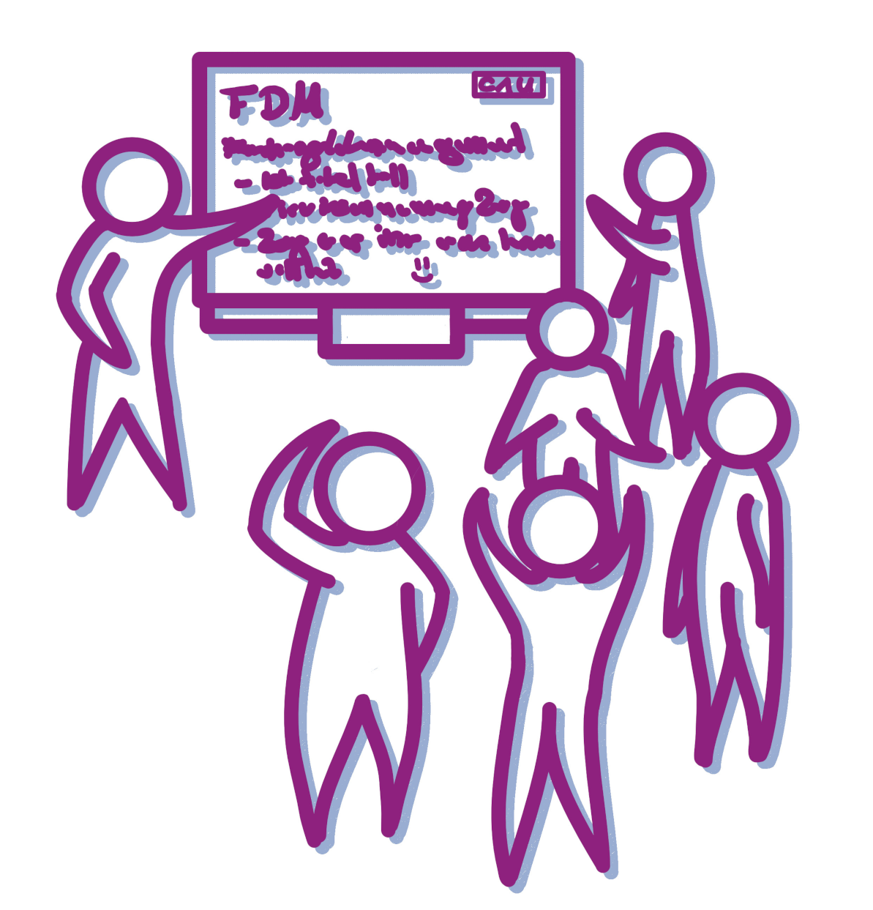

> To see this document as an interactive LiaScript rendered version, click on the
> following link/badge:
>
> 
>
> If you have questions, please contact us: [Central Research Data Management](https://www.datamanagement.uni-kiel.de/de)
>
> This work is licenced under CCBY (https://creativecommons.org/licenses/by/4.0/)

# Los geht es!

<!-- MODULES WILL BE INSERTED HERE BY BUILD SCRIPT -->

<!-- MODULE: 01_TtL-FDM_Agena_I.md -->

## Agenda

<!---
Vorstellung der Agenda

Zeit: 1-2 Min

Lernziele: 

Inhalte und Ablauf des Workshops sind für die Lernenden transparent.

Lernende stimmen sich auf die kommenden Inhalte ein.

--->

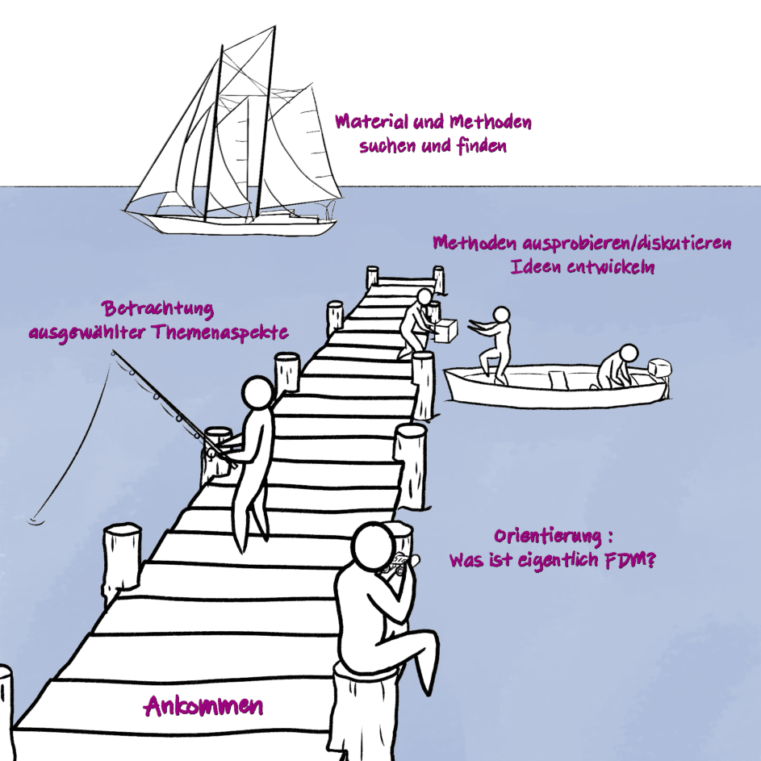
Illustration: Cleo Michelsen

Unsere Agenda für heute

- Ankommen: Workshop Regeln, Warm-up, Erwartungen, Ziele und Limitationen
- Allgemeine didaktische Hinweise
- Überblick über das Themenspektrum FDM
- Betrachtung ausgewählter Themenaspekte
- Ausprobieren und eigene Ideen/Übungen/Aufgabenstellungen entwickeln
- FDM an der CAU
- Offene Fragen/Wünsche
- Feedback

---

** Wir machen eine Stunde Mittagspause**

<!-- END MODULE: 01_TtL-FDM_Agena_I.md -->
<!-- MODULE: 01_TtL-FDM_Limitationen_I.md -->

## Limitationen

<!---
Hinweise zu Limitationen

Zeit: 1 Min

Lernziele: 

Limitationen des Workshops sind für die Lernenden transparent.

--->

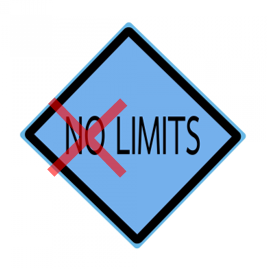

Aus zeitlichen Gründen werden wir nur ausgewählte Inhalte behandeln können.

Der Workshop ist auf die Integration von Themenaspekten des FDM in die Lehre ausgelegt. Wir gehen daher auf Grundlagen ein.

Fachspezifische Aspekte werden nicht explizit behandelt, dürfen von Ihnen aber sehr gerne in die Diskussionen eingebracht werden.

<!-- END MODULE: 01_TtL-FDM_Limitationen_I.md -->
<!-- MODULE: 01_TtL-FDM_Ziele_I.md -->

## Ziele dieses Workshops

<!---
Aufwärmübung

Zeit: 1-2 Min.

Lernziele: 

Lernziele: 

Zielef des Workshops sind für die Lernenden transparent.

Lernende stimmen sich auf die kommenden Inhalte ein.

--->

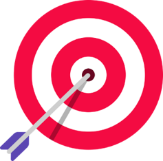

Wir möchten mit Ihnen erreichen, dass Sie am Ende des Workshops ...

* ... erläutern können, welche Aspekte zum Themenkomplex FDM gehören.  
* ... Grundbegriffe des FDM benennen und die Bedeutung von FDM für Forschungsprozesse und GWP erläutern können.
* ... Themenaspekte aus dem FDM identifizieren, die in die eigene Lehre integriert werden können.
* ... erste Ideen zur Integration von FDM-Aspekten in die eigene Lehre entwickeln.
* ... über Ideen zur Integration von FDM-Themenaspekten in die Lehre reflektiert und diskutiert haben.
* ... auch ein bisschen Spaß hatten.

<!-- END MODULE: 01_TtL-FDM_Ziele_I.md -->
<!-- MODULE: 01_TtL-FDM_Regeln_I.md -->

## Workshop Regeln

<!---
Hinweise zu Limitationen

Zeit: 1-2 Min

Lernziele: 

Limitationen des Workshops sind für die Lernenden transparent.

--->

- Machen Sie auf sich aufmerksam, wenn Sie etwas sagen wollen.
- Fragen Sie bei Unklarheiten nach.
- Hören Sie sich gegenseitig zu und lassen Sie einander ausreden.
- Helfen Sie sich gegenseitig.
- Erledigen Sie möglichst nichts nebenbei.
- Beteiligen Sie sich aktiv.
- Fehler zulassen -> positive Fehlerkultur.
- Geben Sie Bescheid, wenn Sie eine Pause benötigen.

<!-- END MODULE: 01_TtL-FDM_Regeln_I.md -->
<!-- MODULE: 01_TtL-FDM_Warm-up.md -->

## Warm up

<!---
Aufwärmübung

Zeit: 5 Min.

Lernziele: 

Die Workshopleitende und die Lernenden erfahren etwas darüber, mit wem sie im Workshop sitzen, ohne dabei sprechen zu müssen. 

Workshopleitende und Lernende erhalten einen Einblick in die Vorkenntnisse der Teilnehmenden.

online: mit abgedeckter Kamera

präsenz: Arm heben oder aufstehen

--->

> **Lassen Sie uns zum Aufwärmen ein kleines Spiel spielen:**
>
> Verdecken Sie Ihre Kamera mit einem Post-it oder einem Finger.
>
> Ich lese Aussagen vor.
>
> Bei jeder Aussage, der Sie zustimmen können, zeigen Sie sich bitte wieder und winken kurz in die Kamera.
>
> That's it !

{{1-2}}
********************************************************************************

>
Ich trinke morgens gerne Kaffee.

********************************************************************************

{{2-3}}
********************************************************************************

>
Ich bin hauptsächlich in der Lehre tätig.

********************************************************************************

{{3-4}}
********************************************************************************

>
Wenn ich mich entscheiden muss, ob ich ins Kino oder in ein Konzert gehe, entscheide ich mich wahrscheinlich für das Konzert.

********************************************************************************

{{4-5}}
********************************************************************************

>
Ich arbeite in einem naturwissenschaftlichen Bereich.

********************************************************************************

{{5-6}}
********************************************************************************

>
Ich arbeite in einem geisteswissenschaftlichen Bereich.

********************************************************************************

{{6-7}}
********************************************************************************

>
Ich kenne die FAIR-Prinzipien.

********************************************************************************

{{7-8}}
********************************************************************************

>
In meinen Lehrveranstaltungen werden bereits FDM-Aspekte behandelt.

********************************************************************************

{{8-9}}
********************************************************************************

>
Ich habe ein Haustier.

********************************************************************************

{{9-10}}
********************************************************************************

>
Ich nutze OER und/oder offene Daten in meinen Lehrveranstaltungen.

********************************************************************************

{{10-11}}
********************************************************************************

>
Ich habe eine ORCID.

********************************************************************************

{{11-12}}
********************************************************************************

>
Ich habe schon hochschuldidaktische Veranstaltungen besucht.

********************************************************************************

{{12-13}}
********************************************************************************

>
Ich arbeite im medizinischen Bereich.

********************************************************************************

{{13-14}}
********************************************************************************

>
In meinen Lehrveranstaltungen wird programmiert.

********************************************************************************

<!-- END MODULE: 01_TtL-FDM_Warm-up.md -->
<!-- MODULE: 02_TtL-FDM_OrientierungThema_I -->

## Orientierung im Thema FDM

<!---
Orientierung im Themenbereich FDM

Methode: 

Zeit: 5 Min

Lernziele:

Lernende können Orientierungshilfen, wie die LZM-FDM und andere Kompetenz- oder Lernzielrahmen, zu Themen des Forschungsdatenmanagement (FDM) benennen.

Lernende können Themen im Forschungsdatenmanagement (FDM) benennen.

Lernende reflektieren eigene Vorstellungen vom Themenfeld FDM und Vorgehensweisen in der eigenen Lehre.

--->

<!-- style: width="150" align="right" -->

Der Themenbereich Forschungsdatenmanagement ist komplex.

Wir wollen uns dem Themenbereich erstmal vorsichtig nähern...

## FDM, Kompetenzen und Lernziele

>Forschungsdatenmanagement ist ein **breites und vielschichtiges Thema**, das viele unterschiedliche Aspekte umfasst:
>
>>**Forschungsdatenmanagement (FDM)** umfasst alle Aktivitäten, die mit der
>>
>> - **Aufbereitung**,
>> - **Speicherung**,
>> - **Archivierung** und
>> - **Veröffentlichung**
>>
>>von Forschungsdaten verbunden sind.
>>
>>FDM begleitet den Forschungsprozess von den ersten Planungen bis zur Archivierung, Nachnutzung oder Löschung der Daten.[^1]

[^1] [Biernacka et al. (2023)](https://doi.org/10.5281/zenodo.10122153)

### Orientierungswerkzeuge für Lehrende

Um sich in dieser Komplexität zu orientieren, gibt es Orientierungswerkzeuge:

{{1-2}}
*********************
**Lernzielmatrix (LZM) zum Themenbereich FDM**

Die [**Lernzielmatrix Forschungsdatenmanagement**](https://zenodo.org/records/15025246) bietet:

- einen Überblick über die verschiedenen Themenbereiche und Inhaltsaspekte des FDM.
- vorformulierte Lernziele für unterschiedliche Zielgruppen und in unterschiedlichen Komplexitätsstufen.

Sie kann als Orientierungshilfe für die Planung von Lehre zum Themenbereich FDM dienen und hilft, **relevante Inhalte zu identifizieren, zu priorisieren und Lehre zu planen**.

*******************

{{2}}
*******************
**Skills4EOSC Minimum Viable Skills Profiles**

Die [**Skills4EOSC Minimum Viable Skills Profiles**](https://www.skills4eosc.eu/resources/publications/mvs) definieren **minimale Kompetenzen**, die Studierende auf verschiedenen Niveaus (Undergraduate, Master) im Bereich **Open Science** erwerben sollten.

Die Profile bieten einen kurzen Überblick auf das "Notwendigste."

*******************

### Kompetenzentwicklung in der Lehre

Der Erwerb von FDM-Kompetenzen (oft auch als "Datenkompetenzen" bezeichnet) erfolgt **schrittweise und kontextabhängig**.

Je nach Disziplin, Forschungsmethodik und institutionellem Kontext können unterschiedliche Schwerpunkte relevant sein.

=> Vorhandene Orientierungswerzeuge zur Orientierung, Themenfindung und Lernzieldefinierung nutzen.

=> Auswahl von für eigenes Fachgebiet relevanten Aspekten, Setzung eigner Schwerpunkte

=> Formulierung von fach- und veranstaltungsspezifischen Lernzielen

=> Ausarbeitung Lehr-/Lernmaterial, eigene Beispiele, Aufgabenestellungen, Lernzielkontrollen usw.

## Weiterführende Ressourcen

Green, D., Sharma, S., Souyioultzoglou, I., Torres-Ramos, G., Sowinski, C., Dostatnia, K., Schirru, L., Whyte, A., Martinez Lavanchy, P. M., Leister, C., & Saurugger, B. (2025). Student - Masters Level: Minimum Viable Skills Profile. Zenodo. https://doi.org/10.5281/zenodo.16923025

Lemaire, M., Voigt, A., & Lehmkuhl, U. (2025). Whitepaper: Datenkompetenzen für die historisch arbeitenden Disziplinen. Zenodo. https://doi.org/10.5281/zenodo.15479671

Lernzielmatrix zum Forschungsdatenmanagement @ forschungsdaten.org, online: https://www.forschungsdaten.org/index.php/Lernzielmatrix,  letzter Zugriff 21.01.2026

Petersen, B., Altemeier, F., Boße, S., Dalby, M., Düvel, N., Engelhardt, C., Fichtner, M., Hastik, C., Haugwitz, J.-M., Jacob, J., Koch, K., Kuntz, A., Manske, A., Mühlichen, A., Murcia Serra, J., Ortmeyer, J., Richter, M., Schranzhofer, H., Slowig, B., … Zollitsch, L. (2025). Lernzielmatrix zum Themenbereich Forschungsdatenmanagement (FDM) (Version 3). Zenodo. https://doi.org/10.5281/zenodo.15025246

Skills4EOSC collection of Minimum Viable Skills Profiles (MVS), online: https://www.skills4eosc.eu/resources/publications/mvs, letzter Zugriff 21.01.2026

Torres-Ramos, G., Sowinski, C., Sharma, S., Souyioultzoglou, I., Dostatnia, K., Schirru, L., Green, D., & Whyte, A. (2025). Student - Undergraduate: Minimum Viable Skills Profile. Zenodo. https://doi.org/10.5281/zenodo.16923028

<!-- END MODULE: 02_TtL-FDM_OrientierungThema_I -->
<!-- MODULE: 02_TtL-FDM_OrientierungThema_A -->

## Orientierung im Thema FDM

<!---
Orientierung im Themenbereich FDM

Methode: Gruppenarbeit

Zeit: 15 Min (10 Minuten Diskussion in Kleingruppen, 5 Minuten Review im Plenum)

Lernziele:

Lernende können Orientierungshilfen, wie die LZM-FDM und andere Kompetenz- oder Lernzielrahmen, zu Themen des Forschungsdatenmanagement (FDM) benennen.

Lernende können Themen im Forschungsdatenmanagement (FDM) benennen.

Lernende reflektieren eigene Vorstellungen vom Themenfeld FDM und Vorgehensweisen in der eigenen Lehre.

--->

<!-- style: width="150" align="right" -->

Der Themenbereich Forschungsdatenmanagement ist komplex.

Wir wollen uns dem Themenbereich erstmal vorsichtig nähern...

## ~~Gruppenarbeit~~: Lernzielmatrix zum Themenbereich FDM

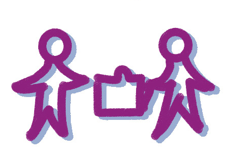

>**Kleingruppenarbeit in Break-Outs:**
>
>* Stellen Sie sich einander vor, berichten Sie gegenseitig in welchen Fachbereichen Sie tätig sind.
>
>Überfliegen Sie die in der [Lernzielmatrix](https://zenodo.org/records/15025246) zum Themenbereich FDM aufgeführten Themenbereiche/Inhaltsaspekte und diskutieren Sie in Ihrer Gruppe:
>
>* Decken sich die aufgeführten Aspekte mit Ihren Vorstellungen?
>* Sind Aspekte aufgeführt, die Sie nicht erwartet hätten oder fehlen Ihnen bestimmte Aspekte?
>* Wenn Sie an Ihre eigene Lehre denken, gibt es Aspekte, die bereits vermittelt werden?

>Notieren Sie Stichpunkte zu Ihren Diskussionen auf dem Miro-Board: https://miro.com/app/board/uXjVM_wsd4I=/?moveToWidget=3458764556852019029&cot=14
>
>* Bestimmen Sie eine Person, die Sie und Ihre Diskussion im Plenum kurz vorstellt.

## Weiterführende Ressourcen

Green, D., Sharma, S., Souyioultzoglou, I., Torres-Ramos, G., Sowinski, C., Dostatnia, K., Schirru, L., Whyte, A., Martinez Lavanchy, P. M., Leister, C., & Saurugger, B. (2025). Student - Masters Level: Minimum Viable Skills Profile. Zenodo. https://doi.org/10.5281/zenodo.16923025

Lemaire, M., Voigt, A., & Lehmkuhl, U. (2025). Whitepaper: Datenkompetenzen für die historisch arbeitenden Disziplinen. Zenodo. https://doi.org/10.5281/zenodo.15479671

Petersen, B., Altemeier, F., Boße, S., Dalby, M., Düvel, N., Engelhardt, C., Fichtner, M., Hastik, C., Haugwitz, J.-M., Jacob, J., Koch, K., Kuntz, A., Manske, A., Mühlichen, A., Murcia Serra, J., Ortmeyer, J., Richter, M., Schranzhofer, H., Slowig, B., … Zollitsch, L. (2025). Lernzielmatrix zum Themenbereich Forschungsdatenmanagement (FDM) (Version 3). Zenodo. https://doi.org/10.5281/zenodo.15025246

https://www.forschungsdaten.org/index.php/Lernzielmatrix

Torres-Ramos, G., Sowinski, C., Sharma, S., Souyioultzoglou, I., Dostatnia, K., Schirru, L., Green, D., & Whyte, A. (2025). Student - Undergraduate: Minimum Viable Skills Profile. Zenodo. https://doi.org/10.5281/zenodo.16923028

<!-- END MODULE: 02_TtL-FDM_OrientierungThema_A -->
<!-- MODULE: 04_0_TtL-FDM_FDM-Grundbegriffe -->

## Begriffsdefinition Forschungsdatenmanagement

{{1}}
********************************************************************************
Das Portal **Forschungsdaten.info** definiert den Begriff **"Forschungsdatenmanagement"** folgendermaßen:

> Forschungsdatenmanagement (FDM) umfasst die Prozesse der **Transformation**, **Selektion** und **Speicherung** von Forschungsdaten mit dem gemeinsamen **Ziel**, diese *langfristig* und *personenunabhängig* **zugänglich**, **nachnutzbar** und **nachprüfbar** zu halten.
>
>(*forschungsdaten.info, letzter Zugriff 29.11.2022*)

********************************************************************************

## Begriffsdefinition Forschungsdaten

**Und was sind Forschungsdaten?**

{{2}}
********************************************************************************
Die **DFG** definiert den Begriff **"Forschungsdaten"** folgendermaßen:

> „Zu Forschungsdaten zählen u. a. Messdaten, Laborwerte, audiovisuelle Informationen, Texte, Surveydaten oder Beobachtungsdaten, methodische Testverfahren sowie Fragebögen. Korpora und Simulationen können ebenfalls zentrale Ergebnisse wissenschaftlicher Forschung darstellen und werden daher ebenfalls unter den Begriff Forschungsdaten gefasst. Da Forschungsdaten in einigen Fachbereichen auf der Analyse von Objekten basieren (z. B. Gewebe-, Material-, Gesteins-, Wasser- und Bodenproben, Prüfkörper, Installationen, Artefakte und Kunstgegenstände), muss der Umgang mit diesen ebenso sorgfältig sein und eine fachlich adäquate Nachnutzungsmöglichkeit, wann immer sinnvoll und möglich, mitgedacht werden. Ähnliches gilt, wenn Software für die Entstehung oder Verarbeitung von Forschungsdaten erforderlich ist."
>
> (*DFG 2021*)

********************************************************************************

{{3}}
********************************************************************************

Etwas weniger kompliziert definierte das PrePARe Projekt der Camebridge University den Begriff **Forschungsdaten** als:

> "Any any information you use in your research."
>
> (*University of Camebridge PrePARe Project*)

********************************************************************************

### Beispiele für Forschungsdaten

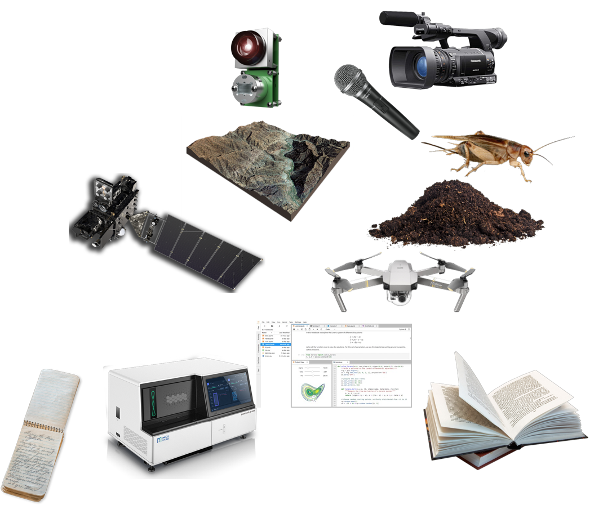

- Audio- und Videoaufzeichnungen
- Tagebücher
- Daten aus geografischen Informationssystemen (GIS)
- Labor- und Feldnotizen
- Modell-, Skript- und Forschungssoftwarecode
- Bilder und Abbildungen
- Fragebögen und Codebücher
- Proben und Artefakte
- Sensor-Daten
- Sequenzierdaten
- Spektren
- Text- und Tabellenkalkulationsdokumente
- Textkorpora und Annotationen
- Topographie-Daten
- Abschriften

## Forschungsdatenlebenszyklus
<!---
Lernende können	Phasen des Forschungsdatenlebenszyklus benennen. (LZ-ID: 01_005_0079)
--->

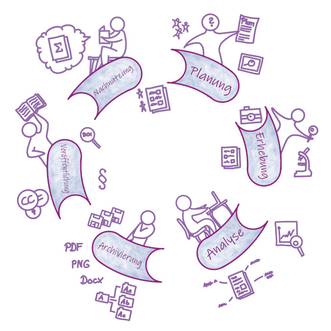

<SMALL>Illustration: Cleo Michelsen, basierend auf dem Forschungsdatenlebenszyklus des UK Data Service</SMALL>

{{1}}
********************************************************************************
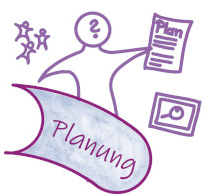

**Planung**:

* Auf welche Weise entstehen neue Daten?
* Werden Daten wiederverwendet?
* Welche Datentypen, im Sinne von Datenformaten (z. B. Bilddaten, Textdaten oder Messdaten in Tabellen) entstehen?
* Welche Analysen sind geplant?
* Welches Datenvolumen ist zu erwarten?
* Welche rechtlichen und ethischen Aspekte müssen berücksichtigt werden?
* Wer ist verantwortlich?

---

********************************************************************************

{{2}}
********************************************************************************
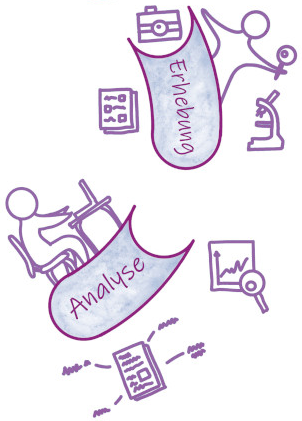

**Erhebung und Analyse**:

* Welche Ansätze werden verfolgt, um die Daten nachvollziehbar zu dokumentieren?
* Welche Maßnahmen werden getroffen, um eine hohe Qualität der Daten zu gewährleisten?
* Welche digitalen Methoden und Werkzeuge (z. B. Software) sind zur Nutzung und Analyse der Daten erforderlich?
* Auf welche Weise werden die Daten während der Projektlaufzeit gespeichert und gesichert?
* Wie wird die Sicherheit sensibler Daten während der Projektlaufzeit gewährleistet (Zugriffs- und Nutzungsverwaltung)?

********************************************************************************
---

{{3}}
********************************************************************************

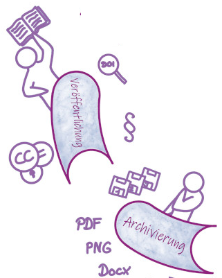

**Archivierung & Veröffentlichung**:

* Welche rechtlichen Besonderheiten bestehen im Zusammenhang mit dem Umgang mit Forschungsdaten in dem Forschungsprojekt?
* Sind Auswirkungen oder Einschränkungen in Bezug auf die spätere Veröffentlichung bzw. Zugänglichkeit zu erwarten?
* Auf welche Weise werden nutzungs- und urheberrechtliche Aspekte sowie Eigentumsfragen berücksichtigt?
* Existieren wichtige wissenschaftliche Kodizes bzw. fachliche Normen, die Berücksichtigung finden sollten?

---
********************************************************************************

{{4}}
********************************************************************************

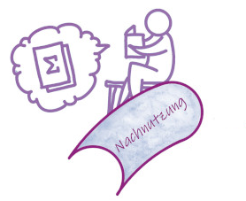

**Nachnutzung**:

* Welche Daten bieten sich für eine Nachnutzung besonders an?
* Nach welchen Kriterien werden Forschungsdaten ausgewählt, um diese für die Nachnutzung durch andere zur Verfügung zu stellen?
* Planen Sie die Archivierung Ihrer Daten in einer geeigneten Infrastruktur?
* Falls ja, wie und wo? Gibt es Sperrfristen?
* Wann sind die Forschungsdaten für Dritte nutzbar?

********************************************************************************

## FAIR-Prinzipien

<!---
Lernende können	die FAIR-Prinzipien	benennen. (LZ-ID: 01_007_0117)
Lernende können	die FAIR-Prinzipien	erläutern. LZ-ID: 01_007_0118)
--->
{{0-1}}
****************
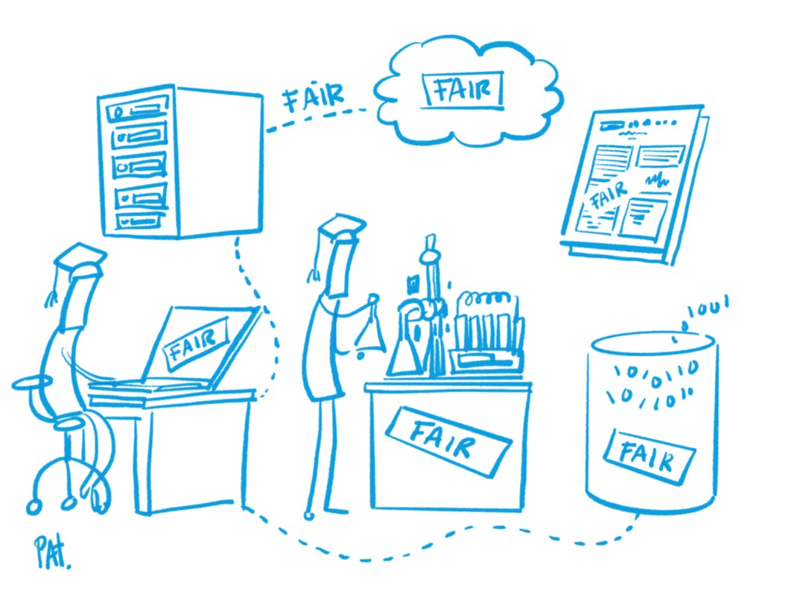 

Ein wichtiges Ziel des strukturierten Foschungsdatenmanagements ist es, Daten langfristig und personenunabhängig zugänglich, nachnutzbar und nachprüfbar zu halten.

Die [**FAIR-Prinzpien**](https://www.nature.com/articles/sdata201618) dienen als Leitfaden für die Auswahl von Handlungsoptionen, die sicherstellen sollen, dass die im Rahmen von Forschung geschaffenen digitalen Artefakte auffindbar, zugänglich, interoperabel und wiederverwendbar sind.

<small>Illustration: Patrick Hochstenbach in Engelhardt, Claudia et. al. (2021).</small>

****************

{{1}}
>**F**indable

{{2-3}}
****************
Der erste Schritt bei der (Wieder-)Verwendung von Daten besteht darin, sie zu finden. Metadaten und Daten sollten sowohl für Menschen als auch für Computer leicht zu finden sein. Maschinenlesbare Metadaten sind für das automatische Auffinden von Datensätzen und Diensten unerlässlich und daher ein wesentlicher Bestandteil des FAIRification-Prozesses.

F1. (Meta)data are assigned a globally unique and persistent identifier

F2. Data are described with rich metadata (defined by R1 below)

F3. Metadata clearly and explicitly include the identifier of the data they describe

F4. (Meta)data are registered or indexed in a searchable resource

***************

{{1}}
>**A**ccessible

{{3-4}}
***********************
Sobald der Nutzer die gewünschten Daten gefunden hat, muss er wissen, wie er auf sie zugreifen kann, möglicherweise einschließlich Authentifizierung und Autorisierung.

A1. (Meta)data are retrievable by their identifier using a standardised communications protocol

A1.1 The protocol is open, free, and universally implementable

A1.2 The protocol allows for an authentication and authorisation procedure, where necessary

A2. Metadata are accessible, even when the data are no longer available

******************

{{1}}
>**I**nteroperable

{{4-5}}
**********************
Daten sollten in einer Form vorliegen, die die Nutzung mit diversen Anwendungen oder Arbeitsabläufen für die Analyse, Speicherung und Verarbeitung ermöglichen.

I1. (Meta)data use a formal, accessible, shared, and broadly applicable language for knowledge representation.

I2. (Meta)data use vocabularies that follow FAIR principles

I3. (Meta)data include qualified references to other (meta)data

**********************

{{1}}
>**R**eusable

{{5-6}}
***************
Das Ziel von FAIR ist es, die Wiederverwendung von Daten zu optimieren. Um dies zu erreichen, sollten Metadaten und Daten gut dokumentiert und beschrieben sowie mit einer eindeutigen Angabe bzgl. der Nutzungsbedingungen (Lizenzen) versehen sein.

R1. Meta(data) are richly described with a plurality of accurate and relevant attributes

R1.1. (Meta)data are released with a clear and accessible data usage license

R1.2. (Meta)data are associated with detailed provenance

R1.3. (Meta)data meet domain-relevant community standards

**************

## Datenmanagementpläne

{{0-1}}
**********

>**Datenmanagementpläne beinhalten …**
>
> - … alle Informationen, die die Sammlung, Aufbereitung, Speicherung, Archivierung und Veröffentlichung von Forschungsdaten im Rahmen eines Forschungsprojekts hinreichend beschreiben und dokumentieren.
>
> - „[… die] Analyse des Workflows von der Erzeugung der Daten bis zu deren Nutzung"^1^
>
><small>^1^ Ludwig, J.; Enke, H. (Hrsg.): Leitfaden zum Forschungsdaten-Management. Handreichungen aus dem WissGrid-Projekt. Verlag Werner Hülsbusch: Glückstadt, 2013. ISBN: 978-3-86488-032-2</small>

*********
{{1-2}}
**********

>Der Datenmanagementplan dokumentiert die (geplante) Erhebung, Speicherung, Dokumentation, Pflege, Verarbeitung, Weitergabe, Veröffentlichung und Aufbewahrung der Daten, ebenso wie die erforderlichen Ressourcen, rechtlichen Randbedingungen und verantwortlichen Personen. Somit trägt ein DMP zur Qualität, langfristigen Nutzbarkeit und Sicherheit der Daten bei und unterstützt zum Beispiel bei der Umsetzung der FAIR-Prinzipien.^2^ 
>
><small>^2^ [Forschungsdaten.info](https://forschungsdaten.info/praxis-kompakt/glossar/#c269828)</small>

*********

### Bestandteile eines DMP

>**Ein DMP sollte Informationen zu...**
>
> - Administration (Projektname, Datenurheber*in, weitere Mitwirkende, Kontakt, Förderprogramm usw.)
>
> - Projekt- und Datensatzbeschreibung
>
> - Datentypen, -formate, -umfang
>
> - Angaben zu Metadaten und Standards
>
> - Datenaustausch und -zugang
>
> - Archivierung und Sicherung der Daten
>
> - Verantwortlichkeiten und Rechtliche Aspekte
>
> - Kosten
>
>**beeinhalten.**
>
>**--> Der Umfang kann zwischen wenigen Absätzen und mehreren Seiten variieren!**

### Anforderungen der Förderorganisationen

| Förderorganisation | Forderung                              | Abgabe bei Antrag                            | Inhalt                  | Bericht          |
| ------------------ | -------------------------------------- | -------------------------------------------- | ----------------------- | ---------------- |
| DFG                | Angaben zum Umgang mit Forschungsdaten | als integraler Bestandteil des Antragstextes | DFG-Checkliste          | Projektende      |
| BMBF               | Plan erforderlich je nach Förderlinie  | ja, wenn erforderlich                        | programmabhängig        | programmabhängig |
| EC Horizon Europe  | DMP                                    | nein, innerhalb der ersten 6 Projektmonate   | Horizon Europe Template | bei Änderungen & Projektende      |
| VWStiftung         | DMP                                    | ja                                           | "Basis DMP-Template"    | living document  | 

=> Während die Templates der nationalen Förderer sich eher am Datenmanagementzyklus orgientieren, orientiert sich das Template der EU an den FAIR-Prinzipien.

### DMP Templates & Tools

>- Wir führen regelmäßig Workshops zur Erstellung von DMPs an der WissWB durch.
>
> Sie finden ein **DMP-Template** auf den Seiten des **Zentralen Forschungsdatenmanagements**: https://www.datamanagement.uni-kiel.de/de/service/materialien
>
>- Weiterführende Informationen sowie eine Liste an **DMP-Tools** stellt [**forschungsdaten.info**](https://forschungsdaten.info/themen/informieren-und-planen/datenmanagementplan/) zur Verfügung.
>
>- Eine voll funktionsfähige Demoversion von RDMO erreichen Sie hier: https://rdmo.aip.de/ 

## GWP & Open Science

### Gute Wissenschaftliche Praxis

{{0-2}}
********************************************************************************
>"***Gute Wissenschaftliche Praxis*** oder ***Wissenschaftliche Integrität*** bildet die Grundlage einer vertrauenswürdigen Wissenschaft. Sie ist eine Ausprägung **wissenschaftlicher Selbstverpflichtung**, die den **respektvollen Umgang** miteinander, mit Studienteilnehmerinnen und -teilnehmern, Tieren, Kulturgütern und der Umwelt umfasst und das unerlässliche **Vertrauen der Gesellschaft in Wissenschaft** stärkt und fördert. (...) Die Wissenschaft selbst gewährleistet durch **redliches Denken** und **Handeln**, nicht zuletzt auch durch **organisations- und verfahrensrechtliche Regelungen**, gute wissenschaftliche Praxis."
>
> [*Leitlinien zur Sicherung guter wissenschaftlicher Praxis, DFG 2019*](https://zenodo.org/records/14281892), [*Verfahrensordnung zum Umgang mit wissenschaftlichem Fehlverhalten (VerfOwF), DFG 2024*](https://www.dfg.de/resource/blob/168578/caf3d827f4a743b6d23d14b79c90bfc6/dfg-80-01-v0819-de-data.pdf)

********************************************************************************

{{1-2}}
********************************************************************************
>***Gute wissenschaftliche Praxis (GWP)*** umfasst die grundlegenden **Werte** und **Normen** des professionellen wissenschaftlichen Arbeitens. Diese Grundsätze, wie beispielsweise die Wahrung von **Ehrlichkeit** & **Transparenz**, sind dabei zunächst einmal unabhängig von der Fachrichtung. Alle Wissenschaftler:innen tragen dabei die Verantwortung dafür, dass das eigene Verhalten diesen Standards entspricht.
>
>*(Saskia Kaiser, Jennifer Schlüß, 2025: "Einführung in die gute wissenschaftliche Praxis")*

********************************************************************************

{{2}}
********************************************************************************

Gute Wissenschaftliche Praxis...
---

> ...betrifft:
>
> * redliches Denken und Handeln Einzelner sowie
> * organisations- und verfahrensrechtliche Regelungen

********************************************************************************

{{3}}
********************************************************************************
> ...sorgt für:
>
> * Vertrauenswürdigkeit der Wissenschaft
>
> * Vertrauen der Gesellschaft in Wissenschaft

********************************************************************************

{{4}}
********************************************************************************
> ...verlangt die Selbstverpflichtung zu respektvollem Umgang mit:
>
> * Studienteilnehmer:innen
> * Tieren
> * Kulturgütern und Umwelt

********************************************************************************

### Open Science

{{1-2}}
********************************************************************************
Open Science umfasst die unterschiedlichsten Aspekte der Wissenschaft.

********************************************************************************

{{2-3}}
********************************************************************************
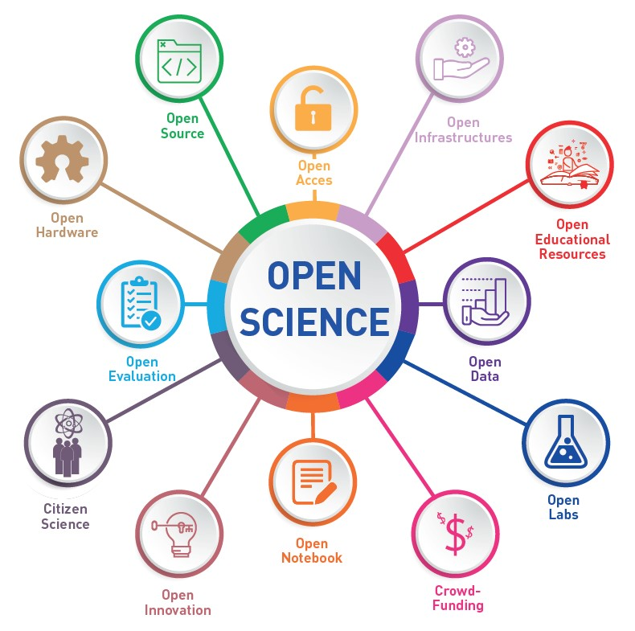 

(CC-BY 4.0, UNESCO)

********************************************************************************

{{3-4}}
********************************************************************************

>**Was:** Unter dem Begriff Open Science versteht man Strategien und Verfahren, die darauf abzielen, alle Bestandteile des wissenschaftlichen Prozesses über das Internet offen zugänglich, nachvollziehbar und nachnutzbar zu machen.
>
>**Wieso:** Um Wissenschaft, Gesellschaft und Wirtschaft neue Möglichkeiten im Umgang mit wissenschaftlichen Erkenntnissen zu eröffnen.
>
>**Ziel:** Die Qualität der Forschung verbessern und die Forschungsförderung effizienter einsetzen. Open Science ist damit ein wichtiger Baustein, um gute wissenschaftliche Praxis zu sichern. Darüber hinaus soll der Wissenstransfer in Gesellschaft, Wirtschaft und Politik durch Offenheit und Transparenz verbessert werden.
>
>Open Science basiert auf vier Grundprinzipien:
>
>* 
Transparenz

>
>* 
Reproduzierbarkeit

>
>* 
Wiederverwendbarkeit

>
>* 
Offene Kommunikation

>
>(https://ag-openscience.de/open-science/)

********************************************************************************

{{4-5}}
********************************************************************************

"Ein zentrales Element von Open Science ist die Forderung nach Offenheit der digitalen Forschung und Lehre. Das bedeutet, dass Forschungsergebnisse, Forschungsdaten, Forschungsmethoden und -verfahren sowie Lehr- und Lerninhalte, Software und Werkzeuge kostenlos zur Verfügung stehen und nachgenutzt werden können"

(Kunst, Sabine & Degkwitz, Andreas. (2019). Open Science - the new paradigm for research and education?. 10.18452/19871.)

********************************************************************************

{{5}}
********************************************************************************

FAIR = Open?

********************************************************************************

## Publikation
Wie können Sie Daten veröffentlichen und weitergeben?
----

{{1}}
********************
> Ergänzung zu einem von peer-review Artikel („enhanced publication")
********************

{{2-3}}
****************
- als Ergänzung zu dem zugehörigen Artikel
- als alleinstehenden Datensatz in einem Repository mit einem Link zum entsprechenden Artikel.

  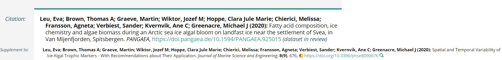

**********************

{{1}}
********************
> Unabhängiges Informationsobjekt in einem Repositorium
********************

{{3-4}}
********************

* disziplinspezifische Repositorien, z.B. [Datorium](https://data.gesis.org/sharing/#!Home), [Pangaea](https://www.pangaea.de/)

* fächerübergreifende Repositorien, z. B. [ZENODO](https://zenodo.org/)

* institutionelle Repositorien, z. B. [Refubium](https://www.fu-berlin.de/sites/open_access/refubium/index.html), [opendata@uni-kiel.de](https://opendata.uni-kiel.de/content/index.xml)

Beispiel:

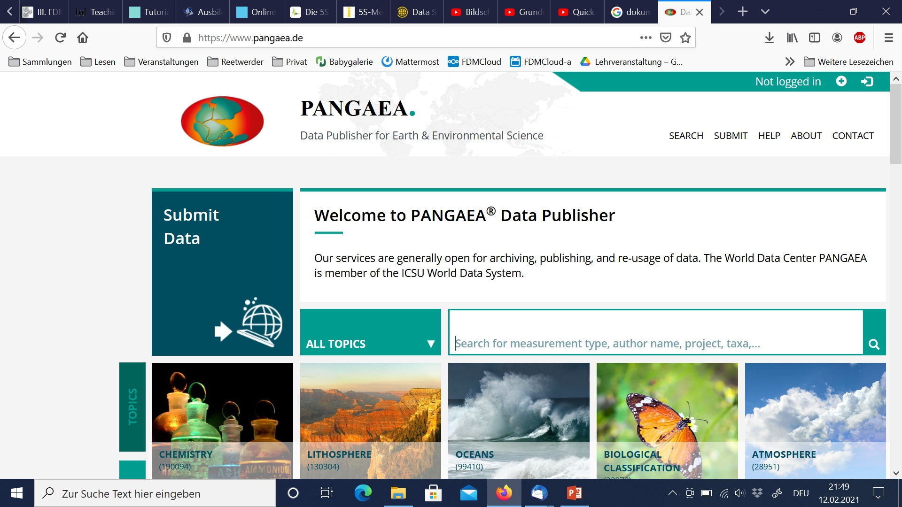
Source: https://www.pangaea.de/, Zugriff 10.02.2021

  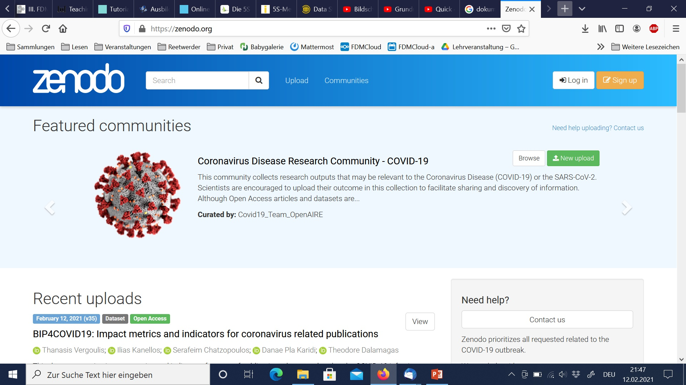
  Source: https://zenodo.org/, Zugriff 10.02.2021

*********************

{{1}}
********************
> Data journals

********************

{{4-5}}
***************************

- detaillierte Beschreibung von Forschungsdaten

- teilweise peer-reviewed

Beispiel:

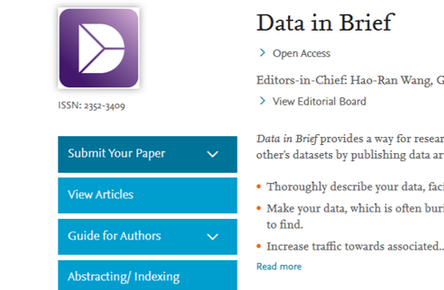
Source: https://www.earth-system-science-data.net, Zugriff 10.02.2021

  
  Source: https://www.journals.elsevier.com/data-in-brief, Zugriff 10.02.2021

***************************

#### Open Data at Kiel University

>**Information und services @Kiel University:**
>
>* Es gibt keine Richtlinien zur Förderung von Open Data an der CAU :-(
>* [Central Research Data Management](https://www.fdm.uni-kiel.de/en?set_language=en) stellt Informationen, Hilfe und Dienstleistungen bereit
>* [**opendata@uni-kiel**](https://opendata.uni-kiel.de/content/index.xml?lang=en) ist das Open Data Repository der CAU

>Veröffentlichen üben:
>
>https://datenrepositorium00.rz.uni-kiel.de 
>
>Dies ist ein dauerhaftes Testsystem mit dem ein Publikationsprozess gefahrlos durchgespielt werden kann.
>
>Nur innerhalb des CAU Netzes zu erreichen!

### Textpublikation

#### Open Access at Kiel University

>**Information und Services @Kiel University:**
>
>* [Richtlinien zur Förderung von Open Access an der CAU](https://www.praesidium.uni-kiel.de/de/dokumente/leitlinien-der-cau-zu-open-access)
>* [Universitätsbibliothek](https://www.ub.uni-kiel.de/en/publishing/publishing/information?set_language=en) bietet Informationen und Services.
>* [Finanzierung von OA](https://www.ub.uni-kiel.de/en/publishing/funding-of-oa-publications?set_language=en)
>* [MACAU ist das Open Access Repository der CAU](https://macau.uni-kiel.de/content/publish/information.xml?lang=en)

### Repositorien
{{0-2}}
**Was ist ein Repositorium?**

{{1-2}}
****************
>*"Ein Repositorium (lateinisch repositorium, ‚Lagerhaus') ist ein verwalteter Ort zur Aufbewahrung geordneter Dokumente, die der Öffentlichkeit oder einem begrenzten Benutzerkreis zugänglich sind. Ein Archiv (lat. archivum, 'Aktenschrank') hingegen verwaltet nur historische Dokumente. „*
>>*"Digitale Forschungsdaten-Repositorien sind Informationsinfrastrukturen, die digitale Forschungsdaten...möglichst dauerhaft speichern und organisieren...um die Auffindbarkeit und Zugänglichkeit der Daten zu gewährleisten... "*
>
>^Quelle: Esther Asef, Katarzyna Biernacka, Elisabeth Böker,Sarah Ann Danker, Juliane Jacob, Janna Neumann, Britta Petersen, Jessica Rex und Ute Trautwein-Bruns (2021): Data Sharing interaktiv vermitteln^
************************

{{2-5}}
**Wie das passende Repositorium finden?**

{{3-4}}
***************

**re3data.org**

- Sammlung von Repositorien
- Weltweit
- Verschiedene Disziplinen
- Forscher, Förderer, Verlage und Institutionen

***************

{{4-5}}
*************

**risources.dfg.de**

- Angebot der DFG
- Informationsportal
- Deutschlandweit
- Forschungsinfrastrukturen

************

## Dateiformate

{{0-1}}
****************
**Mit welchen Dateinformaten arbeiten Sie?**
<iframe src="https://answergarden.ch/embed/3189718" width="100%" height="500px" style="border: none;" scrolling="no" frameborder="0" title="AnswerGarden" allowTransparency="true">
<a href="https://answergarden.ch/3189718">Go to AnswerGarden</a>
</iframe>
***************

{{1}}
********************************************************************************

**Bzgl. Interoperabilität und Nachnutzbarkeit empfehlenswerte Datenformate:**

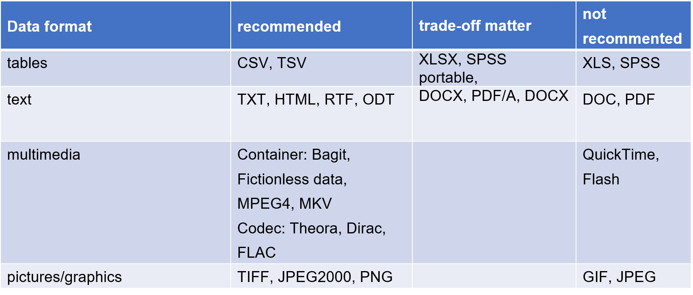

********************************************************************************

## Weiterführende Ressourcen

<!-- END MODULE: 04_0_TtL-FDM_FDM-Grundbegriffe -->
<!-- MODULE: 05_TtL-FDM_Wrap-Up -->

<!--

author:   Britta Petersen, Linda Zollitsch
email:    
version:  0.1.0
language: de
narrator: Deutsch male

icon:     images/Logo_cau-norm-de-lilagrey-rgb-0720_2022.png

comment:  This document provides a brief introduction to research data management for lecturers. It provides an overview of rdm related topics as well as some didactic and methodologies for teaching rdm to students.

-->

# Wrap Up

{{0-1}}
********************************************************************************

**Wir schauen uns ein kurzes Video an. Dies verdeutlicht nochmal die Gründe, warum Forschungsdatenmanagement wichtig ist.**

Movie time!

---

<iframe width="560" height="315" src="https://www.youtube.com/embed/66oNv_DJuPc" title="YouTube video player" frameborder="0" allow="accelerometer; autoplay; clipboard-write; encrypted-media; gyroscope; picture-in-picture; web-share" allowfullscreen></iframe>

---

********************************************************************************

{{1}}
********************************************************************************
>**Gutes Forschungsdatenmanagement trägt bei zu ...**
>
> - Reproduzierbarkeit von Ergebnissen (GWP)
> - Rückverfolgbarkeit und Transparenz der Forschung (GWP)
> - gute Auffindbarkeit von Daten, z. B. durch aussagekräftige Benennung und beschreibende Metadaten
> - Wissenserhalt – Daten sollen unabhängig von einzelnen Menschen, Projekten oder Institutionen zugänglich sein (GWP)
> - Erleichterung der Zusammenarbeit
> - Vorbeugung von Datenverlusten
> - Kostenersparnis, z. B. durch Nachnutzung statt neuer Erhebung
> - Transfer der Daten in zukünftige Projekte
> - Erhöhung der Sichtbarkeit der eigenen Arbeit durch Forschungsdatenzitation
> - Erfüllung von Auflagen der Drittmittelgeber
> - ….

********************************************************************************

<!-- END MODULE: 05_TtL-FDM_Wrap-Up -->
<!-- MODULE: 06_TtL-FDM_Feedback_WieWars_A -->

<!--

author:   Britta Petersen, Linda Zollitsch
email:    
version:  0.1.0
language: de
narrator: Deutsch male

icon:     images/Logo_cau-norm-de-lilagrey-rgb-0720_2022.png

comment:  This document provides a brief introduction to research data management for lecturers. It provides an overview of rdm related topics as well as some didactic and methodologies for teaching rdm to students.

-->

# ~~Feedback~~: Na, wie war´s?

> 
>
>Sie haben heute Abend noch eine Verabredung mit einigen Freunden. Ihre Freunde erinnern sich daran, dass Sie heute an einem Workshop zum Thema Forschungsdatenmanagement teilgenommen haben und fragen: "Na, wie war's"?
>
>Was antworten Sie?

<!-- END MODULE: 06_TtL-FDM_Feedback_WieWars_A -->
<!-- MODULE: 06_TtL-FDM_Herzlichen-Dank_I.md -->

<!--

author:   Britta Petersen, Linda Zollitsch
email:    
version:  0.1.0
language: de
narrator: Deutsch male

icon:     images/Logo_cau-norm-de-lilagrey-rgb-0720_2022.png

comment:  This document provides a brief introduction to research data management for lecturers. It provides an overview of rdm related topics as well as some didactic and methodologies for teaching rdm to students.

-->

# Herzlichen Dank!

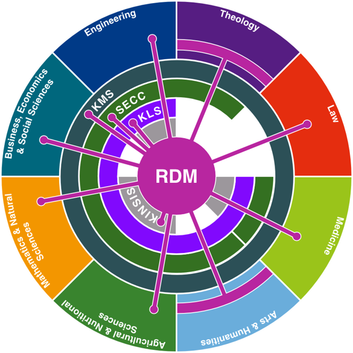

Mehr zum FDM an der CAU finden Sie hier: https://www.fdm.uni-kiel.de/de

<!-- END MODULE: 06_TtL-FDM_Herzlichen-Dank_I.md -->