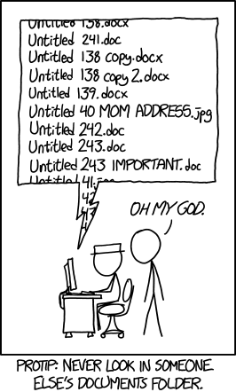
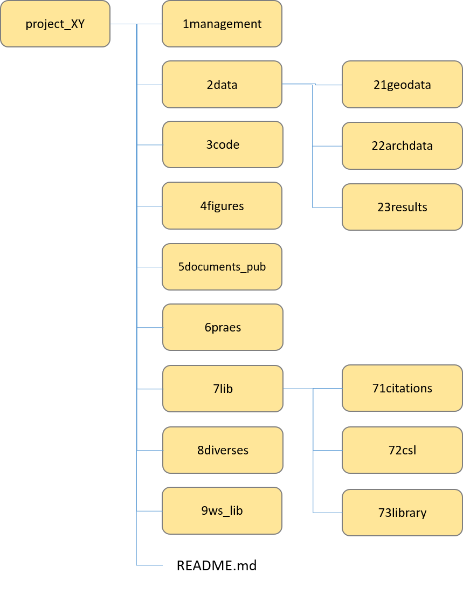
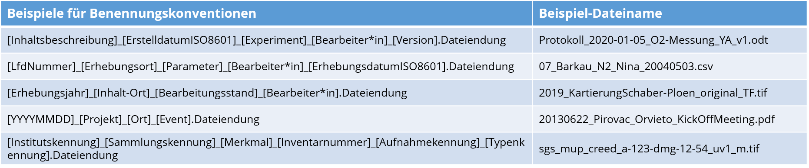
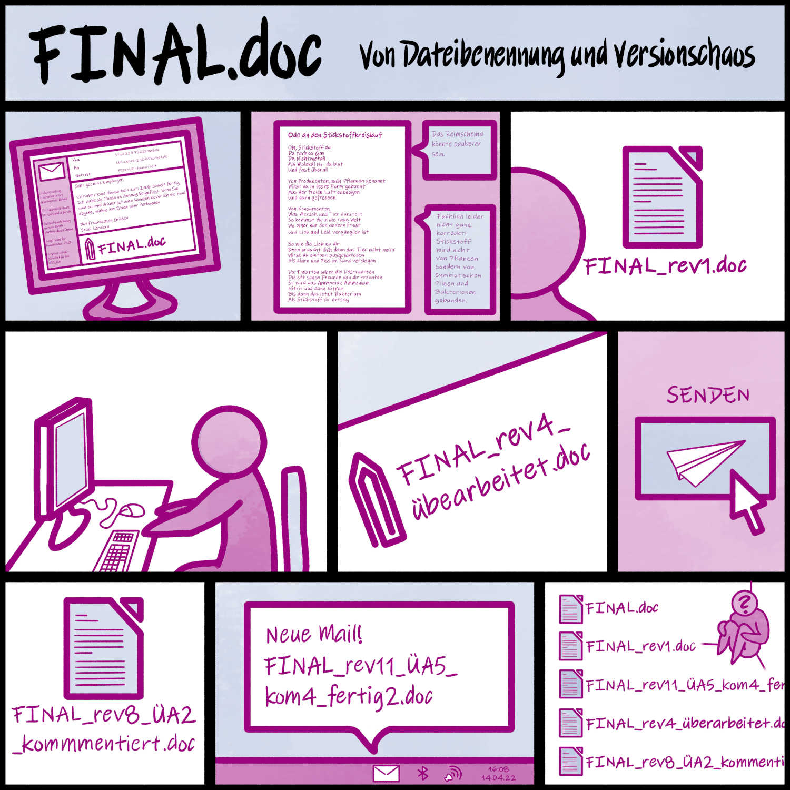
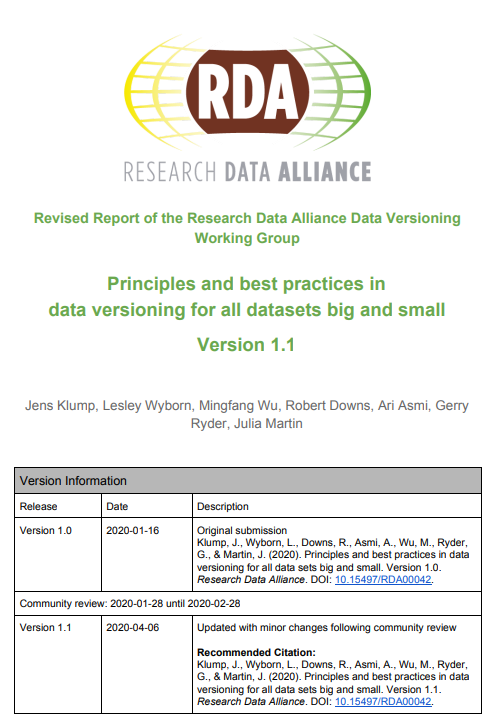
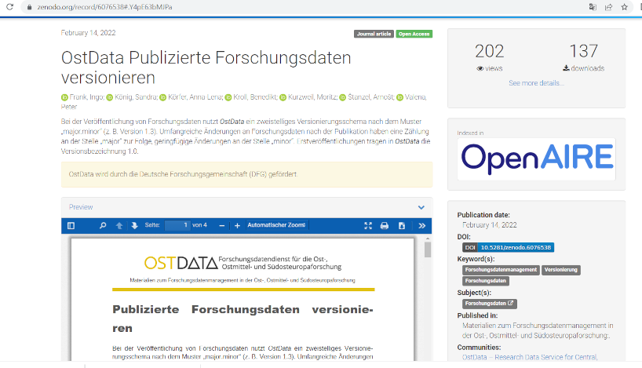

<!--

author:   Britta Petersen, Linda Zollitsch
email:    
version:  0.1.0
language: de
narrator: Deutsch male

icon:     images/Logo_cau-norm-de-lilagrey-rgb-0720_2022.png

comment:  This document provides a brief introduction to research data management for lecturers. It provides an overview of rdm related topics as well as some didactic and methodologies for teaching rdm to students.

-->

# Train-the-Lecturer Forschungsdatenmanagement

<script input="button">
alert("Disclaimer: Please note that you are leaving the CAU net once you open this presentation in your browser. This presentation includes links to other third party websites and services. These sites are not under our control. RDM@CAU is not responsible for the content of linked third party websites. Please be aware that the security and privacy policies on these sites may be different than CAU policies. Please read third party privacy and security policies closely.")

"Disclaimer"
</script>

<center></center>

<div style="page-break-after: always;"></div>

> To see this document as an interactive LiaScript rendered version, click on the
> following link/badge:
>
> [](https://liascript.github.io/course/?https://raw.githubusercontent.com/RDM4CAU/TtL-FDM/main/TtL-FDM_Workshop.md#1)
>
> If you have questions, please contact us: [Central Research Data Management](https://www.datamanagement.uni-kiel.de/de)
>
> This work is licenced under CCBY (https://creativecommons.org/licenses/by/4.0/)

<div style="page-break-after: always;"></div>

<!-- MODULES WILL BE INSERTED HERE BY BUILD SCRIPT -->

<!-- MODULE: 01_TtL-FDM_Agena_I.md -->

## Agenda

<!---
Vorstellung der Agenda

Den Teilnehmenden (TN) wird der grobe Ablauf des Workshops transparent gemacht. Dies soll das Einstimmen in die kommenden Inhalte sowie das Selbstmanagement der Teilnehmenden unterstützen.

An dieser Stelle können auch organisatorische Absprachen zu individuellen Bedarfen (z. B. "Kind muss um 12:30 Uhr von Kita abgeholt werden) mit den TN getroffen werden.

Zeit: 1-2 Min

Lernziele: 

- Lernende können den groben Ablauf des Workshops beschreiben und dessen Inhalte benennen.

--->


Illustration: Cleo Michelsen

Unsere Agenda für heute

- Ankommen: Workshop Regeln, Warm-up, Erwartungen, Ziele und Limitationen
- Allgemeine didaktische Hinweise
- Überblick über das Themenspektrum FDM
- Betrachtung ausgewählter Themenaspekte
- Ausprobieren und eigene Ideen/Übungen/Aufgabenstellungen entwickeln
- FDM an der CAU
- Offene Fragen/Wünsche
- Feedback

---

** Wir machen eine Stunde Mittagspause**

<div style="page-break-after: always;"></div>


<!-- END MODULE: 01_TtL-FDM_Agena_I.md -->
<!-- MODULE: 01_TtL-FDM_Limitationen_I.md -->

## Limitationen

<!---
Vorstellung der Limitationen

Den Teilnehmenden (TN) werden die Limitationen des Workshops transparent gemacht. Dies unterstützt eine realistische Einschätzung der Workshopinhalte und hilft, Erwartungen entsprechend einzuordnen.

Die explizite Benennung der Limitationen trägt dazu bei, Klarheit über den Umfang des Workshops zu schaffen und mögliche Missverständnisse zu vermeiden.

Zeit: 1–2 Min

Lernziele:

- Lernende können die zentralen Limitationen des Workshops benennen.
- Lernende können die Bedeutung der Limitationen für ihre Erwartungen einordnen.

--->


Aus zeitlichen Gründen werden wir nur ausgewählte Inhalte behandeln können.

Der Workshop ist auf die Integration von Themenaspekten des FDM in die Lehre ausgelegt. Wir gehen daher auf Grundlagen ein.

Fachspezifische Aspekte werden nicht explizit behandelt, dürfen von Ihnen aber sehr gerne in die Diskussionen eingebracht werden.

<div style="page-break-after: always;"></div>


<!-- END MODULE: 01_TtL-FDM_Limitationen_I.md -->
<!-- MODULE: 01_TtL-FDM_Regeln_I.md -->

## Workshop-Regeln

<!---
Vorstellung der Workshopregeln

Den Teilnehmenden (TN) werden die Workshopregeln transparent gemacht. Dies unterstützt eine angenehme und respektvolle Arbeitsatmosphäre sowie eine klare Orientierung im sozialen Miteinander während des Workshops.

Die explizite Benennung der Regeln trägt dazu bei, gemeinsame Erwartungen zu klären und eine konstruktive Zusammenarbeit zu fördern.

Zeit: 1–2 Min

Lernziele:

- Lernende können die zentralen Workshopregeln benennen.
- Lernende können die Bedeutung der Workshopregeln für die Zusammenarbeit einordnen.

--->


- Machen Sie auf sich aufmerksam, wenn Sie etwas sagen wollen.
- Fragen Sie bei Unklarheiten nach.
- Hören Sie sich gegenseitig zu und lassen Sie einander ausreden.
- Helfen Sie sich gegenseitig.
- Erledigen Sie möglichst nichts nebenbei.
- Beteiligen Sie sich aktiv.
- Fehler zulassen -> positive Fehlerkultur.
- Geben Sie Bescheid, wenn Sie eine Pause benötigen.


<!-- END MODULE: 01_TtL-FDM_Regeln_I.md -->
<!-- MODULE: 01_TtL-FDM_Ziele_I.md -->

## Ziele dieses Workshops

<!---
Vorstellung der (Lern-)ziele

Den Teilnehmenden (TN) werden die Ziele des Workshops transparent gemacht. Dies unterstützt die Orientierung im Workshop, schafft Klarheit über die erwarteten Ergebnisse und ermöglicht es den TN, ihre eigenen Erwartungen mit den Workshopzielen abzugleichen.

Die explizite Benennung der Lernziele fördert zudem die Fokussierung auf die zentralen Inhalte und erleichtert eine spätere Reflexion des Lernerfolgs.

Zeit: 1–2 Min

Lernziele:

- Lernende können die zentralen (Lern-)Ziele des Workshops benennen.
- Lernende können die Bedeutung der Workshopziele für ihren eigenen Lernprozess einordnen.

--->


Wir möchten mit Ihnen erreichen, dass Sie am Ende des Workshops ...

* ... erläutern können, welche Aspekte zum Themenkomplex FDM gehören.  
* ... Grundbegriffe des FDM benennen und die Bedeutung von FDM für Forschungsprozesse und GWP erläutern können.
* ... Themenaspekte aus dem FDM identifizieren, die in die eigene Lehre integriert werden können.
* ... erste Ideen zur Integration von FDM-Aspekten in die eigene Lehre entwickeln.
* ... über Ideen zur Integration von FDM-Themenaspekten in die Lehre reflektiert und diskutiert haben.
* ... auch ein bisschen Spaß hatten.

<div style="page-break-after: always;"></div>

<!-- END MODULE: 01_TtL-FDM_Ziele_I.md -->
<!-- MODULE: 01_TtL-FDM_Warm-up.md -->

## Warm up

<!---
Warm-up – Aufwärmübung

Die Teilnehmenden (TN) und die Workshopleitenden erhalten einen ersten Überblick darüber, mit wem sie im Workshop arbeiten. Dies erfolgt niedrigschwellig und ohne verbale Beiträge, um allen TN eine unkomplizierte Beteiligung zu ermöglichen.

Die Übung unterstützt zudem eine erste Einschätzung der Vorkenntnisse innerhalb der Gruppe und schafft eine aktivierende Einstiegsphase.

Methodik:

Die Workshopleitenden lesen Aussagen vor. TN sind aufgefordert, sich bei jeder zutreffenden Aussage sichtbar zu machen.

- online: Kamera an-/ausschalten oder visuelles Signal
- Präsenz: Arm heben oder aufstehen

Zeit: 5 Min

Lernziele:

- Lernende können ihre eigenen Vorerfahrungen im Vergleich zur Gruppe einordnen.
- Workshopleitende und Lernende können eine grobe Einschätzung zu den Vorerfahrungen der teilnehmenden Personen formulieren.

--->

> **Lassen Sie uns zum Aufwärmen ein kleines Spiel spielen:**
>
> Verdecken Sie Ihre Kamera mit einem Post-it oder einem Finger.
>
> Ich lese Aussagen vor.
>
> Bei jeder Aussage, der Sie zustimmen können, zeigen Sie sich bitte wieder und winken kurz in die Kamera.
>
> That's it !

{{1-2}}
********************************************************************************

><p style="color:#9a047f">Ich trinke morgens gerne Kaffee.</p>

********************************************************************************

{{2-3}}
********************************************************************************

><p style="color:#9a047f">Ich bin hauptsächlich in der Lehre tätig.</p>

********************************************************************************

{{3-4}}
********************************************************************************

><p style="color:#9a047f">Wenn ich mich entscheiden muss, ob ich ins Kino oder in ein Konzert gehe, entscheide ich mich wahrscheinlich für das Konzert.</p>

********************************************************************************

{{4-5}}
********************************************************************************

><p style="color:#9a047f">Ich arbeite in einem naturwissenschaftlichen Bereich.</p>

********************************************************************************

{{5-6}}
********************************************************************************

><p style="color:#9a047f">Ich arbeite in einem geisteswissenschaftlichen Bereich.</p>

********************************************************************************

{{6-7}}
********************************************************************************

><p style="color:#9a047f">Ich kenne die FAIR-Prinzipien.</p>

********************************************************************************

{{7-8}}
********************************************************************************

><p style="color:#9a047f">In meinen Lehrveranstaltungen werden bereits FDM-Aspekte behandelt.</p>

********************************************************************************

{{8-9}}
********************************************************************************

><p style="color:#9a047f">Ich habe ein Haustier.</p>

********************************************************************************

{{9-10}}
********************************************************************************

><p style="color:#9a047f">Ich nutze OER und/oder offene Daten in meinen Lehrveranstaltungen.</p>

********************************************************************************

{{10-11}}
********************************************************************************

><p style="color:#9a047f">Ich habe eine ORCID.</p>

********************************************************************************

{{11-12}}
********************************************************************************

><p style="color:#9a047f">Ich habe schon hochschuldidaktische Veranstaltungen besucht.</p>

********************************************************************************

{{12-13}}
********************************************************************************

><p style="color:#9a047f">Ich arbeite im medizinischen Bereich.</p>

********************************************************************************

{{13-14}}
********************************************************************************

><p style="color:#9a047f">In meinen Lehrveranstaltungen wird programmiert.</p>

********************************************************************************

<div style="page-break-after: always;"></div>


<!-- END MODULE: 01_TtL-FDM_Warm-up.md -->
<!-- MODULE: 03_1_TtL-FDM_Didaktische-Hinweise_I.md -->

## Planung einer Lehrveranstaltung

Bei der Planung einer Lehrveranstaltung müssen Sie immer drei wichtige Fragen beantworten:

- Was ist das Ziel?
- Wer ist Ihre Zielgruppe?
- Wie viel Zeit haben Sie zur Verfügung?

<!-- style="width: 80%;background-color: lightblue;"-->
``` ascii

         Ziel🎯
          /\
         /  \
        /____\
  Zeit⏳       Zielgruppe👥
```
<div style="page-break-after: always;"></div>

## Rahmenbedingungen einer Lehrveranstaltung

Neben den Schlüsselfragen gilt es, sich weitere Rahmenbedingungen zu verdeutlichen und diese bei der Planung zu beachten:

<!-- style="width: 80%;background-color: lightblue;"-->
``` ascii

 .--------------------------------.
 | Aspects of course planning     |
 '--------------------------------'

                        learning styles    prior knowledge     learning content
                                    \         /                   /
                                   .-------------.     .-----------------.
                   diversity------ | learners👥  |     | content related |----learning objectives
                                   '-------------'     | aspects 🎯      |
                                        \              '-----------------'
                                         \              /
           type of course                 \            /               equipment
                   \                       \          /                  /
               .----------------.        +-----------------+       .--------------.
      time-----| administrativ  |--------| course planning |-------|  technical   |--- support
               | aspects ⏳     |        +-----------------+       |  aspects     |
               '----------------'                |                 '--------------'
                 /        |                      |                         \
  learning location     formal                   |                          \
                        requirements             |                         media
                                         .-------------.  
                                         | didactic    |
                            assessment---| aspects     | \
                                         '-------------'  social forms
                                                |
                                        teaching methods
```

<div style="page-break-after: always;"></div>

## Phasen einer Lerneinheit

<!-- style="width: 80%;background-color: palegrey;"-->
``` ascii
.----------------------------------------------------------------------.
|Preparation: define goal(s), target group, time and other             |
|conditions. Explain access and technical requirements, references     |
|to related materials/LMS course, other references                     |
+----------------------------------------------------------------------+
.----------------------------------------------------------------------.
| Teaching unit                                                        |
| +----------------.  .--------------------------.  .----------------+ |
| | Entry      📖  |  | Working phase        👩‍💻  |  | Closing    🏁  | |
| |----------------|  |--------------------------|  |--------------- | |
| | identify       |  | stimulate                |  | summarize      | |
| | activate       |  | support                  |  | confirm        | |
| | motivate       |  | lead/direct              |  | feedback       | |
| |                |  |                          |  | evaluate       | |
| |                |  |                          |  | close          | |
| |                |  |                          |  | open           | |
| +----------------'  '--------------------------'  '----------------+ |
|                                                                      |
|      -----------------learning objectives----------------->          |
'----------------------------------------------------------------------'
+----------------------------------------------------------------------+
| Follow-up: save results, share minutes with participants,            |
| evaluate feedback, reflection                                        |
'----------------------------------------------------------------------'

```
<div style="page-break-after: always;"></div>

## Planungshilfen

Bei der Gestaltung und Vorbereitung einer Lehrveranstaltung können hilfreich sein:

- **Mindmaps**

  - helfen, einen thematischen Überblick über Inhalte und Rahmenbedingungen zu erhalten

- **Checklisten**

  - helfen bei der (Selbst-)Organisation im Vorfeld

- **Ablaufpläne**

  - helfen bei der Feinplanung der Veranstaltung
  - helfen, während einer Veranstaltungsdurchführung organisiert zu bleiben
  - dokumentieren die Veranstaltungen

- **Vorhandenes Unterrichtsmaterial**

  - offen lizensiert und nachnutzbar aufbereitetes Lehr-/Lernmaterial (OER)

<div style="page-break-after: always;"></div>

## Weiterführende Ressourcen

Biernacka, K., Dockhorn, R., Engelhardt, C., Helbig, K., Jacob, J., Kalová, T., Karsten, A., Meier, K., Mühlichen, A., Neumann, J., Petersen, B., Slowig, B., Trautwein-Bruns, U., Wilbrandt, J., & Wiljes, C. (2023). Train-the-Trainer-Konzept zum Thema Forschungsdatenmanagement (Version 5) [Computer software]. Zenodo. https://doi.org/10.5281/zenodo.10122153

Christian-Albrechts-Universität zu Kiel, Geschäftsbereich Qualitätsentwicklung, Referat Lehrentwicklung, Einfach gute Methoden, verfügbar unter: https://einfachgutelehre.uni-kiel.de/methoden, letzter Zugriff am 30.01.2026

Didaktische Planungsprozesse. einfachlehren – Hochschuldidaktik Portal, Technische Universität Darmstadt, 15 Feb. 2023, https://www.einfachlehren.tu-darmstadt.de/themensammlung/details_13056.de.jsp
. letzter Zugriff am 30 Jan. 2026

Lehrveranstaltungen konzipieren.” Teaching & Learning Academy, Wirtschaftsuniversität Wien, https://learn.wu.ac.at/open/tlac/lehrveranstaltungenkonzipieren, letzter Zugriff am 30 Jan. 2026

Manske, A., & Petersen, B. (2025). 23 TrainingThings for Writing Learning Objectives. Zenodo. https://doi.org/10.5281/zenodo.15043810

<!-- END MODULE: 03_1_TtL-FDM_Didaktische-Hinweise_I.md -->
<!-- MODULE: 02_TtL-FDM_OrientierungThema_I.md -->

## Orientierung im Thema FDM

<!---
Orientierung im Themenbereich Forschungsdatenmanagement (FDM)

Die Teilnehmenden (TN) erhalten eine Einführung in das Themenfeld Forschungsdatenmanagement (FDM). Dabei werden zentrale Orientierungshilfen, wie die LZM-FDM sowie weitere Kompetenz- und Lernzielrahmen, vorgestellt. Ziel ist es, eine gemeinsame Ausgangsbasis für das weitere Arbeiten im Workshop zu schaffen.

Die Einführung unterstützt die Einordnung zentraler Inhalte des FDM und regt zur Reflexion eigener Vorstellungen sowie bestehender Lehr- und Vermittlungsansätze im eigenen Kontext an.

Methode: Vortrag im Plenum

Zeit: 5 Min

Lernziele:

- Lernende können Orientierungshilfen, wie die LZM-FDM und andere Kompetenz- oder Lernzielrahmen, im Themenfeld Forschungsdatenmanagement (FDM) benennen.
- Lernende können zentrale Inhalte des Forschungsdatenmanagements (FDM) benennen.
- Lernende reflektieren eigene Vorstellungen vom Themenfeld FDM sowie Vorgehensweisen in der eigenen Lehre.

--->

<!-- style: width="150" align="right" -->

Der Themenbereich Forschungsdatenmanagement ist komplex.

Wir wollen uns dem Themenbereich erstmal vorsichtig nähern...

## FDM, Kompetenzen und Lernziele

>Forschungsdatenmanagement ist ein **breites und vielschichtiges Thema**, das viele unterschiedliche Aspekte umfasst:
>
>>**Forschungsdatenmanagement (FDM)** umfasst alle Aktivitäten, die mit der
>>
>> - **Aufbereitung**,
>> - **Speicherung**,
>> - **Archivierung** und
>> - **Veröffentlichung**
>>
>>von Forschungsdaten verbunden sind.
>>
>>FDM begleitet den Forschungsprozess von den ersten Planungen bis zur Archivierung, Nachnutzung oder Löschung der Daten.[^1]
>
>[^1] [Biernacka et al. (2023)](https://doi.org/10.5281/zenodo.10122153)

> 🤔 **Aber: Was bedeutet das konkret bezüglich der zu unterrichtenden Inhalte?**

### Orientierungswerkzeuge für Lehrende

{{0-1}}
*******************
Um sich in dieser Komplexität zu orientieren, können Orientierungswerkzeuge hilfreich sein:
*******************

{{1-2}}
*******************
**Skills4EOSC Minimum Viable Skills Profiles**

Die [**Skills4EOSC Minimum Viable Skills Profiles**](https://www.skills4eosc.eu/resources/publications/mvs) definieren **minimale Kompetenzen**, die Studierende auf verschiedenen Niveaus (Undergraduate, Master) im Bereich **Open Science** erwerben sollten.

=> Die Profile bieten einen groben Überblick über benötigte Kompetenzen, gehen jedoch nichts Detail.

*******************

{{2}}
*********************
**Lernzielmatrix (LZM) zum Themenbereich FDM**

Die [**Lernzielmatrix Forschungsdatenmanagement**](https://zenodo.org/records/15025246) bietet:

- einen Überblick über die verschiedenen Themenbereiche und Inhaltsaspekte des FDM.
- vorformulierte Lernziele für unterschiedliche Zielgruppen und in unterschiedlichen Komplexitätsstufen.

= > Sie kann als Orientierungshilfe für die Planung von Lehre zum Themenbereich FDM dienen und hilft, **relevante Inhalte zu identifizieren, zu priorisieren und Lehre zu planen**.

*******************

### Kompetenzentwicklung in der Lehre

Der Erwerb von FDM-Kompetenzen (oft auch als "Datenkompetenzen" bezeichnet) erfolgt **schrittweise und kontextabhängig**.

Je nach Disziplin, Forschungsmethodik und institutionellem Kontext können unterschiedliche Inhalte mehr oder weniger relevant sein.

=> Vorhandene Orientierungswerzeuge zur Orientierung, Themenfindung und Lernzieldefinierung nutzen.

=> Auswahl von für eigenes Fachgebiet relevanten Aspekten, Setzung eigner Schwerpunkte

=> Formulierung von eignen fach- und veranstaltungsspezifischen Lernzielen

=> Ausarbeitung Lehr-/Lernmaterial, eigene Beispiele, Aufgabenestellungen, Lernzielkontrollen usw.

## Weiterführende Ressourcen

Biernacka, K., Dockhorn, R., Engelhardt, C., Helbig, K., Jacob, J., Kalová, T., Karsten, A., Meier, K., Mühlichen, A., Neumann, J., Petersen, B., Slowig, B., Trautwein-Bruns, U., Wilbrandt, J., & Wiljes, C. (2023). Train-the-Trainer-Konzept zum Thema Forschungsdatenmanagement (Version 5) [Computer software]. Zenodo. https://doi.org/10.5281/zenodo.10122153

Green, D., Sharma, S., Souyioultzoglou, I., Torres-Ramos, G., Sowinski, C., Dostatnia, K., Schirru, L., Whyte, A., Martinez Lavanchy, P. M., Leister, C., & Saurugger, B. (2025). Student - Masters Level: Minimum Viable Skills Profile. Zenodo. https://doi.org/10.5281/zenodo.16923025

Lemaire, M., Voigt, A., & Lehmkuhl, U. (2025). Whitepaper: Datenkompetenzen für die historisch arbeitenden Disziplinen. Zenodo. https://doi.org/10.5281/zenodo.15479671

Lernzielmatrix zum Forschungsdatenmanagement @ forschungsdaten.org, online: https://www.forschungsdaten.org/index.php/Lernzielmatrix,  letzter Zugriff 21.01.2026

Petersen, B., Altemeier, F., Boße, S., Dalby, M., Düvel, N., Engelhardt, C., Fichtner, M., Hastik, C., Haugwitz, J.-M., Jacob, J., Koch, K., Kuntz, A., Manske, A., Mühlichen, A., Murcia Serra, J., Ortmeyer, J., Richter, M., Schranzhofer, H., Slowig, B., … Zollitsch, L. (2025). Lernzielmatrix zum Themenbereich Forschungsdatenmanagement (FDM) (Version 3). Zenodo. https://doi.org/10.5281/zenodo.15025246

Skills4EOSC collection of Minimum Viable Skills Profiles (MVS), online: https://www.skills4eosc.eu/resources/publications/mvs, letzter Zugriff 21.01.2026

Torres-Ramos, G., Sowinski, C., Sharma, S., Souyioultzoglou, I., Dostatnia, K., Schirru, L., Green, D., & Whyte, A. (2025). Student - Undergraduate: Minimum Viable Skills Profile. Zenodo. https://doi.org/10.5281/zenodo.16923028

<!-- END MODULE: 02_TtL-FDM_OrientierungThema_I.md -->
<!-- MODULE: 02_TtL-FDM_OrientierungThema_A.md -->

## ~~Gruppenarbeit~~: Lernzielmatrix zum Themenbereich FDM

<!---
Orientierung im Themenbereich Forschungsdatenmanagement (FDM) 

Aktivität

Die Teilnehmenden (TN) arbeiten in Kleingruppen mit den zuvor eingeführten Orientierungswerkzeugen (insbesondere der LZM-FDM). Sie überfliegen Themencluster und Inhalte und gleichen diese mit ihren eigenen Vorstellungen vom Forschungsdatenmanagement (FDM) ab.

Im Mittelpunkt steht die Reflexion darüber, welche Inhalte bereits in der eigenen Lehre oder in eigenen Veranstaltungen vermittelt werden und wo mögliche Ergänzungen oder neue Perspektiven sichtbar werden. Die anschließende kurze Plenumsphase dient dem gemeinsamen Abgleich und der Verdichtung zentraler Beobachtungen.

Methode: Gruppenarbeit (Kleingruppen + Plenum)

Zeit: 15 Min (10 Min Kleingruppendiskussion, 5 Min Plenumsreview) / 25 (5 Minuten Erklärung, 10 Minuten Kleingruppendiskussion, 10 Minuten Plenumsreview)

Lernziele:

- Lernende können die LZM-FDM als Orientierungswerkzeug im Themenfeld Forschungsdatenmanagement (FDM) benennen.
- Lernende können relevante Inhalte des Forschungsdatenmanagements (FDM) identifizieren und einordnen.
- Lernende reflektieren eigene Vorstellungen vom Themenfeld FDM im Abgleich mit der LZM-FDM.
- Lernende diskutieren eigene Vorstellungen vom Themenfeld FDM sowie Vorgehensweisen in der eigenen Lehre.

--->


>**Kleingruppenarbeit in Break-Outs:**
>
>* Stellen Sie sich einander vor, berichten Sie gegenseitig in welchen Fachbereichen Sie tätig sind.
>
>Überfliegen Sie gemeinsam die in der [Lernzielmatrix](https://zenodo.org/records/15025246) zum Themenbereich FDM aufgeführten Themenbereiche/Inhaltsaspekte und diskutieren Sie in Ihrer Gruppe:
>
>* Decken sich die aufgeführten Aspekte mit Ihren Vorstellungen?
>* Sind Aspekte aufgeführt, die Sie nicht erwartet hätten oder fehlen Ihnen bestimmte Aspekte?
>* Wenn Sie an Ihre eigene Lehre denken, gibt es Aspekte, die bereits vermittelt werden?

>Notieren Sie Stichpunkte zu Ihren Diskussionen auf dem Miro-Board: https://miro.com/app/board/uXjVM_wsd4I=/?moveToWidget=3458764556852019029&cot=14
>
>* Bestimmen Sie eine Person, die Ihre Diskussion im Plenum kurz vorstellt.

<div style="page-break-after: always;"></div>

<!-- END MODULE: 02_TtL-FDM_OrientierungThema_A.md -->
<!-- MODULE: 04_TtL-FDM_GWP-und-Open-Science.md -->

## GWP & Open Science

### Gute Wissenschaftliche Praxis

{{0-2}}
********************************************************************************
>"***Gute Wissenschaftliche Praxis*** oder ***Wissenschaftliche Integrität*** bildet die Grundlage einer vertrauenswürdigen Wissenschaft. Sie ist eine Ausprägung **wissenschaftlicher Selbstverpflichtung**, die den **respektvollen Umgang** miteinander, mit Studienteilnehmerinnen und -teilnehmern, Tieren, Kulturgütern und der Umwelt umfasst und das unerlässliche **Vertrauen der Gesellschaft in Wissenschaft** stärkt und fördert. (...) Die Wissenschaft selbst gewährleistet durch **redliches Denken** und **Handeln**, nicht zuletzt auch durch **organisations- und verfahrensrechtliche Regelungen**, gute wissenschaftliche Praxis."
>
> [*Leitlinien zur Sicherung guter wissenschaftlicher Praxis, DFG 2019*](https://zenodo.org/records/14281892), [*Verfahrensordnung zum Umgang mit wissenschaftlichem Fehlverhalten (VerfOwF), DFG 2024*](https://www.dfg.de/resource/blob/168578/caf3d827f4a743b6d23d14b79c90bfc6/dfg-80-01-v0819-de-data.pdf)

********************************************************************************

{{1-2}}
********************************************************************************
>***Gute wissenschaftliche Praxis (GWP)*** umfasst die grundlegenden **Werte** und **Normen** des professionellen wissenschaftlichen Arbeitens. Diese Grundsätze, wie beispielsweise die Wahrung von **Ehrlichkeit** & **Transparenz**, sind dabei zunächst einmal unabhängig von der Fachrichtung. Alle Wissenschaftler:innen tragen dabei die Verantwortung dafür, dass das eigene Verhalten diesen Standards entspricht.
>
>*(Saskia Kaiser, Jennifer Schlüß, 2025: "Einführung in die gute wissenschaftliche Praxis")*

********************************************************************************

{{2}}
********************************************************************************

Gute Wissenschaftliche Praxis...
---

> ...betrifft:
>
> * redliches Denken und Handeln Einzelner sowie
> * organisations- und verfahrensrechtliche Regelungen

********************************************************************************

{{3}}
********************************************************************************
> ...sorgt für:
>
> * Vertrauenswürdigkeit der Wissenschaft
>
> * Vertrauen der Gesellschaft in Wissenschaft

********************************************************************************

{{4}}
********************************************************************************
> ...verlangt die Selbstverpflichtung zu respektvollem Umgang mit:
>
> * Studienteilnehmer:innen
> * Tieren
> * Kulturgütern und Umwelt

********************************************************************************

<div style="page-break-after: always;"></div>

#### Ideen für die Lehre

Einbindung der Richtlinien der CAU zur guten wissenschaftlichen Praxis in projektbasiertes Lernen.

**Mögliche Lernziele**

Die Lernenden können...

... Prinzipien der Guten Wissenschaftlichen Praxis benennen.


TODO

### Open Science

{{1-2}}
********************************************************************************
Open Science umfasst die unterschiedlichsten Aspekte der Wissenschaft.

********************************************************************************

{{2-3}}
********************************************************************************
 

(CC-BY 4.0, UNESCO)

********************************************************************************

{{3-4}}
********************************************************************************

>**Was:** Unter dem Begriff Open Science versteht man Strategien und Verfahren, die darauf abzielen, alle Bestandteile des wissenschaftlichen Prozesses über das Internet offen zugänglich, nachvollziehbar und nachnutzbar zu machen.
>
>**Wieso:** Um Wissenschaft, Gesellschaft und Wirtschaft neue Möglichkeiten im Umgang mit wissenschaftlichen Erkenntnissen zu eröffnen.
>
>**Ziel:** Die Qualität der Forschung verbessern und die Forschungsförderung effizienter einsetzen. Open Science ist damit ein wichtiger Baustein, um gute wissenschaftliche Praxis zu sichern. Darüber hinaus soll der Wissenstransfer in Gesellschaft, Wirtschaft und Politik durch Offenheit und Transparenz verbessert werden.
>
>Open Science basiert auf vier Grundprinzipien:
>
>* <p style="color:#9a047f">Transparenz</p>
>
>* <p style="color:#9a047f">Reproduzierbarkeit</p>
>
>* <p style="color:#9a047f">Wiederverwendbarkeit</p>
>
>* <p style="color:#9a047f">Offene Kommunikation</p>
>
>(https://ag-openscience.de/open-science/)


********************************************************************************

{{4-5}}
********************************************************************************

"Ein zentrales Element von Open Science ist die Forderung nach Offenheit der digitalen Forschung und Lehre. Das bedeutet, dass Forschungsergebnisse, Forschungsdaten, Forschungsmethoden und -verfahren sowie Lehr- und Lerninhalte, Software und Werkzeuge kostenlos zur Verfügung stehen und nachgenutzt werden können"

(Kunst, Sabine & Degkwitz, Andreas. (2019). Open Science - the new paradigm for research and education?. 10.18452/19871.)

********************************************************************************

{{5}}
********************************************************************************

FAIR = Open?

********************************************************************************

<div style="page-break-after: always;"></div>

## Weiterführende Ressourcen

<!-- END MODULE: 04_TtL-FDM_GWP-und-Open-Science.md -->
<!-- MODULE: 04_0_TtL-FDM_FDM-Grundbegriffe.md -->

<!--

author:   Britta Petersen, Linda Zollitsch
email:    
version:  0.1.0
language: de
narrator: Deutsch male

icon:     images/Logo_cau-norm-de-lilagrey-rgb-0720_2022.png

comment:  This document provides a brief introduction to research data management for lecturers. It provides an overview of rdm related topics as well as some didactic and methodologies for teaching rdm to students.

-->

# FDM-Basics

<!---

Startfolie Grundbegriffe

--->


Wir wollen zunächst einige Grundbegriffe klären...

<!-- END MODULE: 04_0_TtL-FDM_FDM-Grundbegriffe.md -->
<!-- MODULE: 04_1_TtL-FDM_Forschungsdatenmanagement_I.md -->

## Begriffsdefinition Forschungsdatenmanagement

<!---
Grundbegriff Forschungsdatenmanagement

Die Teilnehmenden (TN) erhalten eine kurze Einführung in den Begriff Forschungsdatenmanagement (FDM). Dabei werden grundlegende Merkmale, Zielsetzungen und typische Tätigkeiten im Forschungsdatenmanagement angesprochen.

Die Einführung schafft eine gemeinsame begriffliche Grundlage für die weitere Auseinandersetzung mit Themen und Praktiken des FDM im Verlauf des Workshops.

Methode: Vortrag im Plenum, Zuruf durch TN

Zeit: 2 Min

Lernziele (LZM-FDM):

Lernende können den Begriff Forschungsdatenmanagement erläutern. (LZ-ID: 01_001_000x)

Lernende können Beispiele für Tätigkeiten im Forschungsdatenmanagement benennen. (LZ-ID: 01_001_000x)

Lernende können Relevanz des Forschungsdatenmanagement für Forschungsprozesse erläutern. (LZ-ID: 01_001_000x)

--->

{{0-1}}
******************
Das Portal **Forschungsdaten.info** definiert den Begriff **"Forschungsdatenmanagement"** folgendermaßen:

> Der Begriff Forschungsdatenmanagement bezeichnet strukturierte Maßnahmen im Kontext der Arbeit mit Forschungsdaten, die u. a. darauf abzielen, **Daten unabhängig von** den an der Erhebung **beteiligten Personen** **langfristig nutz- bzw. nachnutzbar** zu machen und somit die Effizienz der Forschung zu steigern (z. B. im Kontext der Forschung einer Arbeitsgruppe, aber auch mit Blick auf den weltweiten wissenschaftlichen Fortschritt). Ein weiteres Ziel besteht in der **Umsetzung rechtlicher Vorgaben** und **ethischer guter Praktiken** im Umgang mit sensiblen Daten, wie beispielsweise personenbezogenen Daten. Forschungsdatenmanagement umfasst nicht nur das Veröffentlichen von Daten (Open Data), sondern auch Maßnahmen entlang der vorangehenden Schritte des gesamten Datenlebenszyklus sowie der Datenarchivierung und -nachnutzung.
>
>(*"Glossar". forschungsdaten.info, letzter Zugriff 30.01.2026*)
*************

{{1-2}}
*******************

> 🤔 **Was bedeutet das konkret?**
>
>**Welche Tätigkeiten und Maßnhamen werden im FDM ausgeführt?**

*******************

{{2}}
*******************
Das Train-the-Trainer Konzept zum Forschungsdatenmanagements (Biernacka et al. 2023) definiert den Begriff **"Forschungsdatenmanagement"** folgendermaßen:

> Das Forschungsdatenmanagement ist an allen Schritten des Forschungsprozesses beteiligt. Die zentralen Aufgaben des Forschungsdatenmanagements sind:
>
>- Planung des Umgangs mit Forschungsdaten zu Beginn eines Forschungsprojektes sowie ggf. Darstellung der geplanten Maßnahmen in Förderanträgen.
>- Festlegen von Ordnerstruktur und Dateinamenskonventionen.
>- Dokumentation von Forschungsdaten und Auszeichnung mit Metadaten.
>- Backup und Langzeitarchivierung von Forschungsdaten
>- IT-Sicherheit und Zugriffsrechte für Forschungsdaten
>- Langzeitarchivierung von Forschungsdaten
>- Publikation von Forschungsdaten
>- Auffinden und Nachnutzen bestehender Forschungsdaten
>- Berücksichtigung von Datenschutz und Urheberrecht im Umgang mit Forschungsdaten
********************
<div style="page-break-after: always;"></div>

## Warum ist Datenmanagement im Forschungsprozess wichtig?

Mit FDM…

- verbessern wir die Auffindbarkeit von Forschungsdaten
- ermöglichen wir Wissenserhalt und -weitergabe
- werden Kooperationen und Zusammenarbeit einfacher
- erhöhen wir die eigene Sichtbarkeit in der wiss. Community
- verbessern wir die Verständlichkeit der (eigenen) Forschungsdaten
- werden Daten zitierbar
- stärken wir die Nachnutzbarkeit von Forschungsergebnissen
- erfüllen wir Voraussetzungen von Fördermittelgebern
- erfüllen wir Anforderungen an die gute wissenschaftliche Praxis

## Ideen für die Lehre

Beispielhafte Lernziele
---

>Studierende können…
>
>…den Begriff Forschungsdatenmanagement erläutern.
>
>…die Relevanz von Forschungsdatenmanagement für Forschungsprozesse erläutern.

Beispielhafte Umsetzungsmöglichkeiten
---

1. **Kurzer Vortrag mit Diskussion**  
   - Lehrende stellen Definitionen vor, Studierende sammeln/diskutieren Tätigleiten, die zum FDM gehören.  

2. **Interaktive Wortwolke**  
   - Studierende sammeln Beispiele für Tätigkeiten im Forschungsdatenmanagement, z. B. via eines Online-Tools, wie [answergarden.ch](https://answergarden.ch/) o. ä., und erstellen gemeinsam eine Wortwolke. Anschließend wird die Sammlung diskutiert.

3. **Gamifiziert**
   - Es hilft oft ein Blick auf das, was schiefgehen kann, um die **Relevanz** eines Themas zu verdeutlichen. Das Spiel [Research Data Scarytales](https://forschungsdaten-thueringen.de/fdm-scarytales/articles/ueberblick.html) enthält reale Forschungsdatenkatastrophenszenarien in Form von „Black Stories“. Das Spiel ist online zugänglich und spielbar.

## Weiterführende Ressourcen

Biernacka, K., Dockhorn, R., Engelhardt, C., Helbig, K., Jacob, J., Kalová, T., Karsten, A., Meier, K., Mühlichen, A., Neumann, J., Petersen, B., Slowig, B., Trautwein-Bruns, U., Wilbrandt, J., & Wiljes, C. (2023). Train-the-Trainer-Konzept zum Thema Forschungsdatenmanagement (Version 5) [Computer software]. Zenodo. https://doi.org/10.5281/zenodo.10122153

Redaktion von forschungsdaten.info. "Glossar". forschungsdaten.info, 27. Januar 2026. https://forschungsdaten.info/praxis-kompakt/glossar/.

Lang, K., Gerlach, R., Rex, J., Neute, N., Annett Schröter, Schwartze, V., Assmann, C., Lehmann, A., Boelter, S., & Meyer, R. (2025). Research Data ScaryTales (5.2) [Data set]. Zenodo. https://doi.org/10.5281/zenodo.17463392


<!-- END MODULE: 04_1_TtL-FDM_Forschungsdatenmanagement_I.md -->
<!-- MODULE: 04_5_TtL-FDM_DMPs.md -->

## Datenmanagementpläne

{{0-1}}
**********

>**Datenmanagementpläne beinhalten …**
>
> - … alle Informationen, die die Sammlung, Aufbereitung, Speicherung, Archivierung und Veröffentlichung von Forschungsdaten im Rahmen eines Forschungsprojekts hinreichend beschreiben und dokumentieren.
>
> - „[… die] Analyse des Workflows von der Erzeugung der Daten bis zu deren Nutzung"^1^
>
><small>^1^ Ludwig, J.; Enke, H. (Hrsg.): Leitfaden zum Forschungsdaten-Management. Handreichungen aus dem WissGrid-Projekt. Verlag Werner Hülsbusch: Glückstadt, 2013. ISBN: 978-3-86488-032-2</small>

*********
{{1-2}}
**********

>Der Datenmanagementplan dokumentiert die (geplante) Erhebung, Speicherung, Dokumentation, Pflege, Verarbeitung, Weitergabe, Veröffentlichung und Aufbewahrung der Daten, ebenso wie die erforderlichen Ressourcen, rechtlichen Randbedingungen und verantwortlichen Personen. Somit trägt ein DMP zur Qualität, langfristigen Nutzbarkeit und Sicherheit der Daten bei und unterstützt zum Beispiel bei der Umsetzung der FAIR-Prinzipien.^2^ 
>
><small>^2^ [Forschungsdaten.info](https://forschungsdaten.info/praxis-kompakt/glossar/#c269828)</small>

*********

<div style="page-break-after: always;"></div>

### Bestandteile eines DMP

>**Ein DMP sollte Informationen zu...**
>
> - Administration (Projektname, Datenurheber*in, weitere Mitwirkende, Kontakt, Förderprogramm usw.)
>
> - Projekt- und Datensatzbeschreibung
>
> - Datentypen, -formate, -umfang
>
> - Angaben zu Metadaten und Standards
>
> - Datenaustausch und -zugang
>
> - Archivierung und Sicherung der Daten
>
> - Verantwortlichkeiten und Rechtliche Aspekte
>
> - Kosten
>
>**beeinhalten.**
>
>**--> Der Umfang kann zwischen wenigen Absätzen und mehreren Seiten variieren!**

<div style="page-break-after: always;"></div>

### Anforderungen der Förderorganisationen

| Förderorganisation | Forderung                              | Abgabe bei Antrag                            | Inhalt                  | Bericht          |
| ------------------ | -------------------------------------- | -------------------------------------------- | ----------------------- | ---------------- |
| DFG                | Angaben zum Umgang mit Forschungsdaten | als integraler Bestandteil des Antragstextes | DFG-Checkliste          | Projektende      |
| BMBF               | Plan erforderlich je nach Förderlinie  | ja, wenn erforderlich                        | programmabhängig        | programmabhängig |
| EC Horizon Europe  | DMP                                    | nein, innerhalb der ersten 6 Projektmonate   | Horizon Europe Template | bei Änderungen & Projektende      |
| VW Stiftung        | DMP                                    | ja                                           | "Basis DMP-Template"    | living document  | 

=> Während die Templates der nationalen Förderer sich eher am Datenlebenszyklus orgientieren, orientiert sich das Template der EU an den FAIR-Prinzipien.

<div style="page-break-after: always;"></div>

### DMP Templates & Tools

>- Wir führen regelmäßig Workshops zur Erstellung von DMPs an der Wissenschaftlichen Weiterbildung durch.
>
> Sie finden ein **DMP-Template** auf den Seiten des **Zentralen Forschungsdatenmanagements**: https://www.uni-kiel.de/de/universitaet/handlungsfelder/digitale-transformation/forschungsdatenmanagement/services
>
>- Weiterführende Informationen sowie eine Liste an **DMP-Tools** stellt [**forschungsdaten.info**](https://forschungsdaten.info/themen/informieren-und-planen/datenmanagementplan/) zur Verfügung.
>
>- Eine voll funktionsfähige Demoversion von RDMO erreichen Sie hier: https://rdmo.aip.de/ 

<div style="page-break-after: always;"></div>

## DMPs in der Lehre thematisieren

Im Rahmen eines projektbasierten Lernens kann beispielsweise ein Teil des Projekts darin bestehen, das methodische Vorgehen in der Datenerhebung, die zu erwartenden Daten sowie die geplante Datenanalyse zu beschreiben.

**Mögliche Lernziele**:

Lernende können ...

...Bestandteile eines Datenmanagementplans benennen.

...unter Anleitung einen Datenmanagementplan entwickeln.

## Weiterführende Ressourcen


<!-- END MODULE: 04_5_TtL-FDM_DMPs.md -->
<!-- MODULE: 04_TtL-FDM_Ordner-und-Dateibenennung.md -->

## Ordner- und Dateibenennung 📂
{{0-1}}
********************************************************************************
<div style="text-align:center">
><p style="color:#9a047f">**Es mag banal erscheinen, aber eine strukturierte Ordner- und Dateibenennung ist ein erster Schritt im Forschungsdatenmanagement!**</p>
</div>

<center></center>

<div style="text-align:center">
<P><SMALL>https://xkcd.com/1459. Shared under CC-BY-NC License</SMALL></P>
</div>

********************************************************************************

{{1-2}}
********************************************************************************

Mögliche Lernziele:

* Lernende können den Nutzen von systematischen Ordner- und Dateibenennungen erläutern.
* Lernende können den Begriff Dateibenennungskonvention erläutern.
* Lernende können Versionierungsmethoden erläutern und anwenden.
* Lernende können Dateibenennungskonventionen und Versionierungsmethoden anwenden.
* Lernende können eigene Dateibenennungskonventionen entwickeln.

********************************************************************************

<div style="page-break-after: always;"></div>

{{2}}
********************************************************************************

Ordner und Dateien sollten systematisch benannt und geordnet sein, damit

* die Dateien jetzt und in Zukunft leicht auffindbar und zugänglich sind,
* längeres Suchen von Dateien oder das Vergleichen verschiedener Versionen von Dateien vermieden wird,
* Änderungen nachvollziehbar sind,
* die Dateien nicht versehentlich gelöscht oder überschrieben werden,
* um die Zusammenarbeit zu verbessern und
* Automatisierungsprozesse zu ermöglichen.

********************************************************************************

<div style="page-break-after: always;"></div>

### Ordnerstrukturen

{{0-1}}
********************************************************************************

Folgende Punkte können bei der Erstellung einer nachvollziehbaren Ordnerstruktur helfen:

* Ordner fassen Dateien mit gemeinsamen Eigenschaften zusammen

  * Mögliche Ordnungskategorien: Teilprojekte, Arbeitspakete, Datum oder Zeitraum (z. B. Monate, Quartale), Datentypen, Datenanalysen, Literatur, Formate, ...

* Beschreibende Ordnernamen verweisen auf die Inhalte

* Ordner sind hierarchisch strukturiert

* Es sind nicht zu viele Unterordner angelegt worden (Pfadlänge)

* Laufende und abgeschlossene Arbeiten werden getrennt

* Rohdaten werden gesondert abgelegt

* Es gibt eine Zwischenablage, die regelmäßig aufgeräumt wird -->

* Nicht mehr benötigte Dateien werden regelmäßig gelöscht

********************************************************************************

{{1-2}}
********************************************************************************

Es gilt außerdem:

* Ausprobieren und anpassen
* Dokumentieren/Dokumentation bei Änderungen anpassen
* Für gemeinsam genutzte Dateien gemeinsame Regeln festlegen
* Konsequent bleiben

********************************************************************************

{{2}}
********************************************************************************
Beispiel Ordnerstruktur:



---

<small>Provided by Oliver Nakoinz</small>

********************************************************************************

<div style="page-break-after: always;"></div>

### Dateibenennung
{{0-1}}
********************************************************************************
Die Art und Weise der Benennung von Dateien ist ein wichtiger Baustein im Forschungsdatenmanagement.

Folgende Punkte können bei der Erstellung nachvollziehbarer Dateinamen helfen:


* Weniger als 32 Zeichen (besser noch weniger) für Dateinamen benutzen

* Dateinamen sollten deutlich auf den Inhalt der Datei hinweisen

* Grundsätzlich keine unspezifischen Dateinamen (untitled3746.cvs, protokoll-final.docx) verwenden

* Keine Sonderzeichen, Umlaute oder Leerzeichen in Dateinamen benutzen

* Erlaubte Sonderzeichen sind Unterstrich ( _ ) und Bindestrich ( - )

* Führende Null(en) bei Nummerierungen verwenden

* Datumsangaben nach der ISO 8601 (YYYYMMDD oder YYYY-MM-DD oder YYYY_MM_DD)
********************************************************************************

{{1-2}}
********************************************************************************

**Es gilt außerdem:**

* Prüfen, ob bereits etablierte Dateibenennungskonventionen existieren
* eigene Benennungsregeln in einer Dateibenennungskonvention festhalten
* Konventionen möglichst frühzeitig festlegen
* Unterschiedliche Konventionen für verschiedene Dateitypen sind erlaubt
* Dokumentieren/Dokumentation bei Änderungen anpassen

********************************************************************************

{{2}}
********************************************************************************
Beispiele für Benennungskonventionen:



********************************************************************************

<div style="page-break-after: always;"></div>

### Versionierung

{{0-1}}
********************************************************************************

 Illustration: Cleo Michelsen

********************************************************************************

<div style="page-break-after: always;"></div>

{{1-2}}
********************************************************************************

>* Um verschiedene Stadien der Bearbeitung von Dateien nachvollziehen und unterscheiden zu können, sollte eine konsequente Versionierung vorgenommen werden.
>
>* Das Vorgehen bei der Versionierung sollte allen, die gemeinsam an Datenmaterial arbeiten bekannt sein.
>
>* Versionierungen können im Dateinamen vorgenommen werden und die Vorgehensweise gemeinsam mit der Dokumentation zu Ordnerstruktur und Dateibenennung in einer README-Datei dokumentiert werden.
>
>* In einer **Versionskontrolltabelle** kann eine Dokumentation der vorgenommenen Änderungen erfolgen.
>
> * <p style="color:#9a047f">***Rohdaten immer separat und ggf. schreibgeschützt abspeichern***</p>

********************************************************************************

<div style="page-break-after: always;"></div>

{{2-3}}
********************************************************************************

**Versionierung im Dateinamen:**

Die Versionierung kann als Bestandteil des Dateinamens definiert werden und dabei zwischen größeren und kleineren Änderungen unterscheiden:

* Beispiel für größere Änderungen = Beispieldatei\_v1 -> Beispieldatei_v2
* Beispiel für kleinere Änderungen = Beispieldatei\_v1.1 -> Beispieldatei\_v1.2
* Beispiel für Major.Minor.Sub-Minor = Beispieldatei\_v0.1.0 -> Beispieldatei\_v0.1.1

><p style="color:#9a047f">**Unspezifische Bezeichnungen vermeiden!**</p>
>
>* ~original1~
>* ~neu~
>* ~bearbeitung2~
>* ~final~
>* ~final_2~


********************************************************************************
<div style="page-break-after: always;"></div>

{{3-4}}
********************************************************************************

**Beispiel für eine Versionskontrolltabelle**

| Versionsnr.  | Änderungen                       | Datum      | Bearbeitung durch |
| :----------  | :----------                      | ---        | ---               |
| 1.0          | Freigabe                         | 2016-11-2  | KL                |
| 1.1          | Verbesserung Rechtschreibfehler  | 2016-11-20 | KL                |
| 1.2          | Änderungen am Layout             | 2017-02-20 | GN                |
| 2.0          | Neues Kapitel (3.1.) hinzugefügt | 2017-02-20 | GN                |

Eine Versionskontrolltabelle kann innerhalb des bearbeiteten Dokuments oder als separate Datei angelegt werden.

********************************************************************************
<div style="page-break-after: always;"></div>

{{4-5}}
********************************************************************************
**Beispiel für eine Versionsinformation innerhalb eines Dokuments:**

---



********************************************************************************

{{5}}
********************************************************************************

<div style="page-break-after: always;"></div>

**Beispiel eines dokumentierten Versionierungsschemas:**



https://zenodo.org/record/6076538#.Y4pE63bMJPa

********************************************************************************
<div style="page-break-after: always;"></div>

#### Softwaregestützte Versionierung

Es gibt eine Reihe von nützlichen Tools, die Ihnen helfen, insbesondere textbasierte Daten und Forschungsdatencode zu verfolgen und zu versionieren.

Die am weitesten verbreiteten basieren auf dem Versionsverwaltungssystem Git und umfassen unter anderem:

* GitHub: https://github.com
* GitLab: https://about.gitlab.com
* Bitbucket: https://bitbucket.org
* Gitea: https://gitea.io/en-us

<div style="page-break-after: always;"></div>

#### Gitlab RZ CAU

{{0-1}}
**********************

> **Das Rechenzentrum betreibt einen zentral den Git-Dienst [Gitlab RZ CAU](https://cau-git.rz.uni-kiel.de/) für die Einrichtungen der CAU.**
>
> Der Dienst basiert auf einer speziellen GitLab-Installation.
>
> Der Dienst ist unter [https://cau-git.rz.uni-kiel.de/](https://cau-git.rz.uni-kiel.de/) aufrufbar.

**********************

{{1-2}}
********************************************************************************

**Zu den Funktionen gehören unter anderem:**

- Die Bereitstellung einer Versionsverwaltung auf Basis von Git.
- Eine Administrationsoberfläche für die dezentrale Vergabe von Rechten.
- Ein Webinterface für die Zusammenarbeit an Projekten auf Basis von GitLab, inkl.

  - Verwaltung von mehreren Entwicklungszweigen
  - Issue-Management
  - integriertes Wiki

********************************************************************************

{{2-3}}
********************************************************************************

**Registrierung:**

Die Registrierung erfolgt mit der Kennung für allgemeine Dienste.

Eine explizite Aktivierung ist für die Registrierung nicht erforderlich.

Dies gilt auch für Studierende.

********************************************************************************

<div style="page-break-after: always;"></div>

{{3-4}}
********************************************************************************

**Beantragung Projektgruppe:**

Das Rechenzentrum der Universität Kiel richtet auf Antrag Projektgruppen ein.

- Antragsberechtigt sind die Leiterinnen und Leiter der dem Rechenzentrum bekannten Einrichtungen.
- Für jede Projektgruppe können ein oder mehrere Administratoren definiert werden, die zunächst neuen Projektgruppen zugeordnet werden.
- Innerhalb der Projektgruppen können die Gruppenadministratoren selbständig

  - neue Projekte anlegen
  - Projekte löschen
  - Rechte an beliebige Benutzer (mit gültiger RZ-LDAP-Kennung) vergeben

- Die weitere Verwaltung von Rechten an untergeordneten Gruppen und Projekten erfolgt durch die Projektadministratoren.

********************************************************************************

{{4}}
********************************************************************************

**Login**

> **Die Login-Seite von [Gitlab RZ CAU](https://cau-git.rz.uni-kiel.de) finden Sie unter [https://cau-git.rz.uni-kiel.de/users/sign_in](https://cau-git.rz.uni-kiel.de/users/sign_in).**
>
> Um sich anzumelden, benötigen Sie
>
> - RZ-LDAP-Benutzername (z.B. *szrzs123*, *sughi456* usw.)
> - Kennwort
>
> Studierende, benötigen
>
> - stu-Kennung (z.B. *stu208876*)
> - Kennwort
>
> <p style="color:#9a047f">***Studierende wie Mitarbeitende müssen sich ein erstes Mal eingeloggt haben, bevor sie von Betreuern auffindbar sind und Projekten hinzugefügt werden können!***</p>

********************************************************************************

<div style="page-break-after: always;"></div>

### ~~Einzelarbeit~~: Dateibenennungskonvention für Abgaben

<div style="text-align:center">
><p style="color:#9a047f">**Haben Sie sich schon mal über die Dateinamen von bei Ihnen eingereichten Hausarbeiten oder sonstigen abgabepflichtigen Aufgaben geärgert?**</p>
</div>

>**Einzelarbeit** (gerne auch in Partnerarbeit, falls Sie eine Veranstaltung gemeinsam durchführen)
>
>Denken Sie an eine Ihrer Lehrveranstaltungen, in der Studierende die Bearbeitung von Aufgaben in Form von Dateien bei Ihnen einreichen müssen. Erstellen Sie eine Dateibenennungskonvention, die Ihren Studierenden vorgibt, in welcher Form die abzugebenden Dateien benannt werden sollen.
>
>Überlegen Sie, was für eine Form der Benennung **für Sie** im Hinblick auf automatisches Sortieren praktisch wäre.
> 
>Bitte dokumentieren Sie 
>
>1. die Konvention Form von [Namensaspekt-a]-[Namensaspekt-b]-[...]-[Namensaspekt-x].\[Dateiendung\]
>2. für welche Dateien Ihre Namenskonvention gilt,
>2. die zu verwendenden, beschreibenden Namensaspekte und deren Reihenfolge sowie
>3. Vorgaben für  ggf. zu verwendende Abkürzungen.
>4. Wie könnte das Thema Ordner-, Dateibenennung und Versionierung in Lehrveranstaltungen behandelt werden?
>
>Dokumentieren Sie auf dem Miro-Board: https://miro.com/app/board/uXjVM_wsd4I=/?moveToWidget=3458764598772120838&cot=10.

<div style="page-break-after: always;"></div>

## Weiterführende Ressourcen


<!-- END MODULE: 04_TtL-FDM_Ordner-und-Dateibenennung.md -->
<!-- MODULE: 04_6_1_TtL-FDM_Dokumentation_numDaten_A.md -->

## Datendokumentation 📝

*~~Lernziel~~: Lernende können Methoden der Datendokumentation bewerten.*

*~~Lernziel~~: Lernende können Datenqualität analysieren und bewerten.*

*~~Lernziel~~: Lernende können verschiedene Aspekte von Datenqualität erläutern.*


> 
>
>**Kleingruppenarbeit**
>
>Sie arbeiten in einem Verbundprojekt und erhalten einen Datensatz in Form einer Excel-Tabelle von einem Projektpartner.
>
>Bitte diskutieren Sie in Ihrer Gruppe:
>
>* Spekulieren Sie, um was für Daten es sich handeln könnte.
>* Welche Informationen benötigen Sie, um mit diesem Datensatz arbeiten zu können?
>* Was fällt Ihnen hinsichtlich der Datenqualität an diesem Datensatz auf?
>* Welche Schritte wären erfoderlich, um diesen Datensatz für Ihre Arbeit berücksichtigen zu können?
>
>Notieren Sie die wichtigsten Punkte Ihrer Diskussionen auf dem Miro-Board:
>https://miro.com/app/board/uXjVM_wsd4I=/?moveToWidget=3458764556852019033&cot=14
>
>Erarbeiten Sie eine Liste an Informationen, die in einer guten Datendokumentation enthalten sein sollten.
>
>Die Excel-Datei Ihres Kollegen finden Sie hier: <A HREF="downloads/average_d.xlsx" download>average_d.xlsx</A> oder auf dem Miro-Board.

********************

<div style="page-break-after: always;"></div>


<!-- END MODULE: 04_6_1_TtL-FDM_Dokumentation_numDaten_A.md -->
<!-- MODULE: 04_6_2_TtL-FDM_Dokumentation_qualiDaten_A.md -->

## Datendokumentation 📝

*~~Lernziel~~: Lernende können Methoden der Datendokumentation bewerten.*

*~~Lernziel~~: Lernende können Datenqualität analysieren und bewerten.*

*~~Lernziel~~: Lernende können verschiedene Aspekte von Datenqualität erläutern.*


> 
>
>**Kleingruppenarbeit**
>
>Sie arbeiten in einem Verbundprojekt und sollen mit Interviewdaten eines ausgeschiedenen Projektpartners weiter bearbeiten.
>
>Bitte diskutieren Sie in Ihrer Gruppe:
>
>* Welche Informationen benötigen Sie, um mit diesem Datensatz arbeiten zu können?
>* Was fällt Ihnen hinsichtlich der Datenqualität an diesem Datensatz auf?
>* Welche Schritte wären erfoderlich, um diesen Datensatz für Ihre Arbeit berücksichtigen zu können?
>
>Notieren Sie die wichtigsten Punkte Ihrer Diskussionen auf dem Miro-Board:
>https://miro.com/app/board/uXjVM_wsd4I=/?moveToWidget=3458764556852019033&cot=14
>
>Erarbeiten Sie eine Liste an Informationen, die in einer guten Datendokumentation enthalten sein sollten.
>
>Das Interviewtranskript finden Sie hier: <A HREF="downloads/transkript.md" download>transkript.md</A> oder auf dem Miro-Board.


Typische Probleme:

* keine Angaben zu Datum, Ort, Methode, Kontext

* keine Pseudonymisierung oder Interview-ID

* keine Transkriptionsregeln erkennbar

* nur Verschriftlichung; inhaltlich-semantisches Transkript? GAT-Transkript?

* fehlende Angaben zu Einverständniserklärung und Rechteklärung

* keine Metadaten / Begleitdokumentation


🌱 Teil 2: „Nachher“ – Überarbeitete Version mit hoher Datenqualität

Datei: Interview_B1_transkript.txt

Interview-Metadaten:

Feld	Beschreibung
Interview-ID	B1
Projekttitel	Datenpraktiken in der Hochschulforschung
Datum der Erhebung	14. Juni 2023
Ort	Online (Videokonferenz, Zoom)
Interviewende Person	I1
Befragte Person (Pseudonym)	B1 (weiblich, Forschungsdatenmanagerin an deutscher Universität)
Sprache	Deutsch
Dauer	00:32:15
Transkriptionsform      einfache inhaltlich-semantische Transkription
Transkriptionsregeln	Nach Dresing & Pehl (2018)
Einverständniserklärung	schriftlich vorliegend, Anonymisierung bestätigt
Lizenz / Nutzungsbedingungen	CC BY-NC 4.0
Speicherort	Dataverse-Repository, DOI: 10.xxxx/zenodo.xxxxxx

Transkript (Auszug):

I1: Hallo B1, können Sie kurz beschreiben, was Sie unter Forschungsdatenmanagement verstehen?

B1: Ja (...) Forschungsdatenmanagement bedeutet für mich, dass man Daten so strukturiert und dokumentiert, dass sie langfristig auffindbar und nachvollziehbar sind. In meiner Arbeit geht es viel darum, (seufzt) Ablagestrukturen zu schaffen und Kolleg:innen zu schulen. Wir orientieren uns an den FAIR-Prinzipien, auch wenn das in der Praxis manchmal schwierig ist.

I1: Welche Herausforderungen begegnen Ihnen dabei?

B1: Das sind, ja, das sind vor allem Datenschutzfragen und technische Schnittstellen. (...) Wir hatten einen Fall, in dem versehentlich (Daten?) gelöscht wurden. Das hat uns gezeigt, wie wichtig klare Zuständigkeiten und Versionierung sind.


Merkmale der verbesserten Qualität:

* vollständige Metadaten und Kontextbeschreibung

* einheitliche Transkriptionskonventionen

* Pseudonymisierung der Personen

* klare Lizenz und Speicherortangabe

* Hinweis auf Einverständniserklärung und Datenschutzmaßnahmen


🗒️ Teil 3: Mini-Vorlage – Interview-Metadatenblatt (für Lehrzwecke)

Dateiname: Interview_Metadata_Template.txt

### Interview-Metadatenblatt (Forschungsdatenmanagement)

**Interview-ID:** [z. B. B1]  
**Projekttitel:** [Titel oder Lehrveranstaltung]  
**Erhebungsdatum:** [TT.MM.JJJJ]  
**Ort / Medium:** [z. B. vor Ort, Zoom, Telefon]  
**Interviewende Person:** [Kürzel oder Pseudonym]  
**Befragte Person (Pseudonym):** [z. B. B2, kurze Rollenbeschreibung]  
**Sprache:** [z. B. Deutsch, Englisch]  
**Dauer:** [z. B. 00:45:00]  
**Transkriptionsregeln:** [z. B. nach Dresing & Pehl, 2022]  
**Einverständniserklärung:** [ja/nein, Datum der Zustimmung]  
**Anonymisierung:** [ja/nein, Art der Pseudonymisierung]  
**Lizenz:** [z. B. CC BY 4.0 / Closed Access / Nur für Lehrzwecke]  
**Speicherort:** [z. B. universitäres Repositorium, Lernplattform]  
**Beschreibung des Inhalts:** [1–2 Sätze zum Interviewthema]  
**Besondere Hinweise:** [z. B. sensible Inhalte, DSGVO-Restriktionen]


### Literatur Transkriptionsregeln

Dresing, Thorsten / Pehl, Thorsten (2018): Praxisbuch Transkription & Analyse. Anleitungen und Regelsysteme für qualitativ Forschende, 8. Auflage, Marburg.

Kuckartz, Udo (2016): Qualitative Inhaltsanalyse: Methoden, Praxis, Computerunterstützung, 3. Auflage, Weinheim und Basel.

Selting, Margret et al. (2009): Gesprächsanalytisches Transkriptionssystem 2 (GAT 2). In: Gesprächsforschung – Online-Zeitschrift zur verbalen Interaktion 10 (2009), S. 353–402.


<!-- END MODULE: 04_6_2_TtL-FDM_Dokumentation_qualiDaten_A.md -->
<!-- MODULE: 04_6_1_TtL-FDM_Dokumentation_I.md -->

## Datendokumentation 📝

{{0-1}}
********************

>Nicht nur für eine Nachnutzung von Forschungsdaten durch Dritte, sondern auch für die zukünftige Nutzung durch die Datenerzeuger:innen selbst, ist eine möglichst ausführliche Dokumentation von Forschungsdaten enorm wichtig.
>
>Dokumentationen sind in der Regel nicht zielführend für die Beantwortung der wissenschaftlichen Fragestellung an der Forschende gerade arbeiten. Sie werden daher häufig als "lästige Zusatzarbeit" verstanden.
>
>Es ist daher enorm wichtig, die Relevanz einer guten Dokumentation aufzuzeigen und Routinen für das Dokumentieren von Forschungsdaten zu erarbeiten und zu vermitteln.

*~~Lernziel~~: Lernende können Methoden der Datendokumentation bewerten.*

*~~Lernziel~~: Lernende können Datenqualität analysieren und bewerten.*

*~~Lernziel~~: Lernende können verschiedene Aspekte von Datenqualität erläutern.*

********************

### Bestandteile einer Datendokumentation

**Eine gute Datendokumentation enthält Informationen zu:**

* Kontext: Projekthistorie, Absicht/Zielsetzung, Hypothesen, ...
* Methoden: Sampling, Umstände der Erhebung, technische Rahmenbedingungen, ...
* Datenstrukturen, Beziehungen zwischen Objekten
* Wertebereiche, Qualitätskriterien, Gültigkeit
* Änderungen im Projektverlauf, Versionierung
* Informationen zu Datenzugang und Nutzungsbedingungen
* Informationen zu Kontaktmöglichkeiten

---

**Fokus Datenqualität**:

* Erläuterung der verwendeten Terminologie, ggf. Definitionen/kontrollierten Vokabularen und Ontologien bzw. Thesauri
* ggf. vordefinierte Wertebereiche, Format-Vorgaben (z.B. Datum YYYY-MM-DD)
* Aussagekräftige Bezeichnungen von Spaltenköpfen (Sonderzeichen vermeiden)
* Namen, Bezeichnungen für Variablen, Einheiten und ihre Werte dokumentieren
* Erklärungen für Codes/Klassifikationsschemata
* Kodierung fehlende Werte/Gründe für fehlende Werte
* Abgeleitete Daten, verwendete Algorithmen, Gewichtungen ...
* Innerhalb einer Zelle nicht mit Komma trennen -> Probleme bei der Umwandlung in csv.

<div style="page-break-after: always;"></div>

### Warum dokumentieren?

{{0-1}}
********************
Ohne Dokumentation laufen wir Gefahr...

>- Daten nicht wiederzufinden,
>- die Entstehung von Daten nicht mehr nachvollziehen zu können,
>- Daten wegen fehlender Kontextinformationen nicht mehr interpretieren zu können,
>- Dateien zu verwechseln (veraltete oder konkurrierende Versionen),
>- Daten nicht mit anderen Personen austauschen oder mit Daten aus anderen Quellen zusammenführen zu können.
>
><p><small>https://forschungsdaten.info/themen/beschreiben-und-dokumentieren/datendokumentation/</small></p>

siehe auch: https://forschungsdaten.info/themen/beschreiben-und-dokumentieren/datendokumentation/

********************

<div style="page-break-after: always;"></div>

### Dokumentation & GWP

{{0-1}}
********************
**Darüberhinaus gehört eine angemessene Dokumentation zur guten wissenschaftlichen Praxis!**

>*Die Qualität von Daten zeichnet sich in der Wissenschaft unter anderem durch Transparenz und Nachvollziehbarkeit der Datensätze aus. Entsprechend der FAIR-Prinzipien sollten die Daten auffindbar (findable), zugänglich (accessible), interoperabel (interoperable) und wiederverwendbar (reusable) sein. Für die (Nach-)Nutzung von Forschungsdaten ist es wichtig, dass sie nicht nur methodisch korrekt erhoben, sondern auch gut dokumentiert vorliegen. Nur so ergeben sich im wissenschaftlichen Arbeiten valide Ergebnisse, die möglichst replizierbar sind.*
>
><P><SMALL>[Bundesministerium für Bildung und Forschung](https://www.bildung-forschung.digital/digitalezukunft/de/wissen/forschungsdaten/datenqualitaet-in-der-wissenschaft-sichern/datenqualitaet-in-der-wissenschaft-sichern_node.html) (2019): Datenqualität in der Wissenschaft sichern.</SMALL></P>

********************

{{1}}
********************
Hierzu ein...

**...kurzer Rechercheauftrag**:

Welche Leitlinie der [DFG Leitlinien zur guten wissenschaftlichen Praxis](https://zenodo.org/records/14281892) beschäftigt sich mit der Dokumentation?

********************

{{2}}
********************

**Leitlinie 12: Dokumentation**
„Wissenschaftler:innen dokumentieren alle für das Zustandekommen eines Forschungsergebnisses relevanten Informationen so nachvollziehbar, wie dies im betroffenen Fachgebiet erforderlich und angemessen ist, um das Ergebnis überprüfen und bewerten zu können. […]"

<P><SMALL>Deutsche Forschungsgemeinschaft. (2024). Leitlinien zur Sicherung guter wissenschaftlicher Praxis. Kodex. https://zenodo.org/records/14281892, S. 17.  
</SMALL></P>

********************

<div style="page-break-after: always;"></div>

### Dokumentationsformen

Daten können auf verschiedene Weise dokumentiert werden. Dabei muss ggf. für jedes Forschungsprojekt individuell entschieden werden, welche Dokumentationsform am geeignetsten ist. Gegebenenfalls kann eine Kombination von verschiedenen Dokumentationsformen nötig sein.

Mögliche Dokumentationsformen könnten sein:

>- in einer ReadMe-Datei
>- in einer Metadatenbank
>- in einem projektinternen Wiki
>- in einem (elektronischen) Laborbuch
>- in einem Datenmanagementplan (DMP)
>- innerhalb der Ordnerstruktur und Dateibenennung
>- in der Datei selber bzw. in den Metainformationen der Datei.
>
>https://forschungsdaten.info/themen/beschreiben-und-dokumentieren/datendokumentation/


#### Beispiele

Beispiel für eine Readme-Vorlage:

{{1}}
********************
https://zenodo.org/record/6956989#.Y8ZHgnbMJPY


********************

{{2}}
********************
Beispiele für Data Dictionary und Codebook


********************

<div style="page-break-after: always;"></div>

## Weiterführende Ressourcen


<!-- END MODULE: 04_6_1_TtL-FDM_Dokumentation_I.md -->
<!-- MODULE: 04_TtL-FDM_Nachnutzung.md -->

## Nachnutzung ♻️

Bereits erhobene Forschungsdaten nachzunutzen kann in verschiedenen Zusammenhängen sinnvoll sein:

* Forschungsdaten müssen ggf. nicht erneut zeit- und kostenintensiv erhoben werden
* Vorhandene Forschungsdaten können als Vergleichswerte dienen,
* für Meta-Analysen verwendet werden,
* in neuen Kontexten analysiert werden oder
* **als OER[^1] in der Lehre eingesetzt** werden.

---

<br>

[^1] sofern die nachgenutzen Daten unter einer entsprechenden Lizenz veröffentlicht sind.

<div style="page-break-after: always;"></div>

### Forschungsdaten als didaktische Ressource

>Forschungsdaten, die unter einer entsprechenden Lizenz veröffentlicht wurden, eignen sich gut, zur
>
>* Föderung der **Datenkompetenz** (suchen, bewerten, analysieren, visualisieren, nutzen)
>* Förderung **Kritischen Denkens** (Datenqualität, Bias, Lücken, Ethik)
>* Förderung **wissenschaftlicher Werte**, wie Offenheit & Reproduzierbarkeit

### Forschungsdaten finden

{{0-1}}
********************
>**Wer Daten nachnutzen möchte, muss zunächst einen passenden Datensatz finden!**
>
>*~~Lernziel~~: Lernende können eigenständig eine Datensatzrecherche durchführen.*
********************

{{1-2}}
********************
Es gibt verschiedene Möglichkeiten, um nach Forschungsdaten zu suchen:

- In **Fachrepositorien** (z.B. https://www.fidgeo.de/daten-publikationen/daten-publikationen) und **fachübergreifenden Repositorien** (z. B. https://zenodo.org/)
- In **institutionellen Repositorien** (z.B. https://opendata.uni-kiel.de/content/index.xml)
- In Repositorien für **offene Verwaltungsdaten** (z. B. https://opendata.schleswig-holstein.de/dataset)
- Mittels **(Meta)suchmaschinen** (z. B. B2FIND http://b2find.eudat.eu gesisDataSearch http://datasearch.gesis.org/start Mendeley Data https://data.mendeley.com/)
- Recherche in **bibliothekarischen Suchmaschinen** (z. B. BASE https://www.base-search.net/Search/Advanced)
- Google: Stichwort und „data set" bzw. [Google Dataset Search](https://datasetsearch.research.google.com/)

<br>
=> Eine Sammlung verschiedener Open Access Repositorien finden Sie auch hier: https://www.uni-due.de/imperia/md/images/ogesomo/oa-rechercheplattformen.pdf 
********************

{{2}}
********************
>Die TUM listet auf Ihren Internetseiten unter der Überschrift "Daten finden" verschiedene Möglichkeiten für die Datenrecherche auf: (https://web.tum.de/researchdata/support-information/daten-nachnutzen/).
>
>**Welche der von der TUM aufgelisteten Möglichkeiten fehlen in unserer Liste?**
>
>[[ ]] Suchmaschienen
>[[ ]] Repositorien
>[[x]] Data Journals
>[[x]] Zeitschriftenartikel
********************

#### Suchauftrag

>Das probieren wir direkt einmal aus!
>
>> 1. Suchen Sie in [Open-Data Schleswig-Holstein](https://opendata.schleswig-holstein.de/dataset) oder mit [Google Dataset Search](https://datasetsearch.research.google.com/) nach einem Datensatz, der zur Beantwortung der Frage **"Welche Baumarten gibt es in der Landeshauptstadt Kiel?"** genutzt werden kann?
>
>> 2. Suchen Sie in einem wissenschaftlichen Forschungsdatenrepositorium (z. B. GFZ Data Services) oder [Google Dataset Search](https://datasetsearch.research.google.com/) nach einem Datensatz zu:
>>
>>  * stabilen Sauerstoffisotopen in der Zellulose von Baumringen in Stieleichen (Quercus robur) aus Deutschland. =>**Verwenden Sie englische Suchbegriffe.**

<div style="page-break-after: always;"></div>

### Forschungsdaten zitieren

{{0-1}}
********************
Im Sinne der guten wissenschaftlichen Praxis müssen Forschungsdaten wie jede andere Quelle eindeutig zitiert werden.

*~~Lernziel~~: Lernende können eigenständig Zitationsregeln auf nachgenutzte Datensätze anwenden.*
********************

{{1-2}}
********************
Verschiedene Gruppen und wissenschaftliche Communities haben sich damit beschäftigt, Guidelines und Empfehlungen zur Zitation von Forschungsdaten zu erstellen.

Hervorzuheben sind hier insbesondere die Empfehlung der Initiative [**Force11**](https://force11.org/) sowie des internationalen Registrierungsservice [**DataCite**](https://schema.datacite.org/).

Es existiert (noch) kein einheitlicher Standard für Datenzitationen.

>**Nach FORCE11-Empfehlung**: Autor:in(nen) (Publikationsjahr): Titel der Forschungsdaten. Datenrepositorium oder Archiv. Version. Weltweit persistenter Identifikator (vorzugsweise als Link)

>**Nach DataCite 2013**: Urheber:in (Veröffentlichungsdatum): Titel. Version. Publikationsagent. Genereller Ressourcentyp. Identifikator

>**Häufig finden sich Zitationsempfehlungen in den Metadaten eines Datensatzes.**
********************

<div style="page-break-after: always;"></div>

{{2-3}}
********************************************************************************
>Auch das probieren wir einmal aus:
>
>**Aufgabe**:
>
>Zitieren Sie die Datensätze
>
>* ["Bäume auf städtischem Grund in der Landeshauptstadt Kiel"](https://opendata.schleswig-holstein.de/dataset/baume2) und
>
>* ["Stable oxygen isotope ratios of tree-ring cellulose from oak (Quercus robur) at Lake Tiefer See, Mecklenburg Lake District, Northeastern Germany"](https://dataservices.gfz-potsdam.de/tereno-new/showshort.php?id=6670569a-fa4a-11ed-95b8-f851ad6d1e4b).
>
>* Pfüfen Sie, ob eine Zitationsempfehlung existiert.
>* Falls keine Empfehlung existiert, zitieren Sie nach FORCE11-Empfehlung.

********************************************************************************

{{3}}
********************************************************************************
>**Lösung**:
>
>1. Landeshauptstadt Kiel (2024): Bäume auf städtischem Grund in der Landeshauptstadt Kiel. Open Data Schleswig-Holstein. URL: https://opendata.schleswig-holstein.de/dataset/baume2
>
>- keine Zitationsempfehlung vorhandenen => Zitat nach FORCE11-Empfehlung
>
>- keine persistenten Identifikatoren angegeben, alternativ wird URL genannt

>2. Helle, Gerhard; Brauer, Achim; Heinrich, Ingo (2023): Stable oxygen isotope ratios of tree-ring cellulose from oak (Quercus robur) at Lake Tiefer See, Mecklenburg Lake District, Northeastern Germany. GFZ Data Services. https://doi.org/10.5880/tereno.trsi.2023.002
>
>  - Zitationsempfehlung vorhandenen => Empfehlung übernommen

********************************************************************************

### Rechtslage einschätzen

{{0-1}}
********************
Um einschätzen zu können, ob und in welcher Form Datensätze und sonstige Materialien nachgenutzt werden dürfen, sollten Lizenzsysteme bekannt sein.

*~~Lernziel~~: Lernende können Lizenssysteme benennen, erläutern und anwenden.*
********************

{{1-2}}
********************
Durch freie Lizenzen wird die Nutzung eines urheberrechtlich geschützten Inhalts Nachnutzenden erlaubt. Dabei können Einschränkungen in Hinblick auf den die Verbreitung von Bearbeitungen und Veränderungen oder in Bezug auf die Modalitäten einer weiteren Veröffentlichung bestehen.

Die am häufigsten verwendeten Lizenzensysteme sind:

- Creative Commons (CC) / für Texte, Abbildungen und Daten geeignet
- GNU General Public License (GPL) / für Software konzipiert
- Open Data Commons (ODC) / für Datenbanken konzipiert
- Community Data License Agreement / für Daten konzipiert

Das hierunter bekannteste Lizenzsystem sind die [Creative Commons Lizenzen](https://de.creativecommons.net/was-ist-cc/):

https://www.ub.uni-kiel.de/de/publizieren/publizieren/bilder/cc-lizenzen-im-ueberblick

Weitere Informationen auf forschungsdaten.info: https://forschungsdaten.info/themen/rechte-und-pflichten/forschungsdaten-veroeffentlichen/creative-commons-lizenzen/

********************
<div style="page-break-after: always;"></div>

{{2}}
********************************************************************************
>**Aufgabe**:
>
>Sie finden eine ähnliche Abbildung, wie die obige auf dieser Seite: https://lehreladen.rub.de/lehrformate-methoden/open-educational-resources/creative-commons/
>
>1. Unter welcher Lizenz wurde die dortige Abbildung veröffentlicht?
>
> [[ ]] CC0
> [[ ]] CCBY
> [[x]] CCBYSA
> [[ ]] CCBYSAND

********************************************************************************

{{3}}
********************************************************************************

>2. Welches Problem ergibt sich, wenn die Abbildung der RUB im Rahmen eines Projektes verändert und in der veränderten Form unter der Lizenz CCBY veröffentlicht werden soll?  
>
> [[ ]] keins
> [[x]] Eine Veröffentlichung unter CCBY ist nicht möglich, da CCBYSA die Veröffentlichung unter gleichen Bedingungen vorschreibt.
> [[ ]] Es fallen Lizenzgebühren an für die verwendete Abbildung an.
> [[ ]] Die Abbildung darf nur unverändert verwendet werden.

********************************************************************************

<div style="page-break-after: always;"></div>

### Dateiformate

{{0-1}}
********************
Um in der Lage zu sein, existierende Forschungsdaten nachzunutzen, müssen wir mit verschiedenen Dateiformaten umgehen können.

  - *~~Lernziel~~: Lernende können verschiedende Dateiformate benennen und erläutern.*

********************

{{1}}
********************
>In welchen Dateiformaten liegen die eben gesuchten und zitierten Daten vor? Mit welchen Softwares können die jeweiligen Formate gelesen werden?
>
>1. https://opendata.schleswig-holstein.de/dataset/baume2
>
>2. https://dataservices.gfz-potsdam.de/tereno-new/showshort.php?id=6670569a-fa4a-11ed-95b8-f851ad6d1e4b

********************

### Analysieren & Visualisieren
{{0-1}}
********************
Nachgenutzte Forschungsdaten können zum Aufbau von Kenntnissen und Fähigkeiten im Analysieren und Visualisieren von Daten, z. B.

- **Analysieren**

  - *~~Lernziel~~: Lernende können das Einlesen verschiedener Dateiformate in verschiedene Softwares durchführen.*
  - *~~Lernziel~~: Lernende können Softwares für die Datenanalyse anwenden.*
  - *~~Lernziel~~: Lernende können können statistische Operationen durchführen.*

- **Visualisierungen**

    - Beispiel Lernziel: *Lernende können Softwares zur grafischen Darstellung von Daten anwenden.*

********************

{{1-2}}
********************
>Auch das probieren wir direkt einmal aus:
>
>1. Laden Sie sich den Datensatz [Bäume auf stäftischem Grund in der Landeshauptstadt Kiel](https://opendata.schleswig-holstein.de/dataset/baume2) als csv-Datei runter.
>2. Lesen Sie den Datensatz in LibreOffice Calc und/oder Excel ein.
>3. Analysieren Sie:
>
>* Bestimmen Sie die absolute Anzahl Ginkgos in diesem Datensatz.
>* Ermitteln Sie den relativen Anteil der Baumart Ginkgo am Gesamtbaumbestand.
>* Ermitteln Sie die durchschnittliche Kronengröße der Ginkgos im Kieler Stadtgebiet.
>* Für ganz schnelle Menschen: Visualisieren die absolute Anzahl Ginkgos nach Kronengrößen in den folgenden vier Gruppen:
>
>  - Kronengröße 1-2 Meter
>  - Kronengröße 3-5 Meter
>  - Kronengröße 6-8 Meter
>  - Kronengröße >9 Meter
********************

{{2}}
********************
>Lesen Sie auch den Datensatz zu den stabilen Sauerstoffisotopen in Stiel-Eichen mit LibreOffice Calc oder Excel ein.
>Vergleichen Sie die beiden Importvorgänge.
>Worauf ist bei Import generell zu achten? Welche Probleme können auftreten?

********************

### Datenqualität

Mit nachgenutzen Forschungsdaten kann das **Evaluieren der Qualität von Datensätzen** bezüglich verschiedener Faktoren (z.B. Korrektheit, Relevanz, Repräsentativität, Vollständigkeit) geübt werden

- Beispiel Lernziel: *Lernende können die Qualität eines Datensatzes hinsichtlich seiner Qualität bewerten und diskutieren.*

>Vergleichen Sie die beiden Datensätze "Bäume" und "Stabile Sauerstoffisotope". Schätzen Sie jeweils die Qualität des Datensatzes und der Datendokumentation ein.

<div style="page-break-after: always;"></div>

## Weiterführende Ressourcen

<!-- END MODULE: 04_TtL-FDM_Nachnutzung.md -->
<!-- MODULE: 03_2_TtL-FDM_Lehre-Formate-Methoden_I.md -->

## Forschungsbasiert lernen

Studierende entwickeln und bearbeiten "echte" Forschungsfragen mit authentischen Daten, um wissenschaftliche Methoden anzuwenden, Daten zu analysieren und evidenzbasierte Schlüsse zu ziehen.

**Beispielhafte Lernziele:**

- *Lernende können für die Fragestellung relevante Datensätze aus verschiedenen Portalen in unterschiedlichen Formaten sinnvoll auswählen.*
- *Lernende können Daten aus verschiedenen Datenquellen extrahieren, filtern und vergleichen, um einen eigenen Datensatz zu erstellen.*
- *Lernende können komplexe evidenzbasierte Argumente entwickeln und präsentieren.*
- *Lernende können komplexe Berichte auf der Grundlage von Datenanalysen in Form von Haus-, Forschungsarbeiten oder Postern präsentieren.*

>**Beispielhafte Fragestellungen**
> 
> - Gibt es einen Zusammenhang zwischen dem Durchschnittseinkommen der Bevölkerung und den durchschnittlichen Kronengrößen der Bäume im Stadtgebiet Kiel?
> - Welchen Einfluss hatten der deutsch-französische Krieg und die Schleswig-Holsteinische Erhebung Ende des 20. Jahrhunderts auf das heutige Vorkommen der Baumarten im Stadtgebiet Kiel?

## Projektbasiert lernen
Studierende können mit realen offenen Forschungsdaten praxisnahe Anwendungen, Services oder Prototypen entwickeln. Dabei geht es weniger um die Beantwortung einer Forschungsfrage, sondern um die Gestaltung, Umsetzung und Reflexion eines Projekts – oft mit interdisziplinärem Bezug.

**Beispielhafte Lernziele:**

- *Lernende können geeignete offene Datensätze identifizieren und für ein Projektvorhaben auswählen.*  
- *Lernende können Daten technisch aufbereiten und in Anwendungen oder Visualisierungen einbinden.*  
- *Lernende können in Teams kollaborativ arbeiten und Arbeitspakete eigenständig koordinieren.*  
- *Lernende können Projektergebnisse adressatengerecht dokumentieren und präsentieren (z. B. in Form von Prototypen, Apps, Dashboards oder Webkarten).*  
- *Lernende können die gesellschaftliche Relevanz und die Nachhaltigkeit ihres Projekts reflektieren.*  

> **Beispielhafte Projekte**: Entwicklung einer interaktiven Webkarte zur Geschichte der Kieler Stadtbäume.

<div style="page-break-after: always;"></div>

# ~~Gruppenarbeit~~: Eigene Ideen für die Lehre

> 
>
>**Kleingruppenarbeit**
>
>Tauschen Sie sich in Ihrer Gruppe darüber aus, in welchen Ihrer Lehrveranstaltungen das Thema Nachnutzung von Forschungsdaten thematisiert werden könnte (oder bereits thematisiert wird).  
>
>Entwickeln und sammeln Sie Idee(n) für Lehrformate, konkrete Aufgabenstellungen oder Übungen zur Sensibilisierung oder Vermittlung von Sachkenntnissen und Methoden zum Themabereich Forschungsdatenmanagement.
>
>  - Welche Lernziele ließen sich verfolgen?
>
>  - Welche Lehr-/Lernszenarien wären denkbar?
>
>  - Welche didaktischen, technischen oder organisatorischen Stolpersteine könnten auftreten?
>
>Notieren Sie die wichtigsten Punkte Ihrer Diskussionen und Ihre Ideen auf dem Miro-Board.

<div style="page-break-after: always;"></div>

## Weiterführende Ressourcen

Forschendes Lernen: Hinweise für Theorie und Praxis.” Hochschule für Wirtschaft und Gesellschaft Ludwigshafen, https://www.hwg-lu.de/fileadmin/user_upload/service/studium-und-lehre/hochschuldidaktik/Handreichungen_und_Links/Handreichung_Forschendes_Lernen.pdf
. Zugriff am 30 Jan. 2026

Forschungsorientierte Lehre: Leitfaden – Begriffsverständnis und Umsetzungsmöglichkeiten am KIT. Personalentwicklung und Berufliche Ausbildung (PEBA), Karlsruher Institut für Technologie, https://www.ipek.kit.edu/downloads/Forschungsorientierte_Lehre.pdf
. Zugriff am 30 Jan. 2026.

<!-- END MODULE: 03_2_TtL-FDM_Lehre-Formate-Methoden_I.md -->
<!-- MODULE: 05_TtL-FDM_Wrap-Up.md -->

<!--

author:   Britta Petersen, Linda Zollitsch
email:    
version:  0.1.0
language: de
narrator: Deutsch male

icon:     images/Logo_cau-norm-de-lilagrey-rgb-0720_2022.png

comment:  This document provides a brief introduction to research data management for lecturers. It provides an overview of rdm related topics as well as some didactic and methodologies for teaching rdm to students.

-->

# Wrap Up

{{0-1}}
********************************************************************************


**Wir schauen uns ein kurzes Video an. Dies verdeutlicht nochmal die Gründe, warum Forschungsdatenmanagement wichtig ist.**

Movie time!

---

<iframe width="560" height="315" src="https://www.youtube.com/embed/66oNv_DJuPc" title="YouTube video player" frameborder="0" allow="accelerometer; autoplay; clipboard-write; encrypted-media; gyroscope; picture-in-picture; web-share" allowfullscreen></iframe>

---

********************************************************************************
<div style="page-break-after: always;"></div>

{{1}}
********************************************************************************
>**Gutes Forschungsdatenmanagement trägt bei zu ...**
>
> - Reproduzierbarkeit von Ergebnissen (GWP)
> - Rückverfolgbarkeit und Transparenz der Forschung (GWP)
> - gute Auffindbarkeit von Daten, z. B. durch aussagekräftige Benennung und beschreibende Metadaten
> - Wissenserhalt – Daten sollen unabhängig von einzelnen Menschen, Projekten oder Institutionen zugänglich sein (GWP)
> - Erleichterung der Zusammenarbeit
> - Vorbeugung von Datenverlusten
> - Kostenersparnis, z. B. durch Nachnutzung statt neuer Erhebung
> - Transfer der Daten in zukünftige Projekte
> - Erhöhung der Sichtbarkeit der eigenen Arbeit durch Forschungsdatenzitation
> - Erfüllung von Auflagen der Drittmittelgeber
> - ….

********************************************************************************
<div style="page-break-after: always;"></div>


<!-- END MODULE: 05_TtL-FDM_Wrap-Up.md -->
<!-- MODULE: 06_TtL-FDM_FDM-an-der-CAU_I.md -->

<!--

author:   Britta Petersen, Linda Zollitsch
email:    
version:  0.1.0
language: de
narrator: Deutsch male

icon:     images/Logo_cau-norm-de-lilagrey-rgb-0720_2022.png

comment:  This document provides a brief introduction to research data management for lecturers. It provides an overview of rdm related topics as well as some didactic and methodologies for teaching rdm to students.

-->

# FDM an der CAU

{{0-1}}
***********

<div style="width: 50%; float:right">

</div>

website: https://www.fdm.uni-kiel.de/de

e-mail: <a href="info@fdm.uni-kiel.de">info@fdm.uni-kiel.de  </a>

***********

{{1-2}}
***********
**Beratung**

<div style="width: 20%; float:right">

</div>

* Antragsberatung

* DMP Beratung

* technische Beratung (Storage, Backup, Tools, usw.)

* Unterstützung bei Peer Reviews

* Hilfe bei der Datenpublikation
***********

{{2-3}}
***********
**Unterstützung bei Training & Lehre**

<div style="width: 20%; float:right">

</div>

* Workshops

 * beim Graduate Center, Wissenschaftliche Weiterbildung
 * kleine Gruppen
 * unterschiedliche Zielgruppen
 * grundsätzliche FDM-Grundlagen
 * Spezialisation, z.B. Einführung in Git (auf Anfrage)

* technische Unterstützung auf Anfrage
***********

{{3-4}}
***********
**FDM Infrastruktur**

<div style="width: 20%; float:right">

</div>

* FDM Services

* Beratung zu Tools und Services

* Kontakt mit den Fachbereichen der CAU
***********


{{4-5}}
***********
**Networking**

<div style="width: 20%; float:right">

</div>

* lokale Netzwerke an der CAU durch die [AG FDM](https://www.datamanagement.uni-kiel.de/en/networking?set_language=en)

* regionale Netzwerke durch [FDM-SH](https://fdm-sh.de/), insbesondere [AG Kompetenzentwicklung](https://fdm-sh.de/ags/)

* Aktive Netzwerke in verschiedenen relevanten nationalen Arbeitsgruppen, e. g. 
  
  - [NFDI Sektion Training & Education](https://www.nfdi.de/section-edutrain/), 
  
  - [DINI/nestor AG Forschungsdaten UAG Schulungen/Fortbildungen](https://www.forschungsdaten.org/index.php/UAG_Schulungen/Fortbildungen), 
  
  - [GoFAIR](https://www.go-fair.org/))

* Internationale Netzwerke: z.B. RDA
***********

{{5-6}}
***********
**Kontakt**

<div style="width: 20%; float:right">

</div>

Zögern Sie nicht, uns zu kontaktieren:

>**DMP Beratung:**
>
>Thorge Petersen
>petersen@rz.uni-kiel.de
>
>Andreas Christ
>christ@ub.uni-kiel.de 

>**Workshops & Lehrunterstützung:**
>
>Britta Petersen
>b.petersen@rz.uni-kiel.de 
>
>Linda Zollisch 
>zollitsch@ub-uni-kiel.de

***********


<!-- END MODULE: 06_TtL-FDM_FDM-an-der-CAU_I.md -->
<!-- MODULE: 06_TtL-FDM_Wuensche_A.md -->

<!--

author:   Britta Petersen, Linda Zollitsch
email:    
version:  0.1.0
language: de
narrator: Deutsch male

icon:     ../images/Logo_cau-norm-de-lilagrey-rgb-0720_2022.png

comment:  This document provides a brief introduction to research data management for lecturers. It provides an overview of rdm related topics as well as some didactic and methodologies for teaching rdm to students.

-->

# Themen- und Vertiefungswünsche

>**Gemeinschaftsarbeit im Plenum**
>
>Notieren Sie bitte Ihre Themen- und Vertiefungswünsche für zukünftige Workshops!

<div style="page-break-after: always;"></div>


<!-- END MODULE: 06_TtL-FDM_Wuensche_A.md -->
<!-- MODULE: 06_TtL-FDM_OneMinutePaper_A.md -->

<!--

author:   Britta Petersen, Linda Zollitsch
email:    
version:  0.1.0
language: de
narrator: Deutsch male

icon:     images/Logo_cau-norm-de-lilagrey-rgb-0720_2022.png

comment:  This document provides a brief introduction to research data management for lecturers. It provides an overview of rdm related topics as well as some didactic and methodologies for teaching rdm to students.

-->

# ~~Einzelarbeit~~: One-Minute-Paper

Nehmen Sie sich ein Blatt Papier und einen Stift oder erstellen Sie einen eigenes Pad, z. B. ein [ZUM-Pad](https://zumpad.zum.de/).

Notieren Sie sich die für Sie wichtigsten Punkte unseres heutigen Workshops.

Sie haben genau eine Minute Zeit.

<div style="page-break-after: always;"></div>

# ~~Feedback~~: Na, wie war´s?

> 
>
>Sie haben heute Abend noch eine Verabredung mit einigen Freunden. Ihre Freunde erinnern sich daran, dass Sie heute an einem Workshop zum Thema Forschungsdatenmanagement teilgenommen haben und fragen: "Na, wie war's"?
>
>Was antworten Sie?

<div style="page-break-after: always;"></div>


<!-- END MODULE: 06_TtL-FDM_OneMinutePaper_A.md -->
<!-- MODULE: 06_TtL-FDM_Feedback_WieWars_A.md -->

<!--

author:   Britta Petersen, Linda Zollitsch
email:    
version:  0.1.0
language: de
narrator: Deutsch male

icon:     images/Logo_cau-norm-de-lilagrey-rgb-0720_2022.png

comment:  This document provides a brief introduction to research data management for lecturers. It provides an overview of rdm related topics as well as some didactic and methodologies for teaching rdm to students.

-->

# ~~Feedback~~: Na, wie war´s?

> 
>
>Sie haben heute Abend noch eine Verabredung mit einigen Freunden. Ihre Freunde erinnern sich daran, dass Sie heute an einem Workshop zum Thema Forschungsdatenmanagement teilgenommen haben und fragen: "Na, wie war's"?
>
>Was antworten Sie?

<div style="page-break-after: always;"></div>


<!-- END MODULE: 06_TtL-FDM_Feedback_WieWars_A.md -->
<!-- MODULE: 06_TtL-FDM_Herzlichen-Dank_I.md -->

<!--

author:   Britta Petersen, Linda Zollitsch
email:    
version:  0.1.0
language: de
narrator: Deutsch male

icon:     images/Logo_cau-norm-de-lilagrey-rgb-0720_2022.png

comment:  This document provides a brief introduction to research data management for lecturers. It provides an overview of rdm related topics as well as some didactic and methodologies for teaching rdm to students.

-->

# Herzlichen Dank!


Mehr zum FDM an der CAU finden Sie hier: https://www.fdm.uni-kiel.de/de

<div style="page-break-after: always;"></div>


<!-- END MODULE: 06_TtL-FDM_Herzlichen-Dank_I.md -->
<!-- MODULE: 07_TtL-FDM_Quellen.md -->

<!--

author:   Britta Petersen, Linda Zollitsch
email:    
version:  0.1.0
language: de
narrator: Deutsch male

icon:     images/Logo_cau-norm-de-lilagrey-rgb-0720_2022.png

comment:  This document provides a brief introduction to research data management for lecturers. It provides an overview of rdm related topics as well as some didactic and methodologies for teaching rdm to students.

-->

# Quellen

Biernacka, K., Buchholz, P., Danker, S. A., Dolzycka, D., Engelhardt, C., Helbig, K., Jacob, J., Neumann, J., Odebrecht, C., Petersen, B., Slowig, B., Trautwein-Bruns, U., Wiljes, C., & Wuttke, U. (2021). Train-the-Trainer-Konzept zum Thema Forschungsdatenmanagement (Version 4). Zenodo. https://doi.org/10.5281/zenodo.5773203 

Biernacka, K., Dockhorn, R., Engelhardt, C., Helbig, K., Jacob, J., Kalová, T., Karsten, A., Meier, K., Mühlichen, A., Neumann, J., Petersen, B., Slowig, B., Trautwein-Bruns, U., Wilbrandt, J., & Wiljes, C. (2023). Train-the-Trainer-Konzept zum Thema Forschungsdatenmanagement (Version 5). Zenodo. https://doi.org/10.5281/zenodo.10122153

Engelhardt, C., Biernacka, K., Coffey, A., Cornet, R., Danciu, A., Demchenko, Y., Downes, S., Erdmann, C., Garbuglia, F., Germer, K., Helbig, K., Hellström, M., Hettne, K., Hibbert, D., Jetten, M., Karimova, Y., Kryger Hansen, K., Kuusniemi, M. E., Letizia, V., … Zhou, B. (2022). D7.4 How to be FAIR with your data. A teaching and training handbook for higher education institutions (V1.2.1). Zenodo. https://doi.org/10.5281/zenodo.6674301

Jaeger, Philipp, & Bode, Janice. (2021). Redet über die Daten! - Forschungsdatenmanagement und Hochschullehre in der Physik und darüber hinaus. Zenodo. https://doi.org/10.5281/zenodo.5168524

Klump, J., Wyborn, L., Downs, R., Asmi, A., Wu, M., Ryder, G., & Martin, J. (2020). Principles and best practices in data versioning for all data sets big and small. Version 1.1. Research Data Alliance. [DOI: 10.15497/RDA00042](https://doi.org/10.15497/RDA00042).

Petersen, B., Engelhardt, C., Hörner, T., Jacob, J., Kvetnaya, T., Mühlichen, A., Schranzhofer, H., Schulz, S., Slowig, B., Trautwein-Bruns, U., Voigt, A., & Wiljes, C. (2023). Lernzielmatrix zum Themenbereich Forschungsdatenmanagement (FDM) für die Zielgruppen Studierende, PhDs und Data Stewards (Version 2). Zenodo. https://doi.org/10.5281/zenodo.8010617

Positionspapier zu FAIR und Open Data im physikalischen Praktikum, ZaPF, 2020, online unter https://zapfev.de/resolutionen/wise20/opendata/opendata.pdf

Ryan, R. M., & Deci, E. L. (2000). Self-determination theory and the facilitation of intrinsic motivation, social development, and well-being. American psychologist, 55(1), 68.

Ryan, R. M., & Deci, E. L. (2017). Self-determination theory: Basic psychological needs in motivation, development, and wellness. Guilford Publications.
https://datamanagement.hms.harvard.edu/collect/file-naming-conventions

https://ddi-lifecycle-3-2-documentation.readthedocs.io/en/latest/generalstructures/versioning.html

https://de.creativecommons.net/was-ist-cc/ 

https://force11.org/info/the-fair-data-principles/ 

https://forschungsdaten.info/

https://learn.opengeoedu.de/

https://mantra.ed.ac.uk/

https://www.dfg.de/download/pdf/foerderung/grundlagen_dfg_foerderung/forschungsdaten/forschungsdaten_checkliste_de.pdf

https://www.fdm.uni-hannover.de/fileadmin/fdm/Dokumente/Schulungsunterlagen/Schulungsunterlagen_FDM_VertiefungDatenorganisation_Folien.pdf

https://www.forschungsdaten-bildung.de

https://www.gida-global.org/care 

https://www.nfdi.de/

https://opendata.uni-kiel.de/content/index.xml 

https://opendata.schleswig-holstein.de/dataset


<!-- END MODULE: 07_TtL-FDM_Quellen.md -->