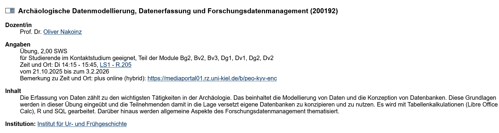
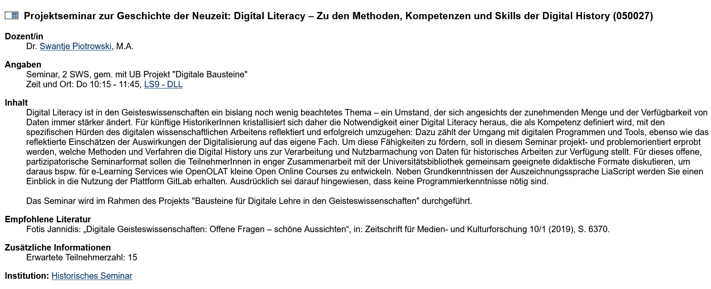

# Lehre: Formate und Methoden

<!--- 
Didaktik: Lehrformate und Methoden

Methode: Vortrag im Plenum

Zeit: 5-10 Min

Lernziele (LZM-FDM):

Lernende können geeignete Lehrsituationen, -formate und -methoden für die Integration von FDM-Inhalten benennen.

--->

{{0-1}}
********************
Aspetkte des FDM können im Rahmen vieler verschiedener Lehrformate adressiert werden:

- Proseminare
- Tutorien
- Vorlesungen
- Übungen
- Praktika
- ...

********************

{{1-2}}
********************
Beispiele:

********************

{{2}}
********************

********************

{{3}}
********************
Mit nachgenutzen Forschungsdaten kann **forschungsbasiertes** oder **projektbasiertes Lernen** ermöglicht werden.
********************

## Forschungsbasiert lernen

Studierende entwickeln und bearbeiten "echte" Forschungsfragen mit authentischen Daten, um wissenschaftliche Methoden anzuwenden, Daten zu analysieren und evidenzbasierte Schlüsse zu ziehen.

**Beispielhafte Lernziele:**

- *Lernende können für die Fragestellung relevante Datensätze aus verschiedenen Portalen in unterschiedlichen Formaten sinnvoll auswählen.*
- *Lernende können Daten aus verschiedenen Datenquellen extrahieren, filtern und vergleichen, um einen eigenen Datensatz zu erstellen.*
- *Lernende können komplexe evidenzbasierte Argumente entwickeln und präsentieren.*
- *Lernende können komplexe Berichte auf der Grundlage von Datenanalysen in Form von Haus-, Forschungsarbeiten oder Postern präsentieren.*

>**Beispielhafte Fragestellungen**
> 
> - Gibt es einen Zusammenhang zwischen dem Durchschnittseinkommen der Bevölkerung und den durchschnittlichen Kronengrößen der Bäume im Stadtgebiet Kiel?
> - Welchen Einfluss hatten der deutsch-französische Krieg und die Schleswig-Holsteinische Erhebung Ende des 20. Jahrhunderts auf das heutige Vorkommen der Baumarten im Stadtgebiet Kiel?

## Projektbasiert lernen
Studierende können mit realen offenen Forschungsdaten praxisnahe Anwendungen, Services oder Prototypen entwickeln. Dabei geht es weniger um die Beantwortung einer Forschungsfrage, sondern um die Gestaltung, Umsetzung und Reflexion eines Projekts – oft mit interdisziplinärem Bezug.

**Beispielhafte Lernziele:**

- *Lernende können geeignete offene Datensätze identifizieren und für ein Projektvorhaben auswählen.*  
- *Lernende können Daten technisch aufbereiten und in Anwendungen oder Visualisierungen einbinden.*  
- *Lernende können in Teams kollaborativ arbeiten und Arbeitspakete eigenständig koordinieren.*  
- *Lernende können Projektergebnisse adressatengerecht dokumentieren und präsentieren (z. B. in Form von Prototypen, Apps, Dashboards oder Webkarten).*  
- *Lernende können die gesellschaftliche Relevanz und die Nachhaltigkeit ihres Projekts reflektieren.*  

> **Beispielhafte Projekte**: Entwicklung einer interaktiven Webkarte zur Geschichte der Kieler Stadtbäume.

#### Weiterführende Ressourcen

- Forschendes Lernen: Hinweise für Theorie und Praxis.” Hochschule für Wirtschaft und Gesellschaft Ludwigshafen, https://www.hwg-lu.de/fileadmin/user_upload/service/studium-und-lehre/hochschuldidaktik/Handreichungen_und_Links/Handreichung_Forschendes_Lernen.pdf
. Zugriff am 30.01.2026

- Forschungsorientierte Lehre: Leitfaden – Begriffsverständnis und Umsetzungsmöglichkeiten am KIT. Personalentwicklung und Berufliche Ausbildung (PEBA), Karlsruher Institut für Technologie, https://www.ipek.kit.edu/downloads/Forschungsorientierte_Lehre.pdf
. Zugriff am 30.01.2026