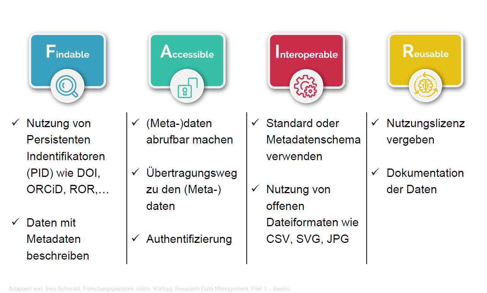
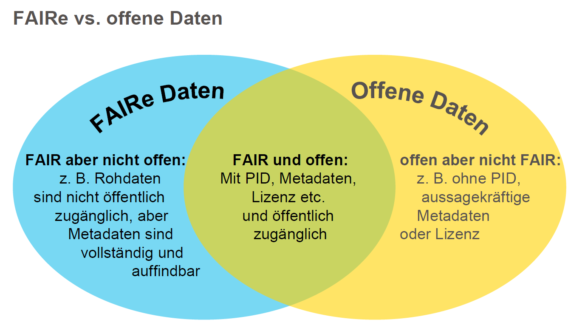

## FAIR-Prinzipien

<!---
Grundbegriff FAIR-Prinzipien

Die Teilnehmenden (TN) erhalten eine Einführung in die FAIR-Prinzipien als grundlegendes Konzept für den Umgang mit Forschungsdaten. Dabei werden die einzelnen Prinzipien (Findable, Accessible, Interoperable, Reusable) vorgestellt und in ihren Zielsetzungen erläutert.

Die Einführung schafft ein gemeinsames Verständnis für die Bedeutung von FAIRen Datenpraktiken im Forschungsdatenmanagement und bildet eine Grundlage für deren Anwendung in unterschiedlichen Kontexten.

Methode: Vortrag im Plenum

Zeit: 5 Min

Lernziele (LZM-FDM):

Lernende können die FAIR-Prinzipien benennen. (LZ-ID: 01_007_0117)

Lernende können die FAIR-Prinzipien erläutern. (LZ-ID: 01_007_0118)

--->

{{0-1}}
****************
 

Ein wichtiges Ziel des strukturierten Foschungsdatenmanagements ist es, Daten langfristig und personenunabhängig zugänglich, nachnutzbar und nachprüfbar zu halten.

Die [**FAIR-Prinzpien**](https://www.nature.com/articles/sdata201618) dienen als Leitfaden für die Auswahl von Handlungsoptionen, die sicherstellen sollen, dass die im Rahmen von Forschung geschaffenen digitalen Artefakte auffindbar, zugänglich, interoperabel und wiederverwendbar sind.

<small>Illustration: Patrick Hochstenbach in Engelhardt, Claudia et. al. (2021).</small>

****************

{{1}}
>**F**indable

{{2-3}}
****************
Der erste Schritt bei der (Wieder-)Verwendung von Daten besteht darin, sie zu finden. Metadaten und Daten sollten sowohl für Menschen als auch für Computer leicht zu finden sein.

F1. (Meta)data are assigned a globally unique and persistent identifier

F2. Data are described with rich metadata (defined by R1 below)

F3. Metadata clearly and explicitly include the identifier of the data they describe

F4. (Meta)data are registered or indexed in a searchable resource

***************

{{1}}
>**A**ccessible

{{3-4}}
***********************
Sobald der Nutzer die gewünschten Daten gefunden hat, muss er wissen, wie er auf sie zugreifen kann, möglicherweise einschließlich Authentifizierung und Autorisierung.

A1. (Meta)data are retrievable by their identifier using a standardised communications protocol

A1.1 The protocol is open, free, and universally implementable

A1.2 The protocol allows for an authentication and authorisation procedure, where necessary

A2. Metadata are accessible, even when the data are no longer available

******************

{{1}}
>**I**nteroperable

{{4-5}}
**********************
Daten sollten in einer Form vorliegen, die die Nutzung mit diversen Anwendungen oder Arbeitsabläufen für die Analyse, Speicherung und Verarbeitung ermöglichen.

I1. (Meta)data use a formal, accessible, shared, and broadly applicable language for knowledge representation.

I2. (Meta)data use vocabularies that follow FAIR principles

I3. (Meta)data include qualified references to other (meta)data

**********************

{{1}}
>**R**eusable

{{5-6}}
***************
Das Ziel von FAIR ist es, die Wiederverwendung von Daten zu optimieren. Um dies zu erreichen, sollten Metadaten und Daten gut dokumentiert und beschrieben sowie mit einer eindeutigen Angabe bzgl. der Nutzungsbedingungen (Lizenzen) versehen sein.

R1. Meta(data) are richly described with a plurality of accurate and relevant attributes

R1.1. (Meta)data are released with a clear and accessible data usage license

R1.2. (Meta)data are associated with detailed provenance

R1.3. (Meta)data meet domain-relevant community standards

**************

### FAIR-Prinzipien im Überblick

### FAIR vs OPEN 

{{0-1}}
>Was denken Sie?
>
>FAIR = Open?

{{1}}

### Ideen für die Lehre

Beispielhafte Lernziele
---

>Studierende können…
>
>…die FAIR-Prinzipien benennen.
>
>…die Relevanz der FAIR-Prinzipien erläutern

Beispielhafte Umsetzungsmöglichkeiten
---

1. **Kurzer Vortrag mit Diskussion**  
   - Lehrende besprechen die FAIR-Prinzipien in einer Lehrveranstaltung. Diskutieren Sie für den Fachbereich typische Tätigkeiten, die den FAIR-Prinzipien entsprechen.

2. **Kleine Gruppenarbeit oder Einzelarbeit**  
   - Aufgabe: Diskutieren Sie anhand von Beispielen oder konkreten Projekten, was getan werden muss, um einzelne Aspekte der FAIR-Prinzipien umzusetzen.

#### Weiterführende Ressourcen

Lehmann, Sebastian B. C.; Altemeier, Franziska; Nina, Düvel, 2026, "Nachhaltige Wissenschaft mit Forschungsdatenmanagement - Eine Einführung für Betreuende von Qualifizierungsarbeiten", https://doi.org/10.25625/EKEEFB, GRO.data, V2

Wilkinson, M., Dumontier, M., Aalbersberg, I. et al. The FAIR Guiding Principles for scientific data management and stewardship. Sci Data 3, 160018 (2016). https://doi.org/10.1038/sdata.2016.18