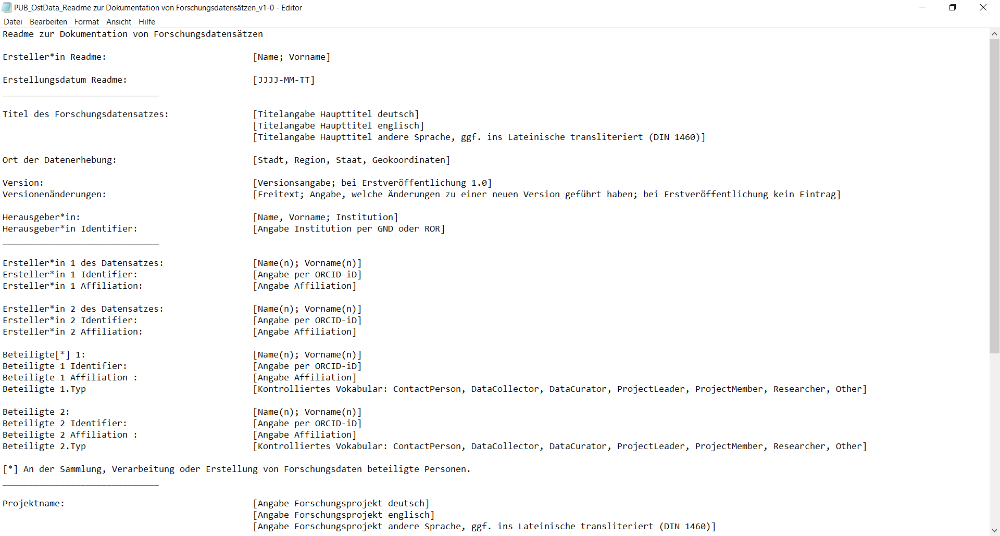
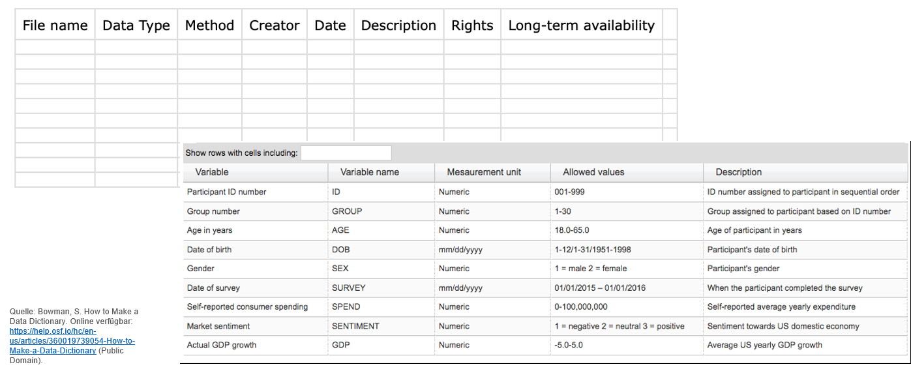

<!--

author:   Britta Petersen, Linda Zollitsch
email:    
version:  0.1.0
language: de
narrator: Deutsch male

icon:     images/Logo_cau-norm-de-lilagrey-rgb-0720_2022.png

comment:  This document provides a brief introduction to research data management for lecturers. It provides an overview of rdm related topics as well as some didactic and methodologies for teaching rdm to students.

-->

## Datendokumentation 📝

{{0-1}}
********************

>Nicht nur für eine Nachnutzung von Forschungsdaten durch Dritte, sondern auch für die zukünftige Nutzung durch die Datenerzeuger:innen selbst, ist eine möglichst ausführliche Dokumentation von Forschungsdaten enorm wichtig.
>
>Dokumentationen sind in der Regel nicht zielführend für die Beantwortung der wissenschaftlichen Fragestellung an der Forschende gerade arbeiten. Sie werden daher häufig als "lästige Zusatzarbeit" verstanden.
>
>Es ist daher enorm wichtig, die Relevanz einer guten Dokumentation aufzuzeigen und Routinen für das Dokumentieren von Forschungsdaten zu erarbeiten und zu vermitteln.

*~~Lernziel~~: Lernende können Methoden der Datendokumentation bewerten.*

*~~Lernziel~~: Lernende können Datenqualität analysieren und bewerten.*

*~~Lernziel~~: Lernende können verschiedene Aspekte von Datenqualität erläutern.*

********************

### Bestandteile einer Datendokumentation

**Eine gute Datendokumentation enthält Informationen zu:**

* Kontext: Projekthistorie, Absicht/Zielsetzung, Hypothesen, ...
* Methoden: Sampling, Umstände der Erhebung, technische Rahmenbedingungen, ...
* Datenstrukturen, Beziehungen zwischen Objekten
* Wertebereiche, Qualitätskriterien, Gültigkeit
* Änderungen im Projektverlauf, Versionierung
* Informationen zu Datenzugang und Nutzungsbedingungen
* Informationen zu Kontaktmöglichkeiten

---

**Fokus Datenqualität**:

* Erläuterung der verwendeten Terminologie, ggf. Definitionen/kontrollierten Vokabularen und Ontologien bzw. Thesauri
* ggf. vordefinierte Wertebereiche, Format-Vorgaben (z.B. Datum YYYY-MM-DD)
* Aussagekräftige Bezeichnungen von Spaltenköpfen (Sonderzeichen vermeiden)
* Namen, Bezeichnungen für Variablen, Einheiten und ihre Werte dokumentieren
* Erklärungen für Codes/Klassifikationsschemata
* Kodierung fehlende Werte/Gründe für fehlende Werte
* Abgeleitete Daten, verwendete Algorithmen, Gewichtungen ...
* Innerhalb einer Zelle nicht mit Komma trennen -> Probleme bei der Umwandlung in csv.

### Warum dokumentieren?

{{0-1}}
********************
Ohne Dokumentation laufen wir Gefahr...

>- Daten nicht wiederzufinden,
>- die Entstehung von Daten nicht mehr nachvollziehen zu können,
>- Daten wegen fehlender Kontextinformationen nicht mehr interpretieren zu können,
>- Dateien zu verwechseln (veraltete oder konkurrierende Versionen),
>- Daten nicht mit anderen Personen austauschen oder mit Daten aus anderen Quellen zusammenführen zu können.
>
>
<small>https://forschungsdaten.info/themen/beschreiben-und-dokumentieren/datendokumentation/</small>

siehe auch: https://forschungsdaten.info/themen/beschreiben-und-dokumentieren/datendokumentation/

********************

### Dokumentation & GWP

{{0-1}}
********************
**Darüberhinaus gehört eine angemessene Dokumentation zur guten wissenschaftlichen Praxis!**

>*Die Qualität von Daten zeichnet sich in der Wissenschaft unter anderem durch Transparenz und Nachvollziehbarkeit der Datensätze aus. Entsprechend der FAIR-Prinzipien sollten die Daten auffindbar (findable), zugänglich (accessible), interoperabel (interoperable) und wiederverwendbar (reusable) sein. Für die (Nach-)Nutzung von Forschungsdaten ist es wichtig, dass sie nicht nur methodisch korrekt erhoben, sondern auch gut dokumentiert vorliegen. Nur so ergeben sich im wissenschaftlichen Arbeiten valide Ergebnisse, die möglichst replizierbar sind.*
>
>
<SMALL>[Bundesministerium für Bildung und Forschung](https://www.bildung-forschung.digital/digitalezukunft/de/wissen/forschungsdaten/datenqualitaet-in-der-wissenschaft-sichern/datenqualitaet-in-der-wissenschaft-sichern_node.html) (2019): Datenqualität in der Wissenschaft sichern.</SMALL>

********************

{{1}}
********************
Hierzu ein...

**...kurzer Rechercheauftrag**:

Welche Leitlinie der [DFG Leitlinien zur guten wissenschaftlichen Praxis](https://zenodo.org/records/14281892) beschäftigt sich mit der Dokumentation?

********************

{{2}}
********************

**Leitlinie 12: Dokumentation**
„Wissenschaftler:innen dokumentieren alle für das Zustandekommen eines Forschungsergebnisses relevanten Informationen so nachvollziehbar, wie dies im betroffenen Fachgebiet erforderlich und angemessen ist, um das Ergebnis überprüfen und bewerten zu können. […]"

<SMALL>Deutsche Forschungsgemeinschaft. (2024). Leitlinien zur Sicherung guter wissenschaftlicher Praxis. Kodex. https://zenodo.org/records/14281892, S. 17.  
</SMALL>

********************

### Dokumentationsformen

Daten können auf verschiedene Weise dokumentiert werden. Dabei muss ggf. für jedes Forschungsprojekt individuell entschieden werden, welche Dokumentationsform am geeignetsten ist. Gegebenenfalls kann eine Kombination von verschiedenen Dokumentationsformen nötig sein.

Mögliche Dokumentationsformen könnten sein:

>- in einer ReadMe-Datei
>- in einer Metadatenbank
>- in einem projektinternen Wiki
>- in einem (elektronischen) Laborbuch
>- in einem Datenmanagementplan (DMP)
>- innerhalb der Ordnerstruktur und Dateibenennung
>- in der Datei selber bzw. in den Metainformationen der Datei.
>
>https://forschungsdaten.info/themen/beschreiben-und-dokumentieren/datendokumentation/

#### Beispiele

Beispiel für eine Readme-Vorlage:

{{1}}
********************
https://zenodo.org/record/6956989#.Y8ZHgnbMJPY

********************

{{2}}
********************
Beispiele für Data Dictionary und Codebook

********************

## Weiterführende Ressourcen
