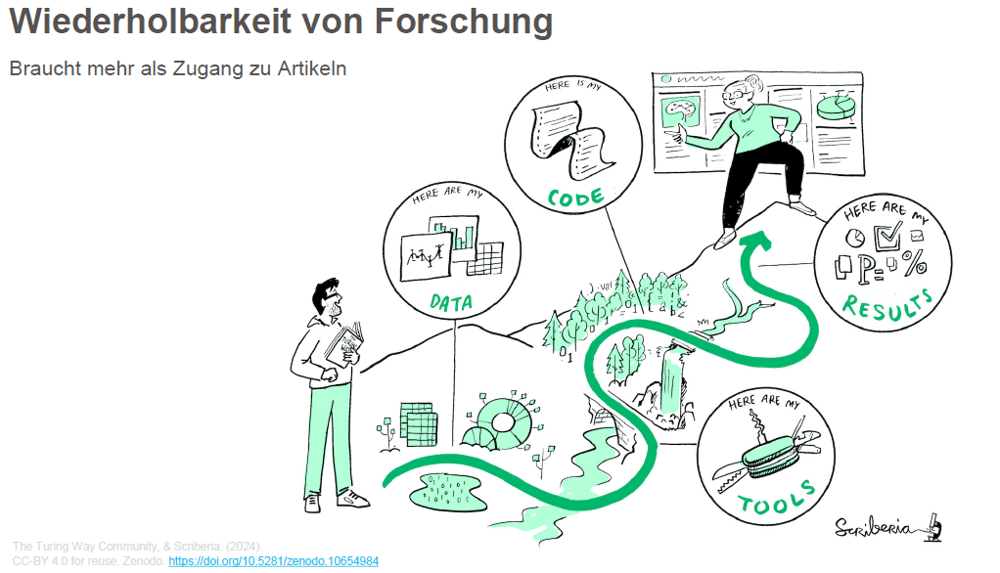
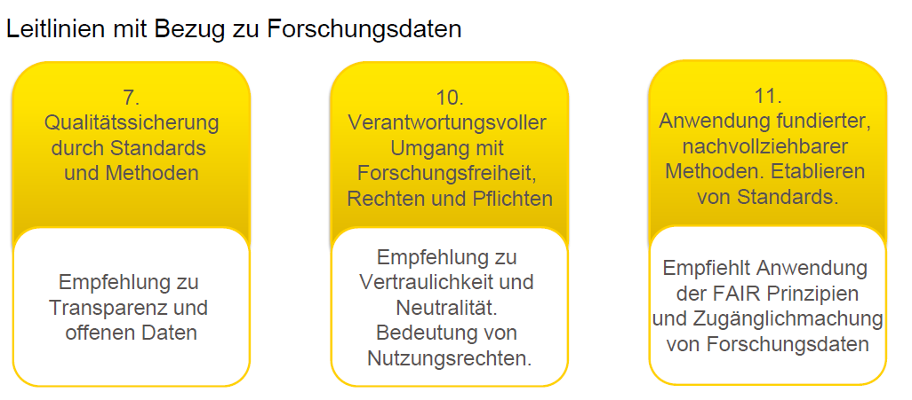
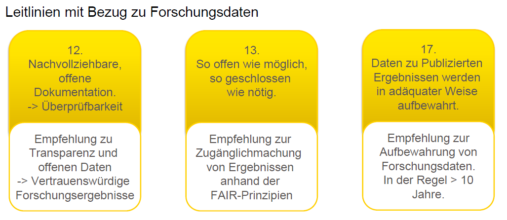

<!--

author:   Britta Petersen, Linda Zollitsch
email:    
version:  0.1.0
language: de
narrator: Deutsch male

icon:     images/Logo_cau-norm-de-lilagrey-rgb-0720_2022.png

comment:  This document provides a brief introduction to research data management for lecturers. It provides an overview of rdm related topics as well as some didactic and methodologies for teaching rdm to students.

-->

## GWP & Open Science

### Gute Wissenschaftliche Praxis

{{0-2}}
********************************************************************************
>"***Gute Wissenschaftliche Praxis*** oder ***Wissenschaftliche Integrität*** bildet die Grundlage einer vertrauenswürdigen Wissenschaft. Sie ist eine Ausprägung **wissenschaftlicher Selbstverpflichtung**, die den **respektvollen Umgang** miteinander, mit Studienteilnehmerinnen und -teilnehmern, Tieren, Kulturgütern und der Umwelt umfasst und das unerlässliche **Vertrauen der Gesellschaft in Wissenschaft** stärkt und fördert. (...) Die Wissenschaft selbst gewährleistet durch **redliches Denken** und **Handeln**, nicht zuletzt auch durch **organisations- und verfahrensrechtliche Regelungen**, gute wissenschaftliche Praxis."
>
> [*Leitlinien zur Sicherung guter wissenschaftlicher Praxis, DFG 2019*](https://zenodo.org/records/14281892), [*Verfahrensordnung zum Umgang mit wissenschaftlichem Fehlverhalten (VerfOwF), DFG 2024*](https://www.dfg.de/resource/blob/168578/caf3d827f4a743b6d23d14b79c90bfc6/dfg-80-01-v0819-de-data.pdf)

********************************************************************************

{{1-2}}
********************************************************************************
>***Gute wissenschaftliche Praxis (GWP)*** umfasst die grundlegenden **Werte** und **Normen** des professionellen wissenschaftlichen Arbeitens. Diese Grundsätze, wie beispielsweise die Wahrung von **Ehrlichkeit** & **Transparenz**, sind dabei zunächst einmal unabhängig von der Fachrichtung. Alle Wissenschaftler:innen tragen dabei die Verantwortung dafür, dass das eigene Verhalten diesen Standards entspricht.
>
>*(Saskia Kaiser, Jennifer Schlüß, 2025: "Einführung in die gute wissenschaftliche Praxis")*

********************************************************************************

{{2}}
********************************************************************************

Gute Wissenschaftliche Praxis...
---

> ...betrifft:
>
> * redliches Denken und Handeln Einzelner sowie
> * organisations- und verfahrensrechtliche Regelungen

********************************************************************************

{{3}}
********************************************************************************
> ...sorgt für:
>
> * Vertrauenswürdigkeit der Wissenschaft
>
> * Vertrauen der Gesellschaft in Wissenschaft

********************************************************************************

{{4}}
********************************************************************************
> ...verlangt die Selbstverpflichtung zu respektvollem Umgang mit:
>
> * Studienteilnehmer:innen
> * Tieren
> * Kulturgütern und Umwelt

********************************************************************************

#### DFG Kodex

>Der **DFG Kodex** "Leitlinien zur Sicherung guter wissenschaftlicher Praxis" umfasst 19 Leitlinien.
>
>**6 dieser Leitlinien beschäftigen sich konkret mit Forschungsdaten und dem nachhaltigen Umgang damit.**

{{1-2}}
********************************************************************************

********************************************************************************

{{2}}
********************************************************************************

********************************************************************************

#### Ideen für die Lehre

{{0-1}}
********************************************************************************

Beispielhafte Lernziele
---

>Studierende können...
>
>... Prinzipien der Guten Wissenschaftlichen Praxis benennen.
>
>... Inhalte der CAU Richtine zur guten Wissenschaftlchen Praxis erläutern.
>
>... die Relevanz des Forschungsdatenmanagements im Hinblick auf die Prinzipien Guter Wissenschaftlicher Praxis	erläutern.

************************************

{{1}}
************************************************************************

Beispielhafte Umsetzungsmöglichkeiten
---

1. **Kurzer Input mit Recherauftrag**

- Lehrende erläutern die Prinzipien guter wissenschaftlicher Praxis und vergeben den Auftrag nach der aktuellen [CAU Richtlinie zur guten wissenschaftlichen Praxis](https://www.uni-kiel.de/fileadmin/user_upload/forschung/integritaet-ethik/downloads/Richtlinien-Sicherung-guter-wissenschaftlicher-Praxis.pdf) zu recherchieren.

2. **Diskussionen, Gruppen- oder Einzelarbeiten**

- Lassen Sie Studierende herausarbeiten, welche der 19 Leitlinien der DFG sich mit Forschungsdaten beschäftigen.

- Diskutieren Sie die Inhalte der CAU Richtlinie zur guten wissenschaftlichen Praxis mit Fokus auf fachspezifische Aspekte.

3. **Bewertungskriterium für Abschlussarbeiten**

- FDM, Transparenz und Nachvollziehbarkeit der Daten als Kriterien für die wissenschaftliche Leistung kommunizieren und honorieren.

************************************************************************

### Open Science

{{0-1}}
********************************************************************************
Open Science umfasst die unterschiedlichsten Aspekte der Wissenschaft.

********************************************************************************

{{1-2}}
********************************************************************************

********************************************************************************

{{2-3}}
********************************************************************************

>**Was?*** 
> - Unter dem Begriff Open Science versteht man **Strategien und Verfahren**, die darauf abzielen, **alle Bestandteile des wissenschaftlichen Prozesses** über das Internet offen **zugänglich**, **nachvollziehbar** und **nachnutzbar** zu machen.
>
>**Wieso?** 
>- Um Wissenschaft, Gesellschaft und Wirtschaft neue Möglichkeiten im Umgang mit wissenschaftlichen Erkenntnissen zu eröffnen.
>
>**Ziel?** 
>- Die **Qualität der Forschung verbessern** und die **Mittel** der Forschungsförderung **effizienter einsetzen**. Open Science ist damit ein wichtiger Baustein, um gute wissenschaftliche Praxis zu sichern. Darüber hinaus soll der **Wissenstransfer** in Gesellschaft, Wirtschaft und Politik durch Offenheit und Transparenz verbessert werden.
>
>Open Science basiert auf vier Grundprinzipien:
>
>* 
Transparenz

>
>* 
Reproduzierbarkeit

>
>* 
Wiederverwendbarkeit

>
>* 
Offene Kommunikation

>
>(https://ag-openscience.de/open-science/)

********************************************************************************

{{3-4}}
********************************************************************************

>*"Ein zentrales Element von Open Science ist die Forderung nach Offenheit der digitalen Forschung und Lehre. Das bedeutet, dass Forschungsergebnisse, Forschungsdaten, Forschungsmethoden und -verfahren sowie Lehr- und Lerninhalte, Software und Werkzeuge kostenlos zur Verfügung stehen und nachgenutzt werden können"*
>
>(Kunst, Sabine & Degkwitz, Andreas. (2019). Open Science - the new paradigm for research and education?. 10.18452/19871.)

********************************************************************************

### Ideen für die Lehre

Beispielhafte Lernziele
---

>Studierende können...
>
>... Prinzipien der Guten Wissenschaftlichen Praxis benennen.
>
>... Inhalte der CAU Richtine zur guten Wissenschaftlchen Praxis erläutern.
>
>... die Relevanz des Forschungsdatenmanagements im Hinblick auf die Prinzipien Guter Wissenschaftlicher Praxis erläutern.

************************************

{{1}}
************************************************************************

Beispielhafte Umsetzungsmöglichkeiten
---

1. **Kurzer Input mit Diskussion**

- Lehrende erläutern die Prinzipien von Open Science. Diskutieren Sie, z. B.: Führt Open Science zu mehr Wissen in der Gesellschaft? Welche Vorteile und Herausforderungen bringen Open Science Praktiken mit?

2. **Datensätze bewerten lassen**

- Stellen Sie ausgewählte Datensätze zur Verfügung, die von Ihrer Studierenden anhand der Kriterien für Open Science bewertet werden sollen.

3. **Selbstorganisation unterstützen**

- Ermutigen Sie Ihre Studierenden, sich in Netzwerken und Arbeitskreisen zum Thema zu engagieren, z. B:

  - [Open Science Community Kiel](https://www.zbw.eu/de/ueber-uns/veranstaltungen/open-science-kiel)

  - [Student Network for Open Science](https://s-nos.org/)

4. **Vorbild sein**

- Eigene Daten, Materialien und Praktiken gut dokumentiert und so offen, wie möglich teilen.

************************************************************************

#### Weiterführende Ressourcen

- Biernacka, K., Dockhorn, R., Engelhardt, C., Helbig, K., Jacob, J., Kalová, T., Karsten, A., Meier, K., Mühlichen, A., Neumann, J., Petersen, B., Slowig, B., Trautwein-Bruns, U., Wilbrandt, J., & Wiljes, C. (2023). Train-the-Trainer-Konzept zum Thema Forschungsdatenmanagement (Version 5) [Computer software]. Zenodo. https://doi.org/10.5281/zenodo.10122153

- Ummul-Kiram Kathawalla, Priya Silverstein, Moin Syed; Easing Into Open Science: A Guide for Graduate Students and Their Advisors. Collabra: Psychology 4 January 2021; 7 (1): 18684. doi: https://doi.org/10.1525/collabra.18684

- Zwicky, R. (2025, December 18). Open Science for students. Zenodo. https://doi.org/10.5281/zenodo.17937551
