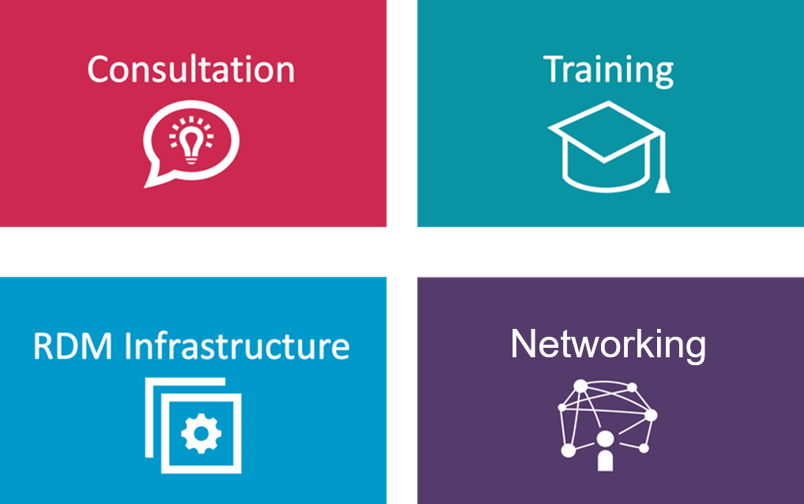
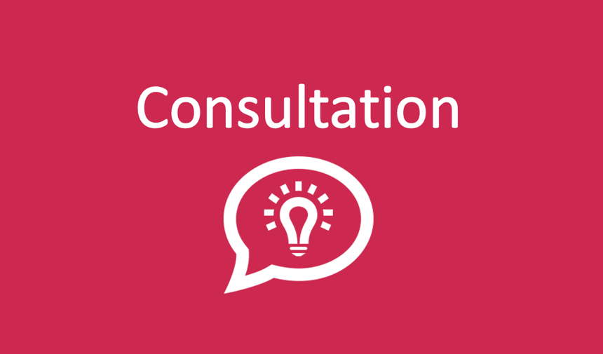
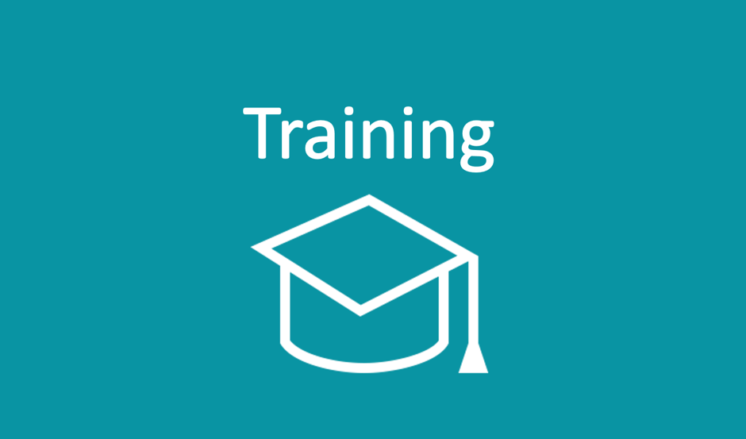
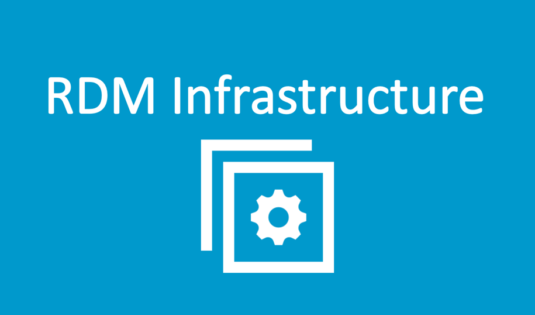
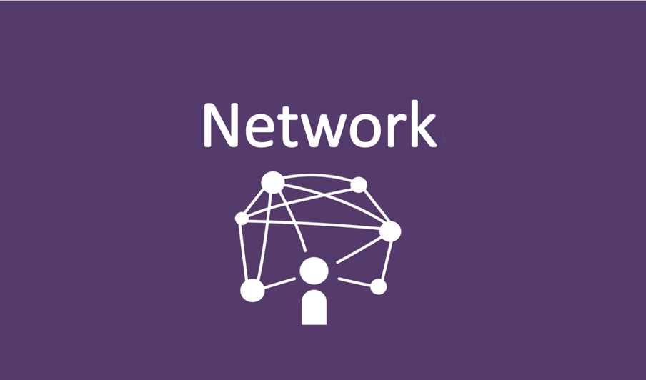
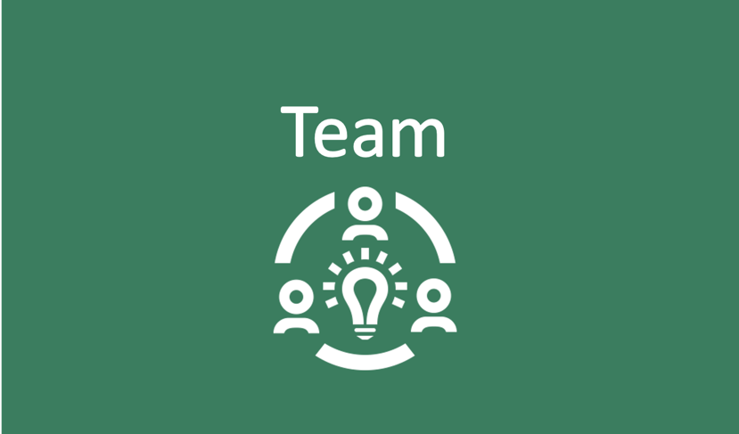

<!--

author:   Britta Petersen, Linda Zollitsch
email:    
version:  0.1.0
language: de
narrator: Deutsch male

icon:     images/Logo_cau-norm-de-lilagrey-rgb-0720_2022.png

comment:  This document provides a brief introduction to research data management for lecturers. It provides an overview of rdm related topics as well as some didactic and methodologies for teaching rdm to students.

-->

# FDM an der CAU

{{0-1}}
***********

website: https://www.fdm.uni-kiel.de/de

e-mail: <a href="info@fdm.uni-kiel.de">info@fdm.uni-kiel.de  </a>

***********

{{1-2}}
***********
**Beratung**

* Antragsberatung

* DMP Beratung

* technische Beratung (Storage, Backup, Tools, usw.)

* Unterstützung bei Peer Reviews

* Hilfe bei der Datenpublikation
***********

{{2-3}}
***********
**Unterstützung bei Training & Lehre**

* Workshops

 * beim Graduate Center, Wissenschaftliche Weiterbildung
 * kleine Gruppen
 * unterschiedliche Zielgruppen
 * grundsätzliche FDM-Grundlagen
 * Spezialisation, z.B. Einführung in Git (auf Anfrage)

* technische Unterstützung auf Anfrage
***********

{{3-4}}
***********
**FDM Infrastruktur**

* FDM Services

* Beratung zu Tools und Services

* Kontakt mit den Fachbereichen der CAU
***********

{{4-5}}
***********
**Networking**

* lokale Netzwerke an der CAU durch die [AG FDM](https://www.datamanagement.uni-kiel.de/en/networking?set_language=en)

* regionale Netzwerke durch [FDM-SH](https://fdm-sh.de/), insbesondere [AG Kompetenzentwicklung](https://fdm-sh.de/ags/)

* Aktive Netzwerke in verschiedenen relevanten nationalen Arbeitsgruppen, e. g. 
  
  - [NFDI Sektion Training & Education](https://www.nfdi.de/section-edutrain/), 
  
  - [DINI/nestor AG Forschungsdaten UAG Schulungen/Fortbildungen](https://www.forschungsdaten.org/index.php/UAG_Schulungen/Fortbildungen), 
  
  - [GoFAIR](https://www.go-fair.org/))

* Internationale Netzwerke: z.B. RDA
***********

{{5-6}}
***********
**Kontakt**

Zögern Sie nicht, uns zu kontaktieren:

>**DMP Beratung:**
>
>Thorge Petersen
>petersen@rz.uni-kiel.de
>
>Andreas Christ
>christ@ub.uni-kiel.de 

>**Workshops & Lehrunterstützung:**
>
>Britta Petersen
>b.petersen@rz.uni-kiel.de 
>
>Linda Zollisch 
>zollitsch@ub-uni-kiel.de

***********
